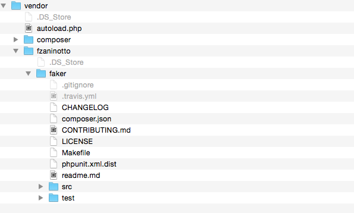
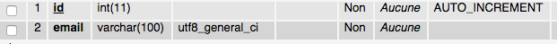
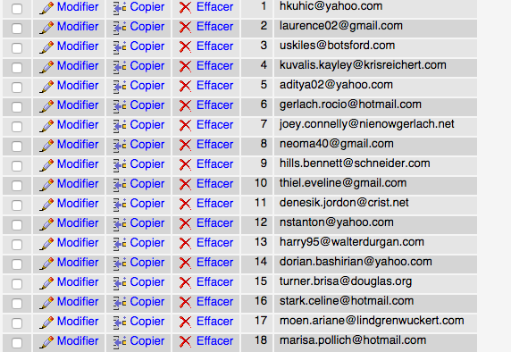

أثناء عملنا في مشاريع نحتاج غالبا لتغذية قاعدة بياناتنا ببعض البيانات من أجل إجراء بعض الإختبارات وهذا ليس بالأمر البسيط خاصة إذا أردنا إدخال عشرات أو مئات السجلات إعتباطيا إلى القاعدة وهذا يا سيأخذ من المبرمج وقتا لابأس به هو في حاجة ماسة إليه. لهذا بدأت معظم إطارات العمل Frameworks الآن في مختلف لغات البرمجة تمنح خدمة للملئ العشوائي لقاعدة البيانات، في ضغطة زر، وفقا للأنواع التي يختارها المطور (مثلا إيميلات، عناوين، أسماء أشخاص، نصوص طويلة...). وفي درسنا هذا لن نستخدم أي إطار عمل، بل سنقوم بالمهمة باستعمال مكتبة PHP مستقلة اسمها Faker لصاحبها الفرنسي **Francois** **Zaninotto**.

## تنصيب مكتبة Faker

أولا سنقوب بتنصيب Faker بواسطة [composer](https://getcomposer.org/ 'Composer') (لا تنسى تثبيت composer في جهازك) ولذلك سننشئ ملفا اسمه composer.json داخل مشروعنا نضع بداخله عنوان المكتبة المراد تحميلها وفي حالتنا عنوانها fzaninotto/Faker وأمامه النسخة التي نريدها (1.4.0) :

```json
{
  "require-dev": {
    "fzaninotto/Faker": "1.4.0"
  }
}
```

> composer يقوم بالتحميل من [هذا الموقع](https://packagist.org/ 'Packagist') ولذلك عندما نريد تحميل مكتبة أو تبعية (Dependency) ما بواسطته يجب البحث عنها هناك، في حالتنا عنوان مكتبتنا هو [هذا الرابط](https://packagist.org/packages/fzaninotto/faker 'Faker Packagist') ومنه أخذنا الإسم المستعمل في ملف composer.json.

ثم بعد ذلك نفتح Terminal ونقوم بإعطاء composer الأمر بتنصيب المكتبة بواسطة هذا السطر composer install.

> إذا واجهتك أي مشاكل مع Composer فالمرجو الرجوع إلى درس [ما هو Composer ؟](http://www.tutomena.com/web-development/tools/composer-dependencies-manager/ 'ماهو Composer ؟')

بعد التنصيب يظهر لدينا ملف Folder اسمه vendor يضم جميع ملفات والسكريبتات الخاصة ب Faker.

[](../images/Capture-d’écran-2015-03-05-à-11.29.48.png)

## إنشاء قاعدة البيانات

بعد التنصيب، سنقوب بإنشاء قاعدة بياناتنا سنسميها test ونضيف إليها جدولا اسمه users يحتوي على عمودين id و email.

[](../images/Capture-d’écran-2015-03-05-à-10.48.01.png)

## إنشاء ملف seed.php وتغدية قاعدة البيانات

الآن سنضيف الملف seed.php إلى مشروعنا وسنضيف إليه الكود التالي :

```php
require 'vendor/autoload.php';
 $db = new PDO('mysql:host=localhost;dbname=test', 'root', 'root');

 $faker = Faker\Factory::create();

 foreach (range(0,100) as $i) {
	$db->query("INSERT INTO users (email) VALUES ('{$faker->email}')");
 }
```

- في السطر الأول استعدينا الملف autoload.php الذي جاء مع Faker وهو مسؤول بربط الإتصال مع جميع الكلاسات التي سنستعملها دون الحاجة إلى دمجها في الكود.
- بعد ذلك ربطنا الإتصال بقاعدة بياناتنا بواسطة ال PDO.
- ثم أنشأنا كائنا $faker للكلاس Factory الموجودة في مكتبة Faker.
- وأخيرا قمنا بملئ قاعدة البيانات بمائة إيميل مختلف باستعمال ال $db->query التي أدخلناها داخل حلقة foreach تدور من 0 إلى 100 وذلك لإضافة 100 سجل (إيميل).

> لو أردنا مثلا إدخال أسماء عوض إيميلات يكفي أن نضع $faker->userName مكان $faker->email في الكود. للمزيد من المعلومات يرجى زيارة [هذا الرابط](https://github.com/fzaninotto/Faker 'Faker in Github').

الآن بمجرد أن نقوم بفتح الملف seed.php في المتصفح سنجد أن الجدول users بات يضم 100 سجل عبارة عن إيميلات كل واحد يختلف عن الآخر.

[](../images/Capture-d’écran-2015-03-05-à-10.46.54.png)

أرجو أني كنت واضحا بما فيه الكفاية ولا تترددوا بطرح أسئلتكم وملاحظاتكم في منطقة التعليقات أسفله.
