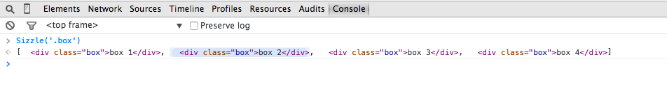
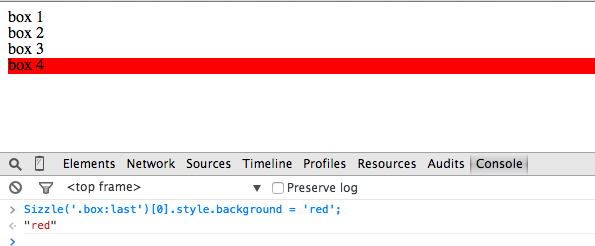

إذا كنت من مستعملي مكتبة جيكويري فأنا متأكد أن من أهم الأسباب التي جعلتك متعلقا بهذه المكتبة هي سهولة اختيار عناصر ال html داخل ال DOM. هذا فعلا ما منح جيكويري هذه المكانة الرفيعة بحيث أنك تستطيع استعمال أي محدد من محددات CSS في جيكويري وهذا ما فشلت فيه معظم المكتبات التي نافست جيكويري في وقت من الأوقات مثل Mootools.js و Prototype.js بعد هذا، إذا كنت مبرمجا فضوليا فلعلك بحثت داخل هذه المكتبة عن الكيفية أو التقنيات التي استعملها مطورو جيكويري بقيادة جون ريزيغ لجعل مكتبتهم بهذه القوة في ال DOM Manipulation وبعد بحث ربما يكون طويلا ستجد أنهم قاموا بتطوير مكتبة مستقلة أو لنقل محرك اسمه Sizzle.js يتيح لنا كل هذا الكم الهائل من المحددات التي يمكنك بفضلها التنقل في DOM بكل سهولة. ولذلك في هذا الدرس قررنا إلقاء نظرة على هذه المكتبة لاكتشاف سحرها.

## التنصيب

يمكنك تحميل المكتبة من موقعها الرسمي، ثم بعد ذلك تقوم باستدعائها في ال head كما هي العادة.

```html
<html>
  <head>
    <script type="text/javascript" src="sizzle.js"></script>
  </head>
  <body></body>
</html>
```

الآن سنضيف بعض العناصر إلى body، مثلا نضيف أربع عناصر div لها جميعا الكلاس box :

```html
<html>
  <head>
    <script type="text/javascript" src="sizzle.js"></script>
  </head>
  <body>
    <div class="box">box 1</div>
    <div class="box">box 2</div>
    <div class="box">box 3</div>
    <div class="box">box 4</div>
  </body>
</html>
```

الآن إذا مررنا المحدد أو "السلكتور" box كبرامتر للدالة Sizzle ستكون القيمة المرجعة على شكل مصفوفة من أربعة عناصر كما يلي :

[](../images/Capture-d’écran-2015-03-06-à-23.34.09.png)

## مثال عملي

لاحظنا أن Sizzle أرجعت لنا العناصر الأربعة كما توقعنا وما علينا الآن سوى تطبيق ما نريد عليها.

لنقوم مثلا بتغيير خلفية العنصر الأخير إلى اللون الأحمر :

[](../images/Capture-d’écran-2015-03-06-à-23.41.44.png)

هنا اخترنا العنصر div.box الأخير و طبقنا عليه الستايل الذي نريد بكل سهولة. أتمنى أن تكونوا قد أخذتم فكرة عن هذه المكتبة الفريدة والمفيدة جدا ولا تنسوا تجربتها. إذا استفدتم من هذا الدرس فلا تنسوا مشاركته مع أصدقائكم. السلام عليكم.
