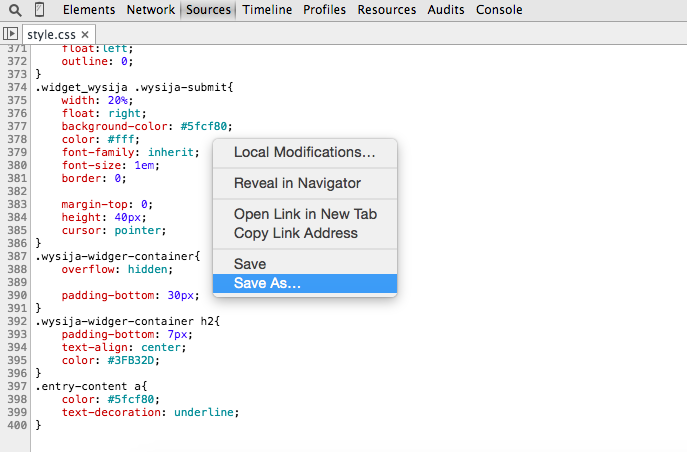

إذا كنت ممن مطوري الواجهات الأمامية (Frontend developer) وتعمل كثيرا بلغة ال CSS فأنت مطالب باختيار طريقة عمل تضمن لك السرعة وقوة الأداء خاصة إذا كنت تعطي للوقت أهمية قصوى. ولعل أول شيء يتبادر إلى الذهن عند الحديث عن طريقة العمل هو اختيار المحرر (Editor)، فالمحرر الذي يدعم الإكمال التلقائي (Autocomplete) مثلا أفضل ممن يجبرك على كتابة الكود كله، والمحرر الذي له إضافات كثيرة ومتنوعة أفضل من المحرر الذي يجعلك تعاني الأمرين عندما تريد إضافة ميزة جديدة إليه... إلخ

## الحل هو محرر المتصفح نفسه

شخصيا، عندما أنتهي من كتابة ال HTML أنتقل إلى CSS وهنا أغير المحرر الذي أعمل به عادة و هو Sublime Text، عند كتابة أكواد ال CSS أفضل حلا آخر أراه عمليا أكثر وهو متوفر لدى الجميع تقريبا بمجرد تنصيب أحد المتصفحات الكبيرة مثل غوغل كروم وفايرفوكس، إنه محرر المتصفح. هذا الحل أجده مثاليا وعمليا إلى حد بعيد خاصة إذا كنت تملك شاشتين أمامك، فكل ما عليك فعله هو فتح متصفحك في شاشة ثم تفتح محرر المتصفح وتجره إلى الشاشة الثانية وهكذا كل ما كتبت كوداً معينا ترى نتيجته على الفور في الشاشة الأولى وبمجرد الضغط على (Ctrl+s) سيتم حفظ عملك في الملف الأصلي.

*_لاتنسى عمل Save As... في المرة الأولى حتى يعرف المتصفح أين سيتم حفظ الملف عند الضغط على Ctrl+s._

## طريقة فتح المحرر في غوغل كروم :

- افتح Chrome Dev Tools.
- أنقر على النافذة Source ثم اختر الملف الذي تريد فتحه على اليسار.

أنت الآن في محرر Google Chrome، فعال وعملي، حتى في حال قررت العمل ب Sass مثلا فلن تجد أي مشكل، فبضبط بعد الإعدادات في Chrome ستجعل هذا الأخير يدعم Sass كذلك.

أما إذا كنت من عشاق فايرفوكس فلاتقلق، هذا المتصفح العملاق يمتلك كذلك محررا رائعا وبنفس ميزات كروم أو ربما أفضل في بعض الجوانب، وبالتالي لاتنسى الإستفادة من هذه التقنيات والمميزات التي يقوم كبار المهندسين في هذه الشركات بدمجها في متصفحاتهم كل يوم.

وربما يكون هذا موضوعا لدرس قادم إن شاء الله. السلام عليكم.
