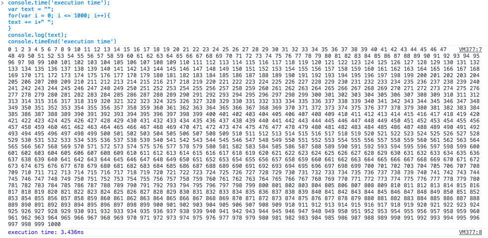

في سائر لغات البرمجة، كلما كانت مدة تنفيذ شفرة البرنامج (Execution time) قصيرة كان ذلك البرنامج أفضل وأجود، وفي الجافاسكريبت بالذات تعطى لهذا العامل أهمية كبرى لكون الكود البرمجي لهذه اللغة تتم قراءته وترجمته داخل المتصفح وبالتالي يتعين على مطوري هذه اللغة كتابة أسرع وأقصر كود ممكن. ولاختبار المدة الزمنية التي يستغرقها تنفيذ كود برمجي معين يمكننا اللجوء لبعض التقنيات كحساب الفارق بين تاريخ بداية التنفيذ وتاريخ نهايته، ولكن التقنية الأمثل هي استعمال الدالتين console.time() و console.timeEnd(). نضع الدالتين السالفتي الذكر، ونمرر لكليهما نفس البارامتر، ثم نضع بينهما الكود الذي نريد حساب المدة الزمنية التي تم فيها تنفيذه :

console.time('execution timer');
var text = "";
for(var i = 0; i <= 1000; i++){
text += i+" ";
}
console.log(text);
console.timeEnd('execution timer')

كلا تلاحظون في المثال السابق طبعنا الأعدد من 0 إلى 1000 في متغير اسمه text ووضعنا الكود بين الدالتين console.time و console.timeEnd اللتين مررنا لهما نفس البارامتر وهو في حالتنا "execution timer". بعد التنفيذ ستظهر لنا في ال console المدة الزمنية بأجزاء الألف من الثانية (milliseconds) التي استغرقها المترجم (Interpreter) في المتصفح لتنفيذ ما سبق في المثال.

