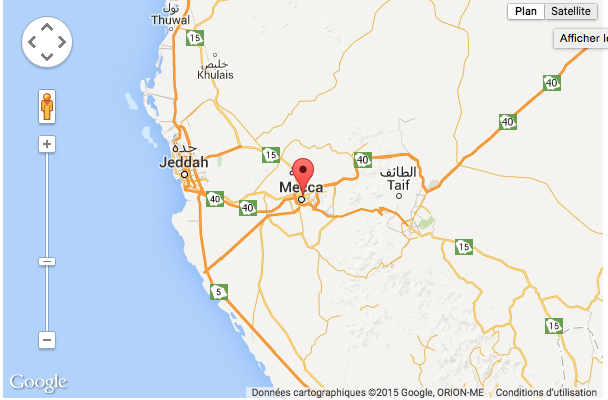
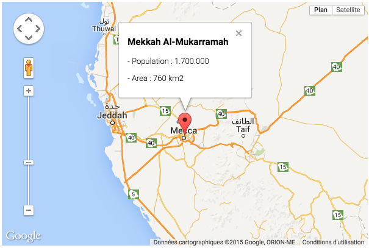

استكمالا [للدرس الأول](http://www.tutomena.com/web-development/javascript/google-maps-api-1/ 'تعرف على منصة Google Maps Api – الجزء الأول') من دورة منصة الجافاسكريبت لخرائط غوغل Google Maps Api، سنرى اليوم كيفية إضافة العلامات (Markers) إلى الخريطة، كما سنقوم بإضافة نافذة معلومات تُفتح على مستوى الخريطة عند النقر على ال Marker.

## إضافة الماركر Marker

لإضافة العلامة (Marker) للخريطة نقوم بإنشاء كائن من الكلاس google.maps.Marker ونقوم بإعطائه بعض البارامترات التي يحتاجها كالتالي :

```js
var marker = new google.maps.Marker({
  position: mekkah,
  map: map,
  title: 'Mekkah Al-Mukarramah!'
});
```

أنشأنا الكائن marker ومررنا له البارامتر position لتحديد موضعه واسم الخريطة map كما أعطيناه في [الدرس السابق](http://www.tutomena.com/web-development/javascript/google-maps-api-1/ 'تعرف على منصة Google Maps Api – الجزء الأول')، ثم عنوانا يظهر عند عمل mouseover على ال Marker.

وهنا الكود كاملا بعد إضافة ال Marker على نقطة مدينة مكة المكرمة :

```html
<!DOCTYPE html>
<html>
  <head>
    <title>Google Maps Api</title>
    <meta name="ROBOTS" content="NOINDEX, NOFOLLOW" />
    <script
      type="text/javascript"
      src="https://maps.googleapis.com/maps/api/js"
    ></script>
    <script type="text/javascript">
      function initialize() {
        var mekkah = new google.maps.LatLng(21.42483, 39.823201);
        var mapOptions = {
          center: mekkah,
          zoom: 8
        };
        var map = new google.maps.Map(
          document.getElementById('map'),
          mapOptions
        );

        var marker = new google.maps.Marker({
          position: mekkah,
          map: map,
          title: 'Mekkah Al-Mukarramah'
        });
      }
      google.maps.event.addDomListener(window, 'load', initialize);
    </script>
  </head>
  <body>
    <div id="map" style="width: 600px; height: 400px;"></div>
  </body>
</html>
```

[](../images/Capture-d’écran-2015-03-09-à-23.48.17.png)

والآن نريد عرض بعد المعلومات عن مدينة مكة بعد النقر على العلامة Marker؛ الأمر ممكن وسهل بفضل الكائن Infowindow.

## إظهار Infowindow عند النقر على العلامة

لإضافة ميزة نافذة المعلومات، سننشئ كائنا من الكلاس google.maps.InfoWindow ثم نقوم بإظهارها عند النقر على العلامة (Marker).

_*هنا استعملنا كلمة الكلاس تجاوزا فقط من أجل إيضاح الموضوع، وإلا فلاوجود لمصطلح كلاس في الجافاسكريبت فكل شيء في هذه اللغة عبارة عن object._

أولا سنقوم بإنشاء متغير(infos) يضم كود ال html أو المعلومات التي نريد إضافتها للنافذة InfoWindow :

```js
var infos =
  '<div class="infos"><h3>Mekkah Al-Mukarramah</h3>' +
  '<p>- Population : 1.700.000</p>' +
  '<p>- Area : 760 km2</p>' +
  '</div>';
```

بعد ذلك ننشئ الكائن infowindow ونضيف إليه هذا المحتوى (content) ثم باستعمال الوظيفة open نطلب من النافذة Infowindow الظهور في الخريطة عن النقر على ال Marker كما يلي :

```js
var infowindow = new google.maps.InfoWindow({
  content: infos
});
google.maps.event.addListener(marker, 'click', function() {
  infowindow.open(map, marker);
});
```

والآن إذا عملنا click على العلامة (Marker) ستظهر لنا نافذة جميلة تحتوي معلومات عن مدينة مكة المكرمة. إليكم الكود الإجمالي و[هذا رابط](http://www.tutomena.com/demos/google-maps-api-part-2/ 'Google Maps Api Demo') من أجل مشاهدة Demo درس اليوم.

[](../images/Capture-d’écran-2015-03-10-à-00.22.55.png)

```html
<!DOCTYPE html>
<html>
  <head>
    <title>Google Maps Api</title>
    <meta name="ROBOTS" content="NOINDEX, NOFOLLOW" />
    <script
      type="text/javascript"
      src="https://maps.googleapis.com/maps/api/js"
    ></script>
    <script type="text/javascript">
      function initialize() {
        var mekkah = new google.maps.LatLng(21.42483, 39.823201);
        var mapOptions = {
          center: mekkah,
          zoom: 8
        };
        var map = new google.maps.Map(
          document.getElementById('map'),
          mapOptions
        );

        var marker = new google.maps.Marker({
          position: mekkah,
          map: map,
          title: 'Mekkah Al-Mukarramah'
        });
        var infos =
          '<div class="infos"><h3>Mekkah Al-Mukarramah</h3>' +
          '<ul><li>Population : 1.700.000</li>' +
          '<ul><li>Area : 760 km2</li></ul>' +
          '</div>';

        var infowindow = new google.maps.InfoWindow({
          content: infos
        });

        google.maps.event.addListener(marker, 'click', function() {
          infowindow.open(map, marker);
        });
      }
      google.maps.event.addDomListener(window, 'load', initialize);
    </script>
  </head>
  <body>
    <div id="map" style="width: 600px; height: 400px;"></div>
  </body>
</html>
```

نتمنى أن يكون الموضوع واضحا للجميع.. لا تترددوا في إبداء ملاحظاتكم وتعليقاتكم أسفله.

إلى درس آخر قادم إن شاء الله.

السلام عليكم.
