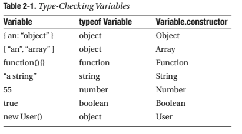

تشترك معظم لغات البرمجة المعروفة كالجافا و PHP و الجافاسكريبت في مزية ال function overloading أو method overloading، بحث تقوم الدالة بسلوك مختلف في كل مرة نقوم باستدعائها فيها وذلك على حسب عدد ونوع البارامترات التي مررناها لهذه الدالة. إذن لكي نقوم بعملية overloading لدالة في الجافاسكريبت نحتاج من جهة لتحديد عدد البارامترات ومن جهة ثانية تحديد أنواع هذه البارامترات.

## تحديد عدد البارامترات

في داخل كل دالة في الجافاسكريبت يوجد كائن اسمه arguments وهو شبيه بمصفوفة ولكنه ليس بمصفوفة (Array-like object or Pseudo-array) ويضم جميع البارامترات الممررة للدالة التي يوجد بداخلها، كما أنه يمتلك خاصية تدعى length تمكننا من معرفة عدد هذه البارامترات (تماما مثل length عند المصفوفات Arrays).

```js
function sendMessage(msg, obj) {
  //التأكد من أن كل من الرسالة msg و الكائن obj قد تم تمريرهما
  if (arguments.length == 2)
    //إظهار الرسالة بواسطة دالة handleMsg للكائن obj
    obj.handleMsg(msg);
  // في الحالة الثانية، عند تمرير بارامتر واحد فقط يتم افتراض
  // أن هذا البارامتر هو الرسالة msg
  // إذن فقط أظهر الرسالة msg في alert
  else alert(msg);
}
```

إذن نستطيع استدعاء الدالة أعلاه (sendMessage) بطريقتين مختلفتين، الطريقة الأولى تتم بتمرير عامل (parameter) واحد فقط وآنذاك سيتم افتراض أن هذا العامل الوحيد هو الرسالة msg فيتم إظهارها في علبة alert كما هي الأوامر داخل الدالة.

```js
// سيتم إظهار الرسالة ("Hello, World!") في علبة alert.
sendMessage('Hello, World!');
```

أما الطريقة الثانية فهي بتمرير عاملين للدالة sendMessage الأول هو الرسالة msg والثاني هو الكائن obj الذي يضم بدوره الدالة handleMsg التي تقوم بدورها بإظهار الرسالة msg.

```js
sendMessage('How are you?', {
  handleMsg: function(msg) {
    alert('This is a custom message: ' + msg);
  }
});
```

والجذير بالمعرفة أنه يمكننا الحصول على قيم البارامترات كلها عن طريق الأوبجكت arguments كذلك بالطريقة التالية كمثال :

```js
for (var i = 0; i < arguments.length; i++) {
  alert(arguments[i]);
}
```

##  تحديد أنواع البارامترات

يتم تحديد أنواع الكائنات في الجافاسكريبت بطرق مختلفة ولعل أهمها :

### 1.استعمال typeof

استعمال التعبير typeof هو من أكثر الطرق شيوعا في تحديد أنواع الكائنات في الجافاسكريبت، إلا أنه مثلا ليس بالدقة الكافية لكي يخبرنا عن نوع كائن مصفوفة مثلا، هو فقط يخبرنا بأن هذا الكائن هو أوبجكت "object" وليس "string".

```js
var arr = ['one', 'two', 'three'],
  nb = 20;
typeof arr; // "object"
typeof nb; // "number"
```

وبالعودة للدالة sendMessage السابقة، سيكون من الأفضل لو تحققنا من أن نوع البارامتر msg هو String قبل أن يتم إظهاره.

```js
if(typeof msg == "string")
//doSomething()
else
//doSomethingElse()
```

###  2.استعمال الخاصية constructor

الطريقة الثانية والأكثر دقة في تحديد أنواع الكائنات هو استخدام الخاصية constructor الموجودة في كل الكائنات، وهي بمثابة مرجع لدالة ال Constructor التي بواسطتها تم بناء هذا الكائن.

> للمزيد عن مفهوم ال Constructor يمكنك الرجوع لدرس [البرمجة الكائنية في الجافاسكريبت](http://www.tutomena.com/web-development/javascript/oriented-object-programming/ 'البرمجة الكائنية في الجافاسكريبت').

هذه الطريقة تمكننا من التحقق من مختلف الأنواع الموجودة في لغة الجافاسكريبت وبدقة عالية. أي أنها ستمكننا من التأكد من أن نوع كائن مصفوفة مثلا هو Array وليس مجرد "object" كما يفعل التعبير typeof.

```js
var x = [];
alert(x.constructor == Array); // true
var nb = 20;
alert(nb.constructor == Number); // true
```

> نلاحظ أن التعبير typeof يقوم بإرجاع نوع الكائن على شكل نص ( "string" مثلا)، بينما الخاصية constructor تقوم بارجاع النوع على شكل أوبجكت (String مثلا).

والصورة التالية تبين مختلف الأنواع الموجودة في لغة الجافاسكريبت باستعمال كل طريقة من الطريقتين السابقتين (typeof و constructor).

[](../images/Capture-d’écran-2015-04-04-à-19.19.04.png) Type checking in javascript

كل هذه التقنيات تمكننا من عمل function overloading بتحكم عالي في الجافاسكريبت وبالتالي إعطاء قوة أكبر ومرونة أكثر لتطبيقاتنا.

لا تترددوا في طرح استفساراتكم في منطقة التعليقات أسفله، كما لا تنسوا التسجيل في نشرتنا البريدية للتوصل بآخر الدروس المرئية والمكتوبة. السلام عليكم.

المراجع : كتاب : pro javascript techniques, John Resig.
