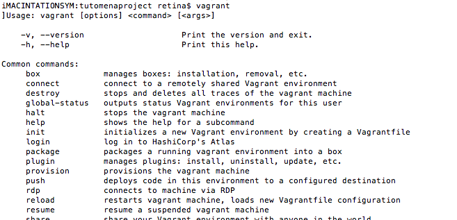
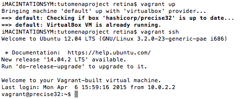
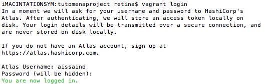
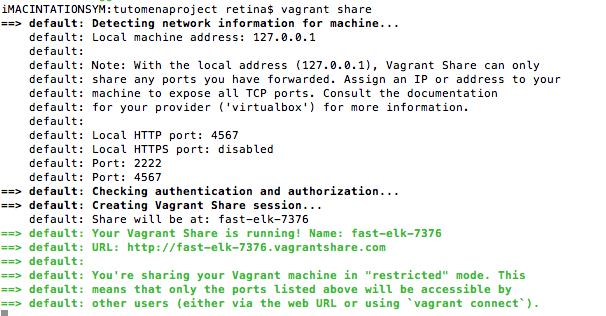

**Vagrant** هو برنامج يمكننا من إنشاء بيئات عمل موحدة "وهمية" (**virtual development environments**) ويستعين في ذلك بأحد برامج تنصيب الآلات الإفتراضية **Virtual machines** مثل **VirtualBox**، **VMware** وغيرها.

## لماذا Vagrant ؟

**Vagrant** أتى من أجل حل إحدى المشاكل التي لطالما كانت تواجه المطورين من حين لآخر، خاصة في المشاريع الجماعية التي يعمل عليها أكثر من فرد واحد، وهو مشكل اختلاف بيئات العمل من مطور لآخر فتجد مثلا أن هذه الجزئية من المشروع تعمل عند أحدهم ولكنها لا تعمل عند الآخر. كما أن **Vagrant** سيمكنك من إنشاء بيئة عمل بعيدا عن جهازك وقابلة للإستعمال المتكرر كلما احتجتها، أي أنك لن تكون مضطرا مثلا لتنصيب سيرفر محلي في جهازك من أجل العمل على مشروع PHP، فكل ما عليك فعله هو إنشاء بيئة عمل في **Vagrant** ثم تعمل عليها في كل مرة.

## تنصيب Vagrant

قبل الشروع في تنصيب **Vagrant** يتوجب علينا أولا تثبيت VirtualBox بعد تحميله من [هذا الموقع](https://www.virtualbox.org 'VirtualBox website')، بعد ذلك نقوم بتحميل **Vagrant** من [الموقع الرسمي للبرنامج](https://www.vagrantup.com 'Vagrant website') والشروع في تنصيبه بعد ذلك مباشرة.

## الخطوة الأولى

بعد تنصيب Vagrant، نقوم بفتح ال Terminal أو Command line ثم نقوم بتنفيذ الأمر التالي : vagrant، إذا ظهرت لك النتيجة كما في الصورة أسفله فهنيئا لك نجاح التنصيب.

[](../images/Capture-d’écran-2015-04-10-à-17.59.32.png)

_*إذا لم تحصل على نفس النتيجة كما في الصورة أعلاه، يرجى التأكد من إضافة Vagrant إلى المتغير PATH الخاص بنظام التشغيل الذي تعمل عليه._

الآن عليك إنشاء المجلد الذي سيضم مشروعك وسمه ماشئت، مثلا سنسميه في مثالنا tutomenaproject، ثم نقوم بالولوج إلى هذا المجلد عن طريق ال Command Line وتنفيذ الأمر vagrant init. بعد تنفيذ هذا الأمر مباشرة سيتم إنشاء ملف اسمه Vagrantfile داخل مجلد tutomenaproject وهو الملف المهم الذي سيحتوي على كل الترتيبات (configurations) التي تهم مشروعك.

## Boxes

إنشاء آلة افتراضية (Virtual Machine) من الصفر ليس دائما بالأمر السهل كونه سيكلفنا وقتا نحن في حاجة إليه فضلا عن صعوبة مشاركتها مع زملائنا في العمل، ولهذا قام Vagrant بإنشاء ما يسمى بال Boxes وهي صور لبيئات عمل موجودة سلفاً تُستعمل لإستنساخ (Clone) آلات افتراضية مطابقة لها وكما قلنا سلفا هي موجودة سلفا (غالبا) ولا حاجة لنا في إعادة إنشائها.

### 1.تنصيب البوكس Box

يمكننا تحميل البوكس Box عن طريق الأمر التالي vagrant box add hashicorp/precise32 بحيث hashicorp/precise32 هو اسم البوكس الذي سيتم تحميله من [هذا الموقع](https://atlas.hashicorp.com/boxes/search 'atlas.hashicorp.com') المعتمد من طرف Vagrant والذي يضم عشرات البوكسات Boxes وأنت حر في تحميل البوكس الذي يناسبك. (عملية التحميل قد تأخذ بعض الوقت، على حسب وزن البوكس).

> موقع Vagrantbox.es هو الآخر مميز ويضم العديد من بيئات العمل المختلفة Boxes ويمكنك استعماله أيضا في حال أردت تحميل إحداها.

### 2.تفعيل البوكس Box

نحن الآن قمنا بتحميل البوكس ولكن لم نقم بتفعيلها بعد، ولتفعيلها يجب إضافة الكود التالي للملف Vagrantfile الذي تم إنشاؤه سابقا.

```
Vagrant.configure("2") do |config|
config.vm.box = "hashicorp/precise32"
end
```

> إذا لم تقم بتحميل البوكس قبل إضافتها إلى ملف Vagrantfile فإن Vagrant سيقوم بتحميلها تلقائيا عند تشغيله.

## تشغيل بيئة العمل

حان الوقت لتشغيل بيئة العمل وذلك عن طريق تفعيل الأمر vagrant up دائما في ال Command Line وبعد ثواني معدودة ستكون قد ربطت الإتصال بالآلة الإفتراضية حيث تشتغل بيئة العمل، وللتأكد من ذلك تستطيع تنفيذ الأمر vagrant ssh وستستطيع بعد ذلك العمل مباشرة على الآلة الإفتراضية عن طريق ال Command Line أي أنك ستستطيع إنشاء ملفات جديدة هناك، تنصيب برامج جديدة إلخ ...

[](../images/Capture-d’écran-2015-04-14-à-16.04.50.png) vagrant up

## مزامنة المجلدات والملفات Folders synchronization

من الأشياء الجميلة في **vagrant** هي عملية المزامنة الموجودة بين مجلد المشروع على جهازك (tutomenaproject في مثالنا) ومجلد المشروع في الآلة الإفتراضية وهو المجلد /vagrant الذي يقوم برنامج **vagrant** بإنشائه تلقائيا بعد تنصيب بيئة العمل، أي أنك بمجرد إنشاء ملف اسمه مثلا index.html في مجلد tutomenaproject على جهازك سيقوم vagrant مباشرة بإضافة نسخة من هذا الملف إلى المجلد /vagrant على الآلة الإفتراضية.

وأي تغيير ستقوم به على الملف سيتم نسخه على الآلة الإفتراضية **Virtual Machine** مباشرة، أي أنك ستظل تعمل على جهازك كالعادة بالمحرر المفضل لديك، والبرامج التي تحبها وسيتولى **vagrant** الشق المتعلق بالآلة الإفتراضية.

## تموين الآلة الإفتراضية Provisioning

نفترض الآن أننا نريد تنصيب خادم محلي Local Server في آلتنا الإفتراضية، الطريقة المثلى لفعل ذلك هي إنشاء ملف من نوع sh نسميه مثلا bootstrap.sh وسيضم جميع الأوامر التي ستمكننا من تنصيب مختلف البرامج على الآلة الإفتراضية ( في حالتنا سنقوم بتنصيب ال Apache ) ثم نقوم باستدعاء هذا الملف في Vagrantfile كما يلي (السطر الثالث) :

```
Vagrant.configure("2") do |config|
config.vm.box = "hashicorp/precise32"
config.vm.provision :shell, path: "bootstrap.sh"
end
```

الآن كلما علينا فعله هو إعادة تشغيل Vagrant عن طريق الأمر vagrant up (أو vagrant reload --provision إذا كان Vagrant مشتغل أصلا) وبعد ذلك مباشرة سيتم تثبيت Apache 2 بنجاح في بيئة عملنا على الآلة الإفتراضية.

## Networking - فتح المشروع في بيئة العمل عن طريق Http

سيمكننا Vagrant من فتح مشروعنا على المتصفح باستعمال ال Port forwording الذي سيربط الإتصال بين متصفحنا وبيئة عملنا على الآلة الإفتراضية باستعمال بعض المنافذ (Ports) ويتم تفعيل ال Port forwording في ملف Vagrantfile كالتالي (السطر الرابع) :

```
Vagrant.configure("2") do |config|
config.vm.box = "hashicorp/precise32"
config.vm.provision :shell, path: "bootstrap.sh"
config.vm.network :forwarded_port, host: 4567, guest: 80
end
```

> بعد كل تغيير في ملف **Vagrantfile** لا تنسى تنفيذ الأمر vagrant up (أو vagrant reload إذا كانت الآلة مشتغلة) من أجل التحديث.
> الآن إذا فتحت الرابط `http://127.0.0.1:4567` في متصفحك سترى الصفحة الرئيسية لمشروعك رغم أنه لم نقم بتنصيب Apache على جهازنا.. هذه هي قوة وفاعلية **Vagrant**.

## المشاركة Sharing

الآن بعد أن فتحت مشروعك على المتصفح، قد ترغب، في مرحلة ما، بمشاركة رابط المشروع مع أحد زملائك أو العميل مثلا ودون أن تحتاج لرفع المشروع على السيرفر، الأمر بسيط مع Vagrant ، كل ما عليك فعله هو التسجيل (Login) باستعمال الأمر vagrant login وبعد ذلك سيطلب منك اسم المستخدم والإيميل ( نفس الإيميل والمستخدم الذي تستعملهما في موقع [HashiCorp's Atlas](https://atlas.hashicorp.com 'hashicorp Atlas')).

[](../images/Capture-d’écran-2015-04-14-à-18.47.56.png) vagrant login

بعد التسجيل، قم بتنفيذ الأمر vagrant share وسيقوم Vagrant بإنشاء رابط من أجلك (**http://fast-elk-7376.vagrantshare.com**) تستطيع إرساله لأي من أصدقائك وتستطيع فتحه في متصفحك كما تفتح أي رابط لموقع آخر! أليس هذا رائعا :)

[](../images/Capture-d’écran-2015-04-14-à-18.54.09.png) vagrant share

نحن الآن أنشأنا بيئة عمل متكاملة بعيدا عن جهازنا وقابلة للمشاركة، يكفي إرسال الملف Vagrantfile إلى زملائك حتى يقوموا باستنساخ بيئة عملك. تستطيع إضافة أي برنامج تحتاجه إلى بيئة عملك بنفس الطريقة التي أضفنا بها Apache 2 وإن كنت غير متخصص في التعامل مع أوامر الشيل سكريبت Shell Script فلا داعي للقلق هناك مواقع عدة تقوم بهذا نيابة عنك بحيث تمكنك من إنشاء بيئة العمل Box التي تناسبك وتحميلها ولعل أشهرها موقع [PuPHPet](https://puphpet.com/ 'PuPHPet')، مع العلم أنه هناك بعض من بيئات العمل الجاهزة مثل [Laravel/Homestead](https://atlas.hashicorp.com/laravel/boxes/homestead 'Laravel Homestead') للتعامل مع مشاريع Laravel وكذالك هناك بيئات عمل مصممة خصيصا من أجل مشاريع الووردبريس، يلزم فقط القليل من البحث لتجد ماتريد.

أتمنى أن يكون الموضوع مفيدا للجميع، ولا تنسوا أن أفضل طريقة للتعلم والفهم هي التطبيق والعمل. لا تترددوا في طرح استفساراتكم وملاحظاتكم أسفله، كما لا يفوتك الإشتراك في نشرتنا البريدية للتوصل بآخر الدروس والمقالات. السلام عليكم.
