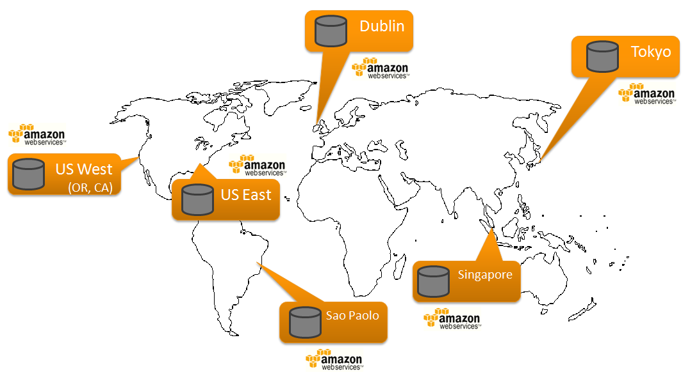
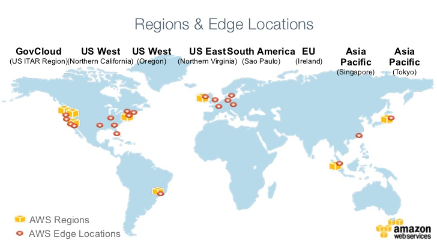

تعتبر خدمات الويب لأمازون Amazon Web Services الأكثر تطورا والأكثر استعمالا من طرف مختلف الفاعلين على الإنترنت من شركات ومطورين منذ ظهورها عام 2006، وتضم AWS حزمة من الخدمات والمنتجات لعل أشهرها منتجين اثنين : **S3** و **Cloudfront**.

## Amazon S3 - Simple Storage Service

كما يتضح من اسمها، هي بمثابة مساحة تخزين (قرص صلب مثلا) خاصة بك من أجل تخزين مختلف البيانات والملفات التي تود الإحتفاظ بها في مكان آمن ضامنا بذلك توفرها الدائم كما أن المساحة التخزينية غير محدودة، أما من ناحية الأسعار فهي رخيصة مقارنة بأنظمة التخزين الأخرى كونك تدفع فقط مقابل ما تستهلكه من مساحة (مابين 15 و20 سنتيما لكل جيغابايت). AWS ستعطيك حق اختيار المكان الذي تود أن تحجز فيه مساحتك التخزينية من بين عدة مراكز بيانات **Data centers** ضخمة منتشرة حول العالم (حوالي 6 مراكز في وقت كتابة هذه الأسطر كما يتضح في الصورة أدناه).

 AWS S3 Data centers

يمكنك مشاركة بياناتك المخزنة في **AWS S3** ( مساحتك التخزينية تطلق عليها أمازون اسم Bucket ) مع أصدقائك على شكل روابط، فإذا كان لديك موقع مثلا، يمكنك تخزين جميع الصور في S3 واستدعاؤها من موقعك بواسطة الرابط الذي تمنحه لك **AWS**.

## Amazon Cloudfront - Content Delivery Network

الآن افترض أنك قمت بحجز مساحتك التخزينية في مركز البيانات S3 الموجود في إيرلندا وهناك زائر لموقعك من أستراليا، من المنطقي إذن أن يصبح عنده وقت تحميل الصور أثقل مقارنة مع زائر من إيرلندا نفسها مثلا، أو مثلا نفترض أن هناك مئات الزوار في موقعك في نفس الوقت يقومون بزيارة نفس الصفحة هذا يعني أنه سيتم تحميل الصور أو ملفات ال CSS في هذه الصفحة مئات المرات ومن نفس المكان وهو قرصك الصلب الذي حجزته في مركز البيانات بإيرلندا. هنا ستظهر أهمية ال Cloufront حيث سيمكننا الأخير من إنشاء ما يسمى ب **Distributions** انطلاقا من مساحتك التخزينية الأصلية بإيرلندا وتقوم بعمل نسخ لبياناتك وملفاتك وتوزيعها على عشرات مراكز البيانات الأخرى وتسمى هذه المرة **Edge Locations**، وهكذا عندما يأتيك زائر من أستراليا فسيقوم أقرب مركز Edge Location بإجابته وإعطائه الملفات التي يريدها. في الصورة التالية ستجدون توزيع مختلف مراكز **Edge Locations** حول العالم دائما إلى حدود كتابة هذه الأسطر:

 AWS Edge Locations

مواقع ضخمة عديدة تستعين بخدمات AWS وخاصة خدمة التخزين S3 من بينها **Dropbox**، **Ubunto one** وموقع **أمازون** نفسه، وهذا ما يفسر نجاعة ونجاح  ثورة السحابيات Clouding التي بدأت منذ وقت ليس بالطويل وبالتالي وجب على المطور العربي أن يحاول مسايرة هذا الإيقاع السريع وألا ننتظر دائما اللحظة الأخيرة من أجل التقدم نحو الأفضل.
