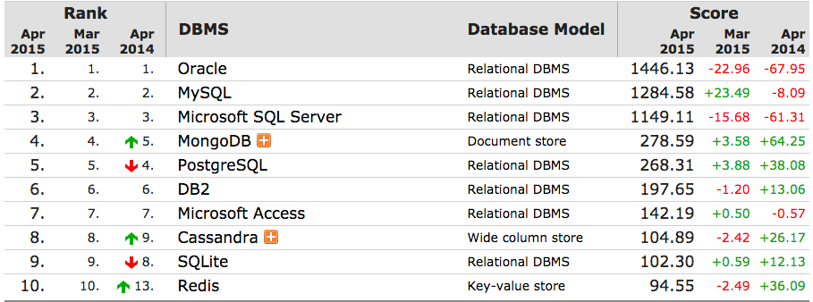

أن تصبح محترفا في مجال معين ليس بالأمر السهل، فالوصول لمستوى احترافي يتطلب الكثير من العمل والمثابرة حتى يصل الإنسان لدرجة الإتقان والإحتراف. ومجال الويب ليس استثناءً، فبعد 6 سنوات عملت فيها كمطور في أكثر من شركة اكتشفت أن على مطور الويب أن يندمج في وسط احترافي والإشتغال على مشاريع احترافية إذا أراد الإرتقاء بمستواه، فالإحتكاك بأشخاص أفضل منك وأكثر خبرة منك يجعلك ترتقي بمؤهلاتك بسرعة أكبر وتستفيد منهم وتتعلم.

هذا فيما يخص المطور أوالشخص نفسه، أما فيما يخص المؤهلات والأشياء التي يجب عليك تعلمها واتقانها إذا أردت أن تحترف مجال الويب بصورة حقيقية فأستطيع أن ألخصها لك في النقاط التالية :

## الخوارزميات Algorithm

الخوارزميات هي أساس كل كود برمجي، وهي تقريبا أول ما يجب على المبرمج الناشئ تعلمه وستكون له فيما بمثابة أرضية صلبة يقف عليها وتعينه على كتابة برمجيات وشيفرات احترافية ومثالية.

## HTML

لا يمكن تخيل الويب من دون HTML، فكل ما تراه في صفحات  المواقع على الإنترنت عبارة عن أكواد HTML، فهي تمكننا من عرض المعطيات والبيانات (من نصوص، صور، فيديوهات وغيرها ...) للمستعمل عن طريق المتصفح وتستعمل مجموعة من الوسوم (Tags) لهذا الغرض.

## CSS

بدورها تعتبر لغة CSS من الأساسيات التي يقوم عليها كل تطبيق ويب، عن طريقها نستطيع تنظيم مواقعنا أو تطبيقاتنا وإعطاؤها جمالية وحركية تظفي على التطبيق رونقا وجاذبية عالية، خاصة بعد ظهور النسخة الجديدة CSS3 الأكثر تطورا.

ويستحسن الإلمام بواحد من إطارات العمل التي ظهرت مؤخرا لتسهيل كتابة أكواد CSS ومنها **SASS**، **LESS**، و **Stylus**.

## JavaScript

منذ ظهور لغة الجافاسكريبت عام 1995 على يد **Brendan Eich** ودمجها فيما بعد في متصفح **Netscape**، شهدت هذه اللغة تطورا مذهلا حتى أصبحت اليوم مدعومة من طرف كل المتصفحات الكبيرة منها والصغيرة، ومنذ ظهور تقنية الأجاكس عام 2004 أصبح للجافاسكريبت نفوذ كبير في الويب بحيث يمكن اعتبارها اليوم أهم لغة برمجية لتطبيقات الويب والتي لا يوجد منافس لها.

كما أن ظهور مكتبة **jQuery** زاد من جاذبية وقوة وسهولة استعمال هذه اللغة وهنا لا تفوتني الإشارة إلى ضرورة تعلم استعمال الجيكويري فناذرا ما نجد موقعا أو تطبيقا على شبكة الإنترنت لا يقوم باستعمال هذه المكتبة.

## PHP

تعتبر لغة البرمجة **PHP** الأكثر استعمالا حاليا في تطبيقات الويب (الواجهات الخلفية Server Side)، هذه اللغة تمكننا من انشاء صفحات ويب ديناميكية، فكما قلنا سابقا ال **HTML** تقوم فقط بتقديم البيانات بشكل ساكن فهي مثلا لا تمكننا من عمل عمليات حسابية أوعمل طلبيات للخادم لجلب البيانات، وبالتالي فإن PHP تقوم بجلب البيانات من الخادم Server وعرضها على شكل أكواد HTML.

العديد من اللغات الأخرى دخلت في منافسة ضارية مع PHP مثل لغة **Python**، **Ruby**، و **Java** ولكن مازالت لغة الفيل هي المتسيدة بشكل واضح فيكفي أن منصات واسعة الإنتشار مثل ووردبريس ودروبال تعتمد عليها كما أن مواقع عالمية كالفيسبوك، ويكيبيديا وحتى غوغل اعتمدت عند إنشائها على لغة ال **PHP**.

في المجال الإحترافي، لايتم عادة اللجوء للعمل ب PHP من الصفر، بل يتم الإستعانة بإطارات عمل جاهزة تساعدنا في عمل تطبيقات احترافية آمنة ومن أشهر هذه الإطارات نجد **Symfony 2**، **Laravel** و **Zend Framework 2**. كمايتم الإستعانة أيضا حسب الحاجة بأنظمة إدارة المحتوى (CMS) كووردبريس ودروبال.

## قواعد البيانات Databases

من الأحسن الإلمام بأكواد لغة SQL فغالبية أنظمة قواعد البيانات مثل MySql و Oracle تعتمد على هذه اللغة، للأمانة لن تقوم باستعمالها كثيرا في العمل لأن أي إطار عمل قد تعمل به الآن يقوم بعملية تجريد (Abstraction) لقاعدة البيانات أي أنك تستطيع جلب البيانات والتعديل عليها باستعمال كلاسات جاهزة ومن دون كتابة أي كود SQL.

هناك أيضا بعد أنظمة قواعد بيانات لا تعتمد على SQL وتسمى NOSQL Databases وأشهرها على الإطلاق MangoDB الذي يحتل الآن المركز الرابع من بين جميع الأنظمة الأخرى بما فيها SQL Databases (بعد Oracle، MySQL و MS Sql Server). هذه النوعية من أنظمة قواعد البيانات تكتسب شعبية يوما بعد يوم، وتستعمل بكثرة خاصة مع تطبيقات **Nodejs**.

## ووردبريس WordPress

يستحسن على مطور الويب أن يتقن **برنامج إدارة المحتوى (Content Management System)** ووردبريس، هذا الأخير يمكننا من عمل مواقع إلكترونية متطورة بمجهود أقل، ولعل العامل الذي يعطي لهذه المنصة كل هذه القوة والسمعة هو الدعم الكبير الذي تلقاه من طرف مجتمع ووردبريس الذي يضم آلاف المطورين والمستعملين حيث يكون من السهل عليك الحصول على المساعدة في حال واجهت إشكالا ما. كما أن ووودبريس يتوفر على آلاف الإضافات تجعل منه أكثر قوة واكتمالا.

## Angular - Backbone - Ember

هذه تقريبا هي أقوى مكتبات الجافاسكريبت الموجودة حاليا لإنشاء تطبيقات الويب أحادية الصفحة (**Single Page Applications**) والتي نعتمد فيها غالبا على تقنية الأجاكس. عليك اختيار واحدة منها وتعلمها ومن ثم اتقانها حتى تستطيع استعمالها بكل يسر في مشاريع من هذا النوع والتي يزداد الطلب عليها يوما بعد يوم.

## NodeJs

NodeJs هي منصة وليست لغة برمجة، قام مطوروها بإنشائها من محرك الجافاسكريبت V8 (الذي يستعمل في متصفح غوغل كروم) وتمكننا من تشغيل أكواد الجافاسكريبت على غير المعتاد خارج المتصفح، أي أننا أصبحنا قادرين على إنشاء تطبيقات تتعامل مع الخادم باستخدام أكواد الجافاسكريبت. حاليا ليس عليك الإلمام التام ب NodeJs (إلا إذا أردت الإختصاص فيه) ولكن عليك فقط استيعاب مفهومه وكيفية تنصيبه لأن العشرات من الوحدات Modules التي تعتمد على NodeJs أصبح ضروريا لكل مطور أن يقوم باستخدامها في مشاريعه، ولعل أهمها:

### Grunt Js

**Grunt** هو واحد من أهم الأدوات التي تعتمد على Nodejs والتي يجب على كل  مطور أومبرمج أن يقوم بتحميلها واستعمالها فهي تمكننا من عمل العديد من العمليات التي نقوم بتكرارها عادة بكبسة زر كضغط ملفات ال CSS والجافاسكريبت أو تحويل أكواد SASS إلى CSS وغيرها من الخطوات التي يكررها المطور في كل مشاريعه والكفيلة بالرفع من انتاجيته وجودة عمله.

### Bower

**Bower** كذلك هو أداة هامة تعطينا إمكانية تحميل جميع المكتبات والسكريبتات (المتعلقة بالواجهة الأمامية) بسهولة تامة دون اللجوء لموقع كل مكتبة لتحميلها في كل مشروع وهي عملية قد تأخذ منا وقتا ثمينا خاصة إذا كان عدد المكتبات كبيرا.

### Browserify

إذا كنت من المطورين الذين يولون لتنظيم الكود أهمية كبيرة فإن **Browserify** سيفي لك بالغرض كون يمكنك من تقسيم وتنظيم أكواد الجافاسكريبت الخاصة بك على شكل وحدات متناغمة فيما بينها وتتخصص كل واحدة منها في شيء معين.

## Git

غالبا ما يتم العمل على مشروع واحد من طرف عدة مطورين، وبالتالي وجب إيجاد وسيلة تمكنهم من جمع الأكواد وربط ودمج كل المهام المنجزة في نقطة واحدة، و **Git** هو أفضل من يقوم بهذه المهمة إضافة لكونه يمكننا من إيداع مشاريعنا في مستودعات من أجل تفادي ضياع الأكواد والملفات في حال حدث عطل ما في جهاز المطور، ومن أفضل وأكثر هذه المستودعات شهرة نجد Bitbucket، Github و Gitlab.

ومن غير الوارد أن تجد شركةً لبرمجيات الويب لا تعمل ببرنامج لإدارة النسخ مثل **Git** أو أحد منافسيه الآخرين نذكر منهم على سبيل المثال **SVN** و **Mercurial**.

## مهارات التواصل

التواصل مهم جدا وهي نقطة قوة كبيرة عند المطور الذي استطاع اكتساب هذه المهارة، فأنت بحاجة لمهارات تواصلية مهمة عند الإتصال بالعميل أوالزبون. ففي بعض الأحيان يطلب منك الأخير إنجاز مشروع بواسطة تقنية معينة ولكنك ربما قد لا تتقن هذه التقنية وحينذاك يتوجب عليك إقناعه بتقنية أخرى بديلة تتقنها وتقوم بنفس العمل وتستطيع بها انجاز مشروع مميز كما ينتظره العميل. إنها قوة الحجة وسرعة البديهة التي يكتسبها المطور مع مرور الزمن وتراكم الخبرات.

هذه جملة التقنيات والأدوات **الأساسية** التي تخول لمن يتقنها إيجاد فرصة لدخول ميدان الشغل في هذا المجال من بابه الواسع، وكما نقول دائما فأفضل وسيلة للتعلم هي التطبيق والعمل وليس التنظير فقط، فكم من برنامج أو لغة برمجة كانت دائما تبدو لنا صعبة الميراس ولكن عندما اقتحمناها وعملنا عليها تطبيقات استطعنا ترويضها واكتشافها وأزحنا بيننا وبينها ذلك الجدار الذي منعنا ذات يوم من فهمها وتعلمها.
