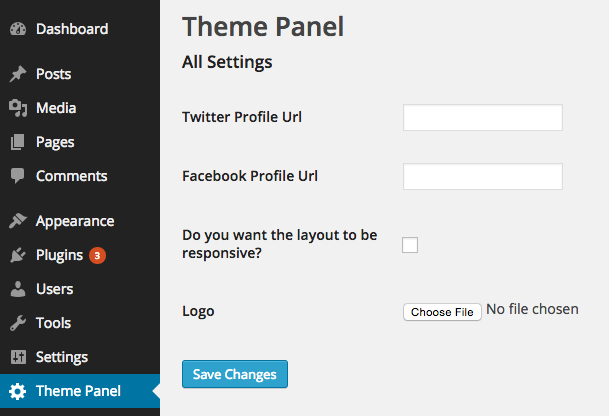

يعتبر الووردبريس WordPress نظام إدارة المحتوى **Content Management System** الأكثر استعمالا على شبكة الإنترنت نظرا لسهولة استعماله ومجتمع هائل يدعمه، كما أن من بين أسباب الشعبية الكبيرة التي يحظى بها هذا البرنامج هو العدد الضخم من الإضافات (40 ألف إضافة أو يزيد) والقوالب التي تجعل منه أكثر قوة واكتمالا. وتعتبر كلمة WordPress هي الأكثر تداولا في محرك البحث غوغل من بين نظيراتها كدروبال وجوملا على سبيل المثال كما يوضح الرسم البياني التالي من خدمة Google Trends.

<script src="//www.google.com/trends/embed.js?hl=en&amp;q=wordpress,+drupal,+joomla&amp;tz=Etc/GMT-1&amp;content=1&amp;cid=TIMESERIES_GRAPH_0&amp;export=5&amp;w=700&amp;h=330" type="text/javascript"></script>

لهذا أي المبرمج فووردبريس يمثل فرصة جيدة لاستثمار مهاراتك البرمجية فهو يوفر فرص شغل جيدة وإذا تعلمت الأمور والتقنيات التي سنذكرها ستصبح إن شاء الله مطور **ووردبريس** **WordPress Developer** ناجح ومتمكن.

## 1\. Hooks

يمكنك أن تعتبر **مجازاً**  الهوكس Hooks بمثابة الأحداث Events في ووردبريس، فهي تمكننا من إضافة أوتغيير أشياء في وقت ومكان محدد. هناك نوعان من الهوكس Action Hooks و Filter Hooks، ويمكننا بيان الفرق بينهما بهذه الجملة : Filter Hooks تعمل أشياء و Action Hooks تغير أشياء (Action Hooks Do Things, Filter Hooks Change Things ).

لنفرض مثلا أنك تريد إرسال إيميل لأصدقائك في كل مرة تقوم فيها بنشر مقال جديد لإعلامهم بجديد مدونتك، publish_post هو ال Hook الذي ستحتاجه في هذه الحالة وهو من نوع ال Action Hooks ويقوم بعملية الإرسال عند نشر المقال كما في المثال التالي :

```php
class emailer {
  static function send($post_ID)  {
      $friends = 'bob@example.org,susie@example.org';
      mail($friends,"sally's blog updated",'I just put something on my blog: http://blog.example.com');
      return $post_ID;
  }
}

add_action('publish_post', array('emailer', 'send'));
```

وربما تود أن تنوه زوارك في نهاية كل مقال على مدونتك إلى ضرورة الإشتراك في نشرتك البريدية دون أن تضطر إلى إعادة كتابة هذه الجملة أسفل كل منشور أو مقال. the_content هو ال Filter Hooks الذي سيقوم بهذا العمل نيابة عنك، المثال التالي سيوضح لك المسألة :

```php
add_filter( 'the_content', 'subscribe_newsletter_after_content' );

function subscribe_newsletter_after_content( $content ) {
    if ( is_singular('post') ) {
        $msg = 'المرجو الإشتراك في نشرتنا البريدية. شكرا.';

        $content = $content . $msg;

    	}

    return $content;

}
```

هكذا ستظهر رسالة طلب الإشتراك أسفل كل منشور من منشوراتك دون أن تكتبها في كل مرة. الفيلتر the_content هنا غير نص المقال وأضاف فيه أشياء أخرى وهذا هو معنى الجملة التي ذكرناها سابقا (Action Hooks Do Things, Filter Hooks Change Things ).

ال Hooks من الأمور الضرورية والأساسية في ال **[WordPress Plugin API](http://codex.wordpress.org/Plugin_API)** والووردبريس ككل، ولو أردت يوما ما كتابة أو تطوير إضافة خاصة بك فبالتأكيد ستظطر لاستعمالها.

## 2. Shortcodes

محرر الووردبريس لايمكنك من كتابة أكواد PHP لجلب بيانات أو التحكم فيها، لهذا تمكنك **[Shortcode API](https://codex.wordpress.org/Shortcode_API)** من كتابة مجموعة من الدوال في أحد الملفات واستدعاء مخرجاتها عن طريق shortcode في محرر (Editor) الووردبريس (صفحة أو بوست).

```php
function tutomena_youtube($atts, $content=null){

    extract(shortcode_atts( array('id' => ''), $atts));


    $iframe = '<iframe width="560" height="349" src="http://www.youtube.com/embed/' . $id . '" frameborder="0" allowfullscreen></iframe>';

    return $iframe;

}
add_shortcode('youtube', 'tutomena_youtube');
```

في المثال أعلاه قمنا بكتابة ... بسيط لعرض فيديو من اليوتيوب في أي صفحة باستعمال الرمز التالي : [youtube id="yOR1gTk8H9U"] تضعه في محرر الووردبريس وسيظهر لك الفيديو في الصفحة بعد الحفظ والتحديث بحسب البارامتر id الذي تعطيه للشورتكود youtube.

هذه فقط نقطة من بحر ما يمكن أن نصنعه بهذه التقنية المهمة في الووردبريس.

## 3. Widgets

ال Widgets موضوع مهم جدا بدوره، هناك عدة widgets تأتي مع الووردبريس عند تنصيبه مثلا Text Widget تمكنك من عرض نص في المكان الذي تريد على موقعك، وتمكنك ال widgets API من تطوير widget خاصة بك تجلب البيانات التي تريدها أنت، مثلا ويدجيت يقوم بجلب آخر التغريدات من حسابك على تويتر.

لا أريد أن أجعل الدرس طويلا ولذلك لن أعطي أمثلة هنا، عوضا عن ذلك يمكنك الإطلاع على الرابط الرسمي ل [WordPress Widgets API](https://codex.wordpress.org/Widgets_API).

## 4. Settings API

ربما هي الواجهة الأكثر أهمية في **WordPress Plugin API**، إذا تعملت كيفية التعامل معها سأقول لك مبروك أنت مطور ووردبريس متميز وقادر على صنع أي شيء تريده في نظام إدارة المحتوى هذا. تمكننا ال [Settings API](https://codex.wordpress.org/Settings_API) من إنشاء صفحات في لوحة التحكم خاصة باستقبال وتخزين البيانات، ولهذا فSettings API هي أساس كل إضافة من إضافات (Plugins) ووردبريس المعروفة مثل Yoast، WP Super Cache وغيرها...

[](../images/1432142503theme-settings-api-5-logo.png) في الوهلة الأولى ربما يبدو لنا أنه صعبٌ تعلمُها، ولكن كما نقول دائما : لا صعب مع التطبيق :) ، حاول القيام بأمثلة تطبيقية وبعدها ستجد نفسك متقنا لها وبارعا في استخدامها.

## 5. WP_Cron

تمكننا هذه الدالة من جدولة scheduling حدث Event معين واستدعاؤه بطريقة أوتاماتيكية مرات عديدة (كل ساعة أو كل يوم مثلا). يمكننا مثلا استعمال هذه الدالة في عمل Back Up لموقعنا نهاية كل يوم وتحديدا في الليل مثلا.

## خاتمة

ووردبريس نظام إدارة محتوى قوي ويتوجب عليك كمطور أن تتقن كيفية التعامل معه إتقانا تاما حتى تستطيع حجز مكان لك في ميدان الشغل وتحقيق التميز الخاص بك، ولكي أحفزك أكثر حاول إلقاء نظرة على موقع [Themeforest](http://themeforest.net/) حيث تباع قوالب ووردبريس وشاهد الأرباح الهائلة التي يحققها المطورون من هذه التجارة.
