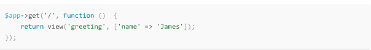

يعتبر **لومن Lumen** من إطارات العمل التي ظهرت مؤخرا على يد فريق لارافيل **Laravel** المعروف. قد تتساءلون لماذا يقوم هذا الفريق بتطوير إطار عمل ثاني مادام هنالك الفريم وورك الدائع الصيت لارافيل، الجواب هو أن لومن يختلف عن لارافيل، إنه إطارعمل صغير Micro-Framework طور خصيصا للتطبيقات الصغيرة والبسيطة مثل ال APIs و Web Services.

هناك عدة إطارات عمل مصغرة ظهرت في الآونة الأخيرة لعل أبرزها Slim و Silex وهما المنافسات المباشران للومن Lumen الذي يتفوق عليهما في السرعة حيث يستطيع القيام ب 1900 طلب في الثانية (Requests per second) حسب [الموقع الرسمي للومن](http://lumen.laravel.com/)، مقابل 1800 ل **Slim 3** و 1000 ل **Silex**.

يتوفر لومن على العديد من الميزات الموجودة في لارافيل، مثل Middlewares، Eloquent، Caching، Routing وغيرها، ولن تظطر لعمل أي ترتيبات (Configurations) تذكر للبدء في العمل، تنصيب هذا الإطار من أسهل ما يكون.

الشيء الإيجابي الآخر في لومن هو أنك تستطيع تحويل مشروعك عليه إلى مشروع **لارافيل** Laravel في أي وقت تريده من دون تعقيدات كل ما عليك فعله هو نسخ ملفاتك من لومن ولصقها في مشروع لارافيل الجديد.
