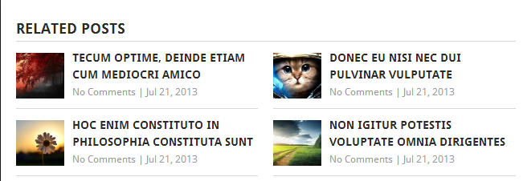

ملايين الأشخاص حول العالم يستعملون نظام إدارة المحتوى **ووردبريس** في مدوناتهم ومشاريعهم الإلكترونية، حيث يعتبر هذا النظام هو الأكثر شعبية من بين جميع أنظمة إدارة المحتوى الأخرى. هذه الشعبية لم تأتي من فراغ، فووردبريس يقف خلفه مجتمع نشيط يقدر عدد أعضائه بمئات الآلاف إن لم يكن بالملايين، يساهمون بتطوره ودفعه نحو الأمام خاصة عبر تطوير عدد من الإضافات (Plugins) يقدر عددها بالآلاف والتي تزيد من إمكانيات ووردبريس وتجعله قادرا على فعل كل الأشياء (تقريبا) التي تتبادر إلى ذهنك.

في هذا المقال نستعرض لكم أهم 10 إضافات لووردبريس، لايكاد يستغني عنها أي مبرمج أو مدون في مشاريعه :

## 1\. Akismet

تعمل [هذه الإضافة](https://wordpress.org/plugins/akismet/) على حماية مدونتك من تعليقات السبام حيث تقوم بفحص جميع التعاليق المرسلة وإشعارك بالأمر في حالة الإشتباه بوجود شيء غير عادي.

## 2. Wordpress Seo by Yoast

[هذه الإضافة](https://wordpress.org/plugins/wordpress-seo/) ممتازة، لا يكاد يخلو منها أي موقع مدعوم من الووربريس، وتساعد على إعداد مقالاتك من أجل تحسين وضعيتها على **محركات البحث** (**Natural SEO**).

## 3. WooCommerce

تمكنك [هذه الإضافة](http://www.woothemes.com/woocommerce/) القوية من إنشاء متجر إلكتروني متكامل داخل الووردبريس، ويعتبر واحدا من [أكثر حلول التجارة الإلكترونية](http://www.tutomena.com/blog/open-source-ecommerce-cms/) استعمالا في الشبكة العنكبوتية بعدد تحميلات من [الموقع الرسمي](http://www.woothemes.com/woocommerce/) فاق 9 ملايين تحميل.

## 4. Contact Form 7

تستطيع باستعمال [هذه الإضافة](https://wordpress.org/plugins/contact-form-7/)، إنشاء نماذج أو استمارات اتصال Contact Forms متكاملة بخطوات بسيطة ومن دون مهارات برمجية خاصة.

## 5. WP Super Cache

على عكس بعض أنظمة إدارة المحتوى الأخرى مثل دروبال، لا يتوفر ووردبريس على نظام افتراضي لإدارة الكاش Cache ولهذا يتوجب عليك البحث عن حل لهذا النقص خاصة إذا كان موقعك ضخما ويستقبل عدد زوار كبير، ولعل [WP Super Cache](https://wordpress.org/plugins/wp-super-cache/) من أفضل الإضافة الموجودة من هذه الناحية. وشخصيا أستعملها في عدد من مشاريعي الإحترافية.

## 6. WordPress Importer

تمكنك [هذه الإضافة](https://wordpress.org/plugins/wordpress-importer/) من جلب بياناتك أو أي بيانات افتراضية (تعليقات، مقالات...) انطلاقا من ملف خارجي من نوع XML أو JSON مثلا.

عند شرائك مثلا قالباً من موقع [themeforest.net](http://themeforest.net/) فهم لا يرسلون لك معه ملف قاعدة البيانات، بل يقومون بإرسال ملفات من الأنواع التي ذكرناها تحتوي على عدد من المعطيات الإفتراضية كالمقالات والتعاليق والتصنيفات (Categories) والوسوم (Tags) إلخ ... وتقوم آنذاك باستيرادها عن طريق WordPress Importer.

## 7. WP-PageNavi

تمكنك [هذه الإضافة](https://wordpress.org/plugins/wp-pagenavi/) من وضع نظام لتعدد الصفحات (Pagination) في موقعك، فووردبريس لا تتوفر على نظام افتراضي من أجل هذا، فكل ما تقدمه لنا في البداية هو تعدد صفحات تقليدي يمكنك من الإنتقال للمنشور التالي أو السابق من دون ترقيم للصفحات كما هو معتاد رؤيته في معظم المواقع.

## 8. Yet Another Related Posts Plugin

قد ترغب في إضافة قائمة لعدد من المواضيع المتعلقة أسفل كل مقال من مقالات مدونتك، [هذه الإضافة](https://wordpress.org/plugins/yet-another-related-posts-plugin/) تمكنك من فعل هذا بكل بساطة وتربح بذلك زيادة في عدد زوار المدونة.

## 9. NextGen Gallery

[هذه الإضافة](https://wordpress.org/plugins/nextgen-gallery/) مهمة وفعالة في حالة ما إذا أردت إضافة عدد من الصور لموقعك وعرضها بالشكل الذي يروق لك.

## 10. WP-DB-Backup

مهما بلغت جودة الإستضافة التي تتعامل معها فلا يمكن أبدا الجزم بعدم تعرضها للإختراق يوما ما، لذلك من الضروري اتخاذ التدابير اللازمة في حال وقع حدث ما، ولعل أهم ما يمكنك فعله هو عمل Back Up لموقعك بشكل **دوري** وهناك عدد من الإضافات التي تمكنك من فعل هذا بضغطة زر من أهمها [WP-DB-Backup](https://wordpress.org/plugins/wp-db-backup/).
