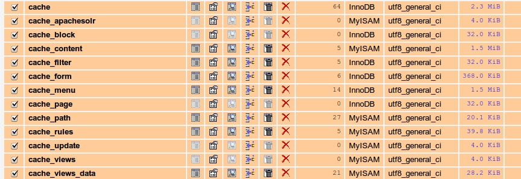

عندما نتكلم عن **ووردبريس** و**دروبال** فإننا نتكلم عن اثنان من أكبر أنظمة إدارة المحتوى (Content Management Systems) الموجودة حاليا، ولطالما شكلا منصتين تبنى عليهما آلاف بل ملايين التطبيقات والمواقع على شبكة الإنترنت.

وكما هو معتاد دائما، فالمقارنة بين العملاقين حاصلة لامحالة، فسؤال **ماهو أقوى نظام إدارة محتوى** دائما يطرح لدى المهتمين والشغوفين بالمجال، ولكني أجد هذا السؤال غير قابل للإجابة لأنه وببساطة ليس هناك طرف أفضل من الآخر فلكل منهما نقاط قوة ونقاط ضعف، وبالتالي أرى بأن السؤال يلزم إعادة طرحه على النحو التالي : **ماهو نظام إدارة المحتوى الذي يستجيب أكثر لفكرة موقعك ويتناغم مع متطلباتها ؟** هذا التساؤل أقرب للمنطق وأكثر قابلية للنقاش من غيره.

## لماذا المقارنة ؟

- كل من ووردبريس ودروبال مفتوحي المصدر، أي أنه يمكنك تحميلهما وتنصيبهما مجانا وهذا ما يفسر نجاحهما الكبير في السوق.
- هما نظامي إدارة المحتوى اللذان يستحوذان على حصة كبيرة في سوق أنظمة إدارة المحتوى.
- الإثنين يتوفران على مجتمع دعم كبير ونشيط يتكون من عشرات الآلاف من المطورين المتطوعين والمحترفين.
- ووردبريس ودروبال يحضيان بعدد هائل من القوالب المجانية الجاهزة للإستخدام، إضافة لعدد كبير جدا من الإضافات التي تضيف القوة والمرونة لكل واحد منهما.

### ووردبريس في أرقام

- أكثر من 35.000 إضافة مجانية متاحة للجميع.
- تم تحميل ووردبريس أزيد من 145 مليون مرة من موقعه الرسمي.
- أزيد من 2500 قالب مجاني للتحميل.

### دروبال في أرقام

- أكثر من 15.000 إضافة مجانية للتحميل.
- ما يزيد على 16 مليون تحميل لدروبال من موقعه الرسمي.
- حوالي 2000 قالب مجاني للتحميل.

نلاحظ أن كلا النظامين يمتلكان أرقاما مهمة تجعلنا ندخل في هذه المقارنة رغما عنا، ولهذا الغرض سنضع معايير لنبني عليها هذه المقارنة :

## سهولة الإستعمال

هذا عامل حاسم من أجل الإختيار، فإذا كنت غير مؤهل تقنيا وغير ملم ببرمجيات الويب فإن **ووردبريس** قد يكون خيارك الأفضل نظرا لبساطة واجهته الخلفية (BackEnd) وسهولة استعماله، عكس **دروبال** الذي دائما ما يتطلب قدرا من الإلمام التقني من جانب المستعمل. مع الووردبريس تستطيع بدء تدويناتك مباشرة بعد تنصيبه باستعمال محرر **WYSIWYG** وذلك بسهولة تامة.

نقطة أخرى تلعب لصالح ووردبريس في هذا الصدد وهي حجم المجتمع الداعم له (Support Community)  والذي يعتبر ضخما، وهذا جيد لأنك ستجد دائما نفسك أمام آلاف المقالات والدروس التعليمية وحل الإشكاليات التي قد تقع فيها في يوم من الأيام. دروبال يتمتع كذلك بمجتمع  ومتابعين أعدادهم كبيرة جدا ولكنها تبقى أقل من نظيراتها لدى ووردبريس.

## القابلية للتخصيص والتعديل

الطريقة المثلى للتعديل على موقعك أو مدونتك هي عن طريق الإضافات (**Plugins**) أو القوالب (**Themes**) التي تمكنك من الحصول على موقع يستجيب لكامل تطلعاتك ومتطلباتك دون المس بنواة النظام (Core)، **ووردبريس** في هذا الجانب يبدو قويا للغاية فهو كما أسلفنا الذكر مدعوم بأكثر من 35.000 إضافة مجانية إلى جانب آلاف القوالب المجانية كذلك، هذا دون صرف النظر عن مئات الإضافات والقوالب الغير مجانية والتي يمكنك شراؤها بأسعار أقل ما يقال عنها أنها في متناول الجميع.

[caption id="attachment_392" align="alignnone" width="759"] بعض القوالب المدفوعة على موقع Themeforest.net\

**دروبال** يتبنى مقاربة مختلفة نوعا ما عن ووردبريس في هذا الجانب، فهو يعتمد على الوحدات (**Modules**) عوض الإضافات (Plugins) في مبدأ التعديل على القوالب والمواقع، إنه يتوفر على عدد كبير من الوحدات الرائعة والعملية ولكنها في كثير من الأحيان تكون مدفوعة غير مجانية.

كما أنك تستطيع إيجاد عددا من القوالب المجانية لدروبال ولكنك كمستعمل عادي قد تكون في حاجة لخدمات أحد المتخصصين للتعامل معها والتعديل عليها كما يحلو لك.

## التكلفة

من المعروف أن المبالغ المالية المخصصة لمشاريع دروبال تكون عادة أعلى من تلك المخصصة لمشاريع ووردبريس، فمطور متخصص في دروبال دائما ما يعمل بأجر أعلى نظرا لكون مشاريع دروبال عادة أكبر وأكثر تعقيدا من نظيراتها في ووردبريس، كما أن المدة الزمنية التي ينجز فيها مشروع دروبال دائما ما تكون أكبر. ولكن لاتنسى أنه إذا ما بلغ موقعك مستوى محددا من الضخامة يصبح من اللازم تغيير استضافتك إلى ما هو أقوى وأسرع كون ووردبريس في الأصل لم يتم تطويره ليستوعب المشاريع الضخمة فهو مجرد منصة للتدوينات وكلما تم استعمال إضافات أكثر معه كلما زاد بطؤ الموقع ونقصت سرعته، وهذه النقطة في غاية الأهمية من ناحية "**السيو الطبيعي**" **Naturial SEO**.

## الأمان

في هذه النقطة يتفوق دروبال بشكل واضح على ووردبريس، وهي نقطة مهمة للغاية. فاستعمال الإضافات بكثرة مع ووردبريس يعرض موقعك للوقوع في ثغرات أمنية قد تكون خطيرة خاصة إذا لم يتم تحديثها باستمرار أو إذا كانت من مصادر غير احترافية أو تستعمل أكوادا قديمة لم يعد ينصح بها خبراء الووردبريس، هذا دون نسيان تحديث ووردبريس نفسه باستمرار كلما ظهرت نسخة جديدة.

وقد تكون هذه النقطة هي السبب الذي يجعل معظم المواقع الحكومية الحساسة تستعين بدروبال في مواقعها الرسمية عوض ووردبريس وغيره.

## ماذا يفضل محرك البحث غوغل؟

كلا المنصتين تبدوان صديقتين لمحركات البحث، ولكن كما أسلفنا الذكر كلما كبر الموقع وازداد محتواه وتضخم كلما تفوق دروبال على وودربريس في الأداء، فالأول جاء ومعه نظام كاش Cache System افتراضي وبالتالي فسرعة تحميل الصفحات والمحتويات عنده تكون أعلى مقارنة بووردبريس الذي لا يحمل معه نظام كاش افتراضي ولكن فقط إضافات تحاول ملئ هذا الفراغ ولعب هذا الدور وقد نجحت في هذا إلى حد ما.

[caption id="attachment_394" align="alignnone" width="863"] عند تنصيبك دروبال ستجد في قاعدة البيانات هذه الجداول الخاصة بنظام الكاش\

وكما يعرف الجميع فغوغل يحب المواقع السريعة والتي تتجاوب بسلاسة مع الزوار، فإذا كان موقعك ذو محتوى غزير ويتجاوب بسرعة مع زواره فأنت قد ربحت التحدي وأصبحت صديقا لغوغل!

## ماذا تختار؟

أظنك الآن أصبحت قادرا أكثر على فهم الإشكالية، فالسؤال ليس هو من الأفضل ومن الأسواء، ولكن فقط هي مسألة احتياجات العميل، فإذا كنت تريد بناء موقع صغير إلى متوسط أو منصة نشر فأنصحك باختيار **وودربريس** مالم يكن هناك مانع آخر، أما إذا كان موقعك كبيرا وموجها لجمهور غفير وتفاعل كبير أيضا فأنصحك باختيار **دروبال** فهو أقرب لتلبية حاجياتك مع العلم أنه سيتطلب منك استثمارا ماليا أكبر ولكن معه بالمقابل نتائج سارة.
