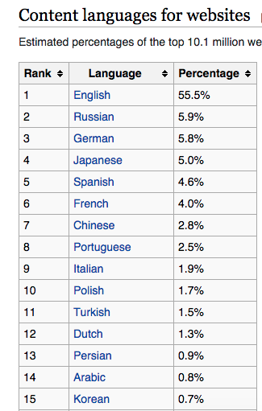

يبلغ تعداد العرب ما يقارب 350 مليون نسمة، ويحتلون مساحة جغرافية واسعة تمتد من شبه جزيرة العرب إلى المحيط الأطلسي هذا دون احتساب ملايين العرب الآخرين الذين يعيشون في الدول الغربية. لكن رغم هذه الأرقام والمعطيات لا يخفى على أحد منكم النقص الكبير في المحتوى العربي على شبكة الإنترنت وخاصة ما يهمنا في هذا المقام : **المحتوى التقني**.

ولهذا يتساءل المرء عن أسباب هذا التخلف الكبير في هذا المجال، وسنحاول معا فهم الأسباب التي أدت بنا إلى هذه الوضعية، وهنا لا يفوتني أن أدعوكم للمشاركة في التعليقات أسفله، حتى نحاول إصلاح أوضاعنا والإرتقاء بلغة الضاد في الشبكة العنكبوتية.

تحتل اللغة الإنجليزية صدارة اللغات الأكثر استعمالا على الإنترنت بنسبة 55% بينما تقبع اللغة العربية في المركز 14 بنسبة ضئيلة لا تتجاوز 0.8% حسب [موسوعة ويكيبيديا](https://en.wikipedia.org/wiki/Languages_used_on_the_Internet)، وما يثير الدهشة أكثر هو أن المحتويان التركي والفارسي يتفوقان على العربي رغم أن عدد الذين يتكلمون التركية في العالم لا يتجاوزون 85 مليون نسمة، نفس الشيء بالنسبة للفارسية.

 اللغة الأكثر حضورا على الإنترنت

هذا يؤكد أن المشكلة ليست في العدد وإنما في نوعية الإنسان نفسه، فما هي إذن صفات الإنسان العربي التي تمنعه من مشاركة ما تعلمه مع الآخرين ؟

## 1.التكاسل

أعتقد أن التكاسل من أكثر الصفات التي تقف في وجه المواطن العربي وتمنعه من مشاركة أبحاثه ومهاراته مع الجمهور على الإنترنت، فكما يوجد لدينا أزمة في القراءة يوجد لدينا أيضا أزمة في الكتابة، وكل هذا مرده إلى التكاسل والتقاعس بينما في المقابل تجد المواطن الأمريكي مثلا يفتتح مدونة ينشر عليها مقالاته وبحوثه فقط من أجل الإحساس بمتعة المشاركة مع الآخرين فمنهم من لا تجد على مدونته أي إعلان فلا يهمه الربح بقدر ما يهمه المشاركة والتفاعل مع أبناء جلدته.

## 2.عدم التفاعل

في بعض المرات تجد فيديو على اليوتيوب وصل عدد مشاهداته لأكثر من 10 آلاف بينما لا يتجاوز عدد مشاركاته 10، وهذا ما يصيب صاحب المحتوى، الذي بدل فيه مجهودا كبيرا، بالإحباط وبالتالي **ينقطع** عن النشر بعدما لم يجد من يتفاعل معه ويشعره بقيمة ما يقدم. نفس الشئ بالنسبة للمدونات والمواقع، فالعربي عندما يدخل لأحد المواقع ويشاهد أو يقرأ درسا تعليميا يخرج مباشرة دون ترك أي أثر خلفه ولو مجرد كلمة شكر وتشجيع وهذا ما يلمسه كل واحد منا من أصحاب المدونات.

## 3.إنطواء المحترفين

يلاحظ معظمكم أن جل المحتوى العربي التقني على الإنترنت يعود لأشخاص مبتدئين لم يعملوا في الميدان قط، بينما المحترفون تجدهم منطوون على أنفسهم يعملون ليل نهار على مواقع وتطبيقات العملاء والزبائن بينما لا يملكون هم أنفسهم أي موقع أو مدونة أو قناة على اليوتيوب. شخصيا لدي عشرات الأصدقاء والزملاء ممن يمتلكون مهارات تقنية عالية في البرمجة وتطوير المواقع ولكن لا تجد لهم حضورا على الإنترنت ولا حتى على شبكات التواصل الإجتماعي، هذه هي عقلية العربي، دائما ما يحب الإستفراد بما يملك وتجده دائما يترفع  عن ذكر المصادر التي يتعلم منها ولو تصرف العالم كله بعقليته لما تعلم ولما وجد أصلا أية مصادر يتعلم منها.

## 4.احتقار الذات

العربي بصفة عامة تجده بمجرد أن يتعلم حرف أوحرفين من اللغة الإنجليزية أوالفرنسية يبدأ بخلطها مع العربية ويتكلمها بداع أو من دون داعٍ حتى ولو كان مخاطَبُهُ عربيا مثله. وهذه العقلية ربما تشربها العديد منا، فحتى إخواننا وزملاؤنا المحترفون الذين قرروا مشاركة معارفهم على الإنترنت تجدهم يشاركونها بلغات أجنبية، إنجليزية أو فرنسية، فنخسر بذلك كعرب كفاءات كانت ستثري المحتوى العربي لو تشبتوا بلغتهم التي كانت في يوم من الأيام لغة كل العلوم وكان الغربيون الذين نغتر بهم يترجمون كتبنا وأبحاثنا إلى لغاتهم عوض أن يتعلموا العربية لأنهم فهموا أن اللغة هي وعاء العلوم ولا يجدي أبدا أن تتعلم العلوم بغير لغتك.

### واجبنا جميعا أن نساهم في إثراء المحتوى العربي على الإنترنت

لقد آن الأوان لكي يخرج العربي من عباءة الغربي، لسنا أقل شأنا من الإنجليزي والأمريكي والفرنسي، الخطوة الأولى بإعادة الإعتبار للغتنا التي نعتز بها جميعا، لغة القرآن الكريم، ولن يشتد عود هذه الأمة مهما قلدت الغرب إلا أن تعود إلى أصالتها وتتشبت بلغتها وأصولها. فالجمهور العربي كبير والكفاءات لا تنقصنا، كل ما هنالك أننا بحاجة لإعادة الإعتبار لأنفسنا ونفض غبار الكسل والبخل عن أنفسنا حتى يكون لنا موقع بين الأمم وألا نظل دائما تابعين نتكلم غير لغتنا ونخاطب بغير لساننا.
