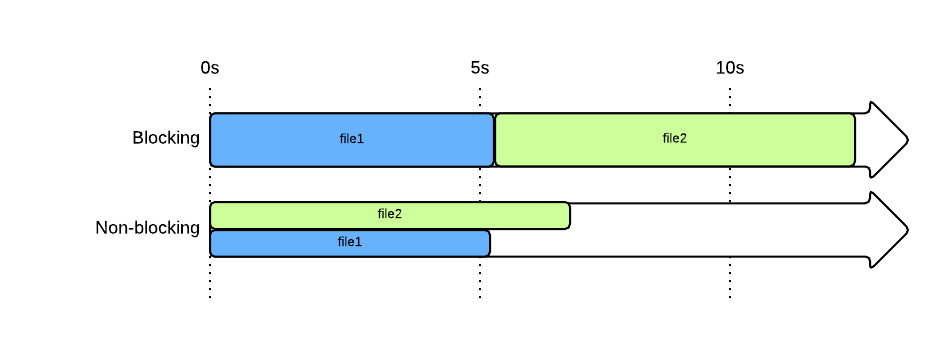

ماذا لو بدأنا بهذه الأسئلة التي قد تتبادر إلى ذهنك دائما :

1.  لماذا يلقى Node.js كل هذا القبول من لدن مطوري الويب المحترفين ؟
2.  ما هو مصدر هذه السرعة التي يتمتع بها Node.js ؟ وماذا أستفيد منها ؟
3.  هل بلغ Node.js مرحلة النضج ؟ وهل علي أنا أيضا أن أبدأ في تعلمه والعمل عليه ؟

اطمئن عزيزي القارئ، هذه الأسئلة سنحاول الإجابة عنها في هذه الدرس الجديد والذي سيمكنك من معرفة كل ما يهمك عن هذه المنصة الجديدة التي أحدثت ضجة كبيرة في أوساط الويب فور صدورها عام 2009.

## تاريخ الجافاسكريبت

يعتقد البعض أن الجافاسكريبت مجرد أداة لإضافة بعض التأثيرات الجميلة على موقعك، ولكن هذا غير صحيح، فالجافاسكريبت هو لغة برمجية تماما مثل ما هي لغات الجافا و PHP و C وغيرها، ولعل هذا التقييم الخاطئ الذي يقع فيه البعض له ما يبرره تاريخيا كون هذه اللغة مرت بعدة مراحل منذ نشوئها عام 1995، وقد نستطيع إيجازها في ثلاث مراحل أساسية :

### 1. عهد التسعينات : عهد نيتسكيب وانترنت اكسبلورر 5

في هذا الوقت كنا نتحدث عن DHTML أو Dynamic HTML وكما تفهمون من الإسم فهذه التقنية كانت تمكن من إضافة بعض التأثيرات الجمالية على الصفحة فتعطيها حيوية جديدة (مثلا إضافة نص أو صورة إلى الصفحة عند الضغط على زر معين) عكس ما كان عليه الوضع قبل هذا الوقت حيث كانت صفحات الويب جامدة لا حيوية فيها.

### 2. بداية الألفية الثالثة

هذه الفترة مهمة جدا وشهدت بداية ظهور تطبيقات الجافاسكريبت بالتزامن مع ظهور المكتبات الشهيرة كالجيكويري والموتولز Mootools وطبعا ظهور تقنية الأجاكس Ajax شكل دفعة هائلة لهذه اللغة حيث أصبحت معها جزءا لا يتجزأ من أي موقع على الإنترنت.

### 3. بداية من عام 2010

هنا حقق الجافاسكريبت قفزة نوعية وكبيرة وخاصة بعد تطوير غوغل لمحرك V8 السريع والذي بنى عليه **ريان دال** منصة Node.js التي أعطت للجافاسكريبت بعدا آخر حيث أصبح بإمكاننا استعمال الجافاسكريبت خارج المتصفحات والتعامل مع الخوادم مباشرة وبالتالي تطوير تطبيقات سريعة وفعالة باستعمال لغة واحدة فقط وهي الجافاسكريبت.

شهدت هذه الفترة أيضا ظهور أعداد كبيرة من مكتبات الجافاسكريبت التي ينتهي اسمها بحرفي js مثل [الأنغولار](https://angularjs.org/) و [الباكبون](http://backbonejs.org/) و[الأمبر](http://emberjs.com/) والتي تمكننا من عمل تطبيقات أحادية الصفحة Single Page Applications بطرق أسهل وأكثر فعالية.

## الجافاسكريبت يتعامل مع الخادم ؟

نعم عزيزي القارئ، تماما كما هو الأمر عند اللغات المعروفة التي تتعامل مع الخوادم وقواعد البيانات مثل PHP، Ruby ، Java EE وغيرها، بحيث أصبح بإمكانك أن ترسل طلب إلى الخادم Server وسيتولى Node.js (باستعمال وحدة Http المدمجة بداخله) مهمة إرسال الصفحة التي طلبتها بعد الإتصال بقاعدة البيانات إذا اقتضى الأمر ذلك وهذا يعني أن Node.js جاء لينافس اللغات التي ذكرناها، وله القدرة في ذلك نظرا للميزات العديدة التي يتمتع بها.

## لماذا Node.js سريع ؟

سرعة Node.js الفائقة تعود أساسا لعاملين اثنين وهما : محرك Chrome V8 المتطور وآلية استقبال وإرسال المدخلات والمخرجات I/O والتي يطلق عليها بالإنجليزية Non-blocking في مقابل آلية ال Blocking التي تنتهجها اللغات الأخرى وعلى رأسها PHP.

### محرك الجافاسكريبت v8

[](../images/v8-engine.png)

يستعمل Nodejs محرك الجافاسكريبت **V8** الذي تم تطويره من طرف مبرمجي **Google Chrome** وقد أحدث ضجة حوله بعد ظهوره لأول مرة عام 2008. يتميز بقوة وسرعة كبيرتين تمكنانه من تنفيذ أكواد الجافاسكريبت بشكل أسرع وأخف وذلك بفضل اعتماده على تقنية متطورة في عملية ال **compilation** تسمى **JIT Compilation** (أو Just In Time Compilation) التي تقوم بتحويل البرنامج إلى أكواد تفهمها الآلة أثناء تنفيذ (Execution) البرنامج وليس قبل بدء التنفيذ عكس ماكان عليه الحال قبل ظهور V8 عندما كانت جل المحركات تعتمد آلية ال Interpretation التقليدية.

### آلية Non-Blocking

كما يعرف الجميع فالجافاسكريبت لغة برمجة تعتمد على الأحداث Events ولهذا استطاع Nodejs وضع فلسفة تعتمد على مفهوم Non-Blocking منصته.

> يمكننا من الآن ترجمة آلية Non Blocking ب**الغير المعرقِلة** بينما نترجم آلية Blocking ب**المعرقِلة**.

ولكي تفهمون لماذا هذه الترجمة، سنرى مثالين يوضحان الفرق بين الآليتين :

#### الآلية الغير المعرقلة Vs الآلية المعرقلة

في لغة PHP مثلا التي تعتمد الآلية المعرقلة blocking model، عند البدء في عملية رفع ملفين اثنين يتوجب على البرنامج انتظار انتهاء رفع الملف الأول لكي يبدأ في رفع الملف الثاني وهذا بمثابة عرقلة للبرنامج حيث يظل متوقفا عن نقطة معينة إلى حين الإنتهاء منها لكي يمر لمهمة أخرى.

بينما في Nodejs الأمر مختلف كليا، حيث الأخير يعتمد على الآلية الغير معرقلة Non blocking حيث يستطيع البرنامج  أن يبدأ عملية رفع الملفين في نفس الوقت وعند نهاية عملية الرفع نلجأ لدوال الإجابة Callback لكل ملف للقيام بما نريده.

```js
request('http://www.site.com/file1.zip', funtion(error, response, body){
	//هنا انتهى رفع الملف الأول، ماذا تريد من البرنامج أن يفعل بعد ذلك ؟
});
request('http://www.site.com/file2.zip', function(error, response, body){
	//هنا انتهى رفع الملف الثاني، ماذا تريد من البرنامج أن يفعل بعد ذلك ؟
});
```

وكما يقال، صورة أبلغ من ألف كلمة :

[](../images/blocking-vs-non-blocking-model.png)

هذا فقط مثال واحد، وهناك أمثلة عدة ينطبق عليها ما ينطبق على مثال رفع الملفين Files upload، مثل التعامل مع قاعدة البيانات واستعمال ال Web Services, Web Api التي دائما ما تأخذ من البرنامج وقتا ثمينا.Nodejs يجنبنا إضاعة الوقت ويتيح لنا إمكانية القيام بأشياء أخرى في انتظار انتهاء المهام التي تأخذ وقتا طويلا.

## إطار العمل ExpressJs لتطبيقات الويب

ذكرنا أن عالم الجافاسكريبت يزخر بعديد المكتبات وأطر العمل التي تساعد المطورين على إنشاء تطبيقات احترافية وتضعهم على أسس قوية عوض البدء من الصفر وإضاعة الوقت في بناء هيكلة المشروع.

لحسن حظ مطوري Node.js كذلك، فإن هذا الأخير يستفيد من عدد كبير من إطارات العمل التي تجعل مهمة إنشاء تطبيقات بواسطته أكثر سهولة، ولعل أهمها [إطار العمل Express.js لتطبيقات الويب](https://www.tutomena.com/web-development/javascript/what-is-expressjs/). هذا الفريموورك ليس بضخامة **سيمفوني** في PHP ولا **دجانغو** في بايثون، إلا أن فائدته تبقى كبيرة ولا يمكن إلا أن تساعد مطوري Node.js على المضي قدما في مشاريعهم بسرعة وفعالية أكبر.

[اقرأ أيضا : الجافاسكربت يأكل الأخضر واليابس](https://www.tutomena.com/web-development/javascript/javascript-dominance/)

## نهاية المقال

صحيح أن العمل على Nodejs أكثر تعقيدا مقارنة بلغات البرمجة التي تنافسه مثل PHP ولكنه يظل حلا ثوريا وواعدا للتطبيقات التي تتطلب خاصة السرعة والتفاعل الآني (Real Time Apps) بين المستعمل والخادم.

### المراجع :

- https://openclassrooms.com/courses/des-applications-ultra-rapides-avec-node-js/node-js-mais-a-quoi-ca-sert
- https://en.wikipedia.org/wiki/Just-in-time_compilation
- https://nodejs.org/
