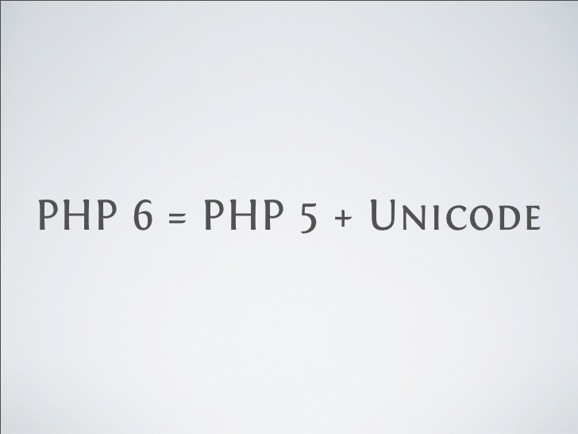

لغة برمجة المواقع PHP هي الأكثر استعمالا بين نظيراتها، فهي تدعم عشرات الملايين من المواقع على شبكة الإنترنت، ويكفي أن نعرف أن أشهر أنظمة إدارة المحتوى مثل **ووردبريس** و**دروبال** وكذلك **جوملا** مبنية على PHP لكي ندرك مدى قوة وأهمية هذه اللغة.

جميع المطورين كانوا يتكلمون عن النسخة الكبيرة المقبلة ل PHP بعد النسخة 5، في الأخير تم الإتفاق على تسمية PHP7 عوض PHP6. فلماذا هذا القرار؟

بعد تطور الويب ودخول PHP في منافسة قوية مع لغات أخرى مثل JavaEE و Ruby كان لا بد من إدخال تطويرات  جوهرية ومهمة في اللغة، ولذلك إتخدت شركة Zend التي تدعم PHP القرار سنة 2005 بالبدء في عملية تطوير نسخة جديدة مطورة ل PHP تقرر تسميتها آنذاك PHP6، وكان من بين الأشياء الجديدة التي كان يود مطورو Zend إضافتها للغة الدعم الإفتراضي ل Unicode عن طريق UTF-16، ولكن هذا المشروع لاقى صعوبات كثيرة ولم تستطع Zend إضافة هذه الخاصية ل PHP في الوقت المحدد وفي مارس من عام 2010 تم الإعلان عن ترك المشروع وإدماج عدد من الآليات الجديدة التي لا تتعلق بال Unicode (مثل Namespaces، Closures وغيرها)  في نسخ جديدة من PHP5 نفسها (5.3, 5.4, 5.5...) عوض الإنتقال ل PHP6.

ورغم هذا الإخفاق إلا أن اسم PHP6 داع صيته بل وأصدرت كتب حولها حتى قبل صدورها ولهذا قررت Zend في تصويت بين عدد من مطوريها تسمية النسخة الكبيرة المقبلة PHP7 حتى يتم تفادي الخلط بين المشروع القديم الذي مات قبل أن يرى النور وبين المشروع الجديد. كما أن الرقم 6 كان مصدر تشاؤم لهم حيث أن النسخة 6 من لغة البرمجة Perl كانت فاشلة، والنسخة 6 من نظام إدارة قواعد البيانات MySQL كان فاشلا بدوره بحيث أنه موجود ولكن الشركة الداعمة ل MySQL لم تستطع إطلاقه حتى الآن. دون أن ننسى نسخة Windows Vista التي شهدت فشلا دريعا وهي بدورها النسخة السادسة لنظام التشغيل Windows.

وستكون PHP 5.6 آخر الإصدارات من نسخة PHP5 قبل الإنتقال رسميا لنسخة PHP 7 الثورية المرتقب عام 2016، والتي ستجلب معها مزايا إضافية للغة PHP من بينها نظام ال Unicode ونظام جديد للكاش Cache system أكثر تميزا وكفاءة.

**المراجع :**

- [https://fr.wikipedia.org/wiki/PHP#PHP_6_et_Unicode](https://fr.wikipedia.org/wiki/PHP#PHP_6_et_Unicode)
- [http://www.nextinpact.com/news/89017-le-langage-php-passera-directement-version-5-6-a-7.htm](http://www.nextinpact.com/news/89017-le-langage-php-passera-directement-version-5-6-a-7.htm)
- [http://www.developpez.com/actu/73836/PHP-7-sera-la-prochaine-version-majeure-de-PHP-il-n-y-aura-pas-une-version-6-pour-le-langage-de-programmation/](http://www.developpez.com/actu/73836/PHP-7-sera-la-prochaine-version-majeure-de-PHP-il-n-y-aura-pas-une-version-6-pour-le-langage-de-programmation/)
