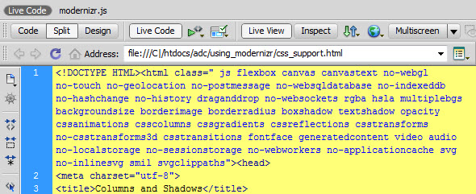

## ماهو موديرنايزر Modernizr ؟

[موديرنايزر Modernizr](https://modernizr.com) (المجدد) هي مكتبة جافاسكريبت معروفة في أوساط المطورين ومصممي المواقع، تقوم بتوقع مؤهلات المتصفحات التي يفتح عليها موقعك وتوافقها مع بعض الخصائص التي يتضمنها مثل خصائص CSS3 الجديدة وبعض خصائص HTML5 كالتموقع الجغرافي Geolocation Api وغيرها.

فمثلا لو قررت إضافة ظل (box-shadow) لصورة في موقعك فستظهر الصورة بشكل جميل في المتصفحات الجديدة ولكن ليس في المتصفحات القديمة كانترنت إكسبلورر 8 وغيرها التي لا تدعم خاصية box-shadow، وبالتالي وجب عليك تعويض الظل في هذه الحالة بشيء آخر، مثلا إطار عادي حول الصورة (border). مثل هذه الأشياء هي بالضبط ما يمكنك Modernizr من فعله، ففي حالة عدم دعم المتصفح لخاصية box-shadow سيضيف لوسم `<html>` كلاس اسمه no-boxshadow يمكنك استعماله كما تشاء في ملف الستايل الخاص بموقعك.

[](../images/modernizr-css3-support.jpg)

```css
img {
  box-shadow: 0 0 3px #ccc;
  /* إضافة الظل للصور في المتصفحات الجديدة التي تدعم CSS3 */
}
.no-boxshadow img {
  border: 2px solid #ccc;
  /* إضافة الإطار للمتصفحات القديمة التي لا تدعم CSS3 */
}
```

نفس الفلسفة يمكنك تطبيقها في توافقية HTML5 مع المتصفحات، فالمكتبة تعطيك أدوات تمكنك من التعامل مع الحالتين معا، حالة دعم Geolocation Api مثلا وحالة عدم دعمه، و طبعا عن طريق كود جافاسكريبت.

```js
if (Modernizr.geolocation) {
  //المتصفح يدعم نظام تحديد المواقع Geolocation Api
} else {
  //الموقع لا يدعم نظام تحديد المواقع، قم بشيء آخر
}
```

## النسخة 3

مؤخرا تم إطلاق النسخة 3 من Modernizr، وقد شهدت النسخة الجديدة تحسينات وتطويرات عديدة وجذرية حيث ثم إعادة كتابتها بالكامل كما تم تحديث الموقع القديم للمكتبة، وقد شارك في هذا العمل ما يناهز 80 مطور. بعض ميزات [Modernizr](https://modernizr.com) :

- دعم معظم المتصفحات القديمة والجديدة.
- كشف دعم المتصفحات لخصائص CSS3
- كشف دعم عناصر HTML5 من طرف المتصفحات.
- كشف دعم SVG, Geolocation Api, أحداث اللمس (Touch events), وكذلك WebGL.
- إضافة وسوم شرطية للتحقق من دعم عدد من الخصائص عن طريق أكواد الجافاسكريبت.
