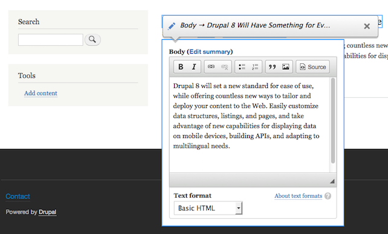

لطالما كان **دروبال** واحدا من أنجح **أنظمة إدارة المحتوى** في السوق، فهو الذي دعم العديد من المنصات والمواقع الحكومية الحساسة مثل [الموقع الرسمي للبيت الأبيض](https://www.whitehouse.gov/) وكذلك [موقع الحكومة الأسترالية](http://www.australia.gov.au/)، هذا يبين مدى الثقة التي يحظى بها دروبال وخاصة بعد صدور النسخة 7 عام 2011.

في وقت لاحق من هذا العام سيتم الإعلان عن صدور نسخة جديدة من دروبال وسميت دروبال 8 وينتظر منها الشئ الكثير خاصة أنها جاءت بتغييرات جدرية على مستوى نواة النظام، وإليكم ثلاثة من أهم المميزات التي سيحملها إلينا دروبال 8:

## دروبال 8 يعتمد على سيمفوني Symfony

دروبال 8 سيعتمد في بنيته التقنية على إطار العمل المعروف [Symfony2](http://symfony.com/) بحيث سيستغل نقاط قوته لدمجها في دروبال، كما أنه سيعتمد على نظام القولبة تويغ [Twig](http://twig.sensiolabs.org/) وهو نفس نظام القولبة الذي يستعمل في مشاريع **سيمفوني 2**.

## إدماج بعض الوحدات الأساسية في النواة

في دروبال 7، عندما تحتاج لإستعمال ال Views ،وهذا في كل المشاريع تقريبا، يتوجب عليك أولا تنصيب الوحدة (module) الخاصة بها والتي تسمى Views، هذا المشكل لم يعد مطروحا في دروبال 8 فعديد الوحدات الأساسية والمهمة تم دمجها في النواة مباشرة وتكون في متناول يدك بمجرد تنصيب **دروبال**.

## إمكانية التعديل من الواجهة الأمامية

في دروبال 8، ليس عليك أن تنتقل للوحة التحكم لمجرد تغيير نص معين، أصبح بإمكانك التعديل على صفحاتك مباشرة من الواجهة الأمامية (Front-end) وحفظ التعديلات بكل سهولة، هذا رائع أليس كذلك ؟

المرجع :

- [https://garage.godaddy.com/webpro/development/what-you-need-to-know-about-drupal-8/](https://garage.godaddy.com/webpro/development/what-you-need-to-know-about-drupal-8/)
