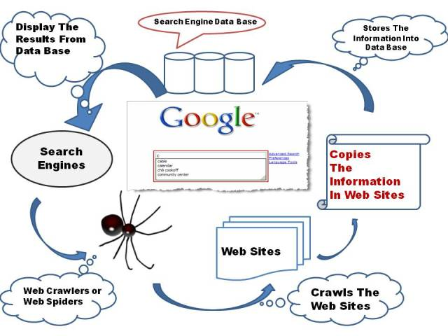

تعتبر **محركات البحث** على شبكة الإنترنت هامة جدا، فهي التي تسهل علينا عملية التصفح والوصول إلى مبتغانا في أسرع وقت ممكن. وفي هذا المقال سنشرح بشكل سريع كيفية عمل هذه المحركات والآلية التي تتبعها لأرشفة وعرض نتائج البحث.

## 1- إطلاق العناكب أو  Crawling

الخطوة الأولى في سلسلة عمل محركات البحث هي إطلاق العناكب أو الروبوتات الخاصة بمحرك البحث (غوغل على سبيل المثال)، هذه العملية تسمى Crawling وفيها يتم تنقل هذه الروبوتات من صفحة إلى أخرى على ملايين المواقع، وتجدر الإشارة إلى أن محركاث البحث  تقوم بأرشفة الصفحات، كل صفحة على حدى، وليس الموقع ككل يعني أن أرشفة صفحة في موقع ما لا يعني أرشفة جميع صفحات هذا الموقع.

## 2- تحليل الصفحات

عندما يصل روبوت **غوغل** إلى إحدى صفحات موقعك فإنه يقوم بتحليلها وقراءة ما بداخلها كعنوان الصفحة، اسم النطاق، نصوص داخل الصفحة إلخ... وهكذا يتمكن محرك البحث من معرفة الموضوع الذي تتناوله الصفحة عن طريق ما يجده في الصفحة من كلمات مفتاحية تصف محتواها.

## 3- الأرشفة أو الفهرسة في خوادم محركات البحث

بعد تحليل الصفحة يقوم الروبوت بإرسال ما وجده في الصفحة من معلومات مفيدة (رابط الصفحة، موضوع الصفحة، كلمات مفتاحية ...) إلى قواعد بيانات المحرك قصد استعمالها لاحقا.

## 4- معالجة الإستعلامات وعرض النتائج

عندما يقوم المستعمل بالبحث عن كلمات معينة، يقوم **محرك البحث** بعرض هذه الكلمات على فهرسه وبناءً عليه يعرض النتائج المناسبة حسب الإستعلام ويرتبها باستعمال خوارزميات معقدة تجدد وتطور باستمرار.

### خاتمة

طبعا التحدي ليس هو فهرسة صفحات موقعك على محرك البحث، ولكن التحدي الكبير أن تجعلها تظهر في الصفحات الأولى لهذه المحركات وهذا يتطلب تقنيات و**عمل دؤوب** من صاحب الموقع حتى يحظى بمرتبة متقدمة في نتائج البحث وهذا ما يطلق عليه اختصارا تقنيات سيو (SEO = Search Engine Optimization) قد نتطرق لبعضها في مواضيع قادمة إن شاء الله..
