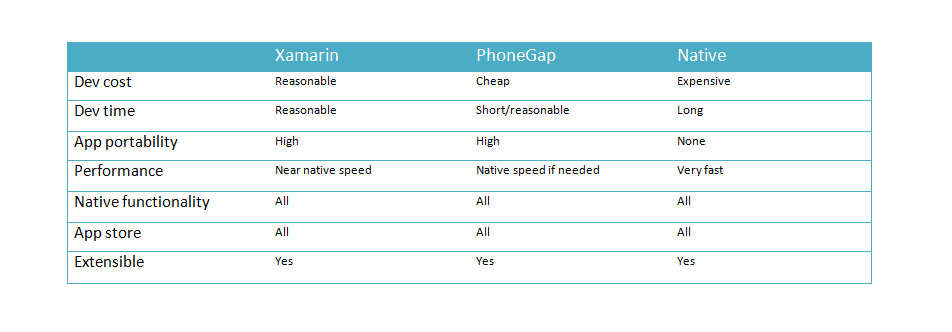

يغري مجال **برمجة تطبيقات الموبايل** العديد من المطورين في أيامنا هذه بالنظر إلى الآفاق العديدة التي يفتحها أمامهم في سوق الشغل كما أنه مجال ما يزال في بداياته خاصة في المنطقة العربية وبالتالي المنافسة فيه أقل مما نجده في مجالات أخرى كالويب مثلا.

سبب آخر يجعل عالم الموبايل مغريا هو إمكانية جني بعض الأموال من تطبيق قمت ببرمجته واستهداف ملايين المستعملين لأن عدد مستعلمي الهواتف الذكية يكبر ويتضاعف يوما بعد يوم في ظل ثورة الموبايل التي نشهدها. ولذلك قررت أن أشارك معك هنا بعض الطرق التي يستعملها المحترفون لبرمجة **تطبيقات الهواتف الذكية**  سواء كانت بنظام **الأندرويد**، **iOS** أو غيرهما.

## كيف أبدأ طريقي في عالم برمجة تطبيقات الموبايل ؟

لتطوير تطبيقات الموبايل (Android,iOS...) يلزمك تعلم إحدى اللغات/التقنيات التالية :

- لغة **الجافا** لتطوير تطبيقات **أندرويد **وذلك بالإستعانة ببيئة العمل **أندرويد ستوديو** Android Studio الذي قامت شركة غوغل بتطويره خصيصا لهذا الغرض.
- لغة **سويفت** Swift (أو **أوبجكتيف سي Objective-C** بالنسبة للحرس القديم ) لتطوير تطبيقات **iOS **والعمل يتم على بيئة العمل **XCode** الذي بدوره قامت شركة Apple بتطويره لهذا الغرض، وهنا يجب أن أشير إلى أن امتلاك حاسوب بنظام **Mac** ضروري لبرمجة تطبيقات iOS.
- [**كوردوفا**](https://cordova.apache.org) (Cordova or PhoneGap) لتطوير تطبيقات هجينة (Android,iOS, Windows Phone) عن طريق لغة الجافاسكريبت، ميزة هذه التقنية هي أنها تمكنك من تطوير تطبيقات لعدة أنظمة تشغيل وذلك بواسطة شيفرة برمجية واحدة (One Code Base).
- لغة **سي شارب**، عن طريقها تستطيع العمل على **منصة زا\*\***مرن\*\* Xamarin لمايكروسوفت التي بدورها تمكننا من تطوير تطبيقات موبايل (Android,iOS,Windows Phone) بواسطة كود برمجي واحد، ولكنها تختلف عن كوردوفا بكونها تسعمل الواجهات الأصلية لنظام التشغيل عوض الإعتماد على WebViews كما هو الشأن عند كوردوفا (أو PhoneGap).
- **[رياكت ناتيف React Native](https://facebook.github.io/react-native/)** : منتج لشركة فيسبوك وهو تقريبا أخ لزامرن Xamarin إلا أنه يستعمل لغة الجافاسكريبت وليس سي شارب أي أنه يمكننا من استعمال الواجهات الأصلية للجهاز Native UIs عوض الإستعانة ب WebViews عند كوردوفا. وهذا يعني أنه عليك تطوير عدة واجهات Views وليس واحدة إذا أردت عمل تطبيق لكل نظام تشغيل، أندرويد و iOS على سبيل المثال (هذا الكلام صحيح أيضا بالنسبة لمنصة Xamarin).
- [**ناتيف سكريبت NativeScript**](https://www.nativescript.org/) : نفس الكلام الذي قيل عن React Native.

إذا كنت ترغب في احتراف برمجة تطبيقات الموبايل فهذه أهم التقنيات التي يجب عليك الإلمام بواحدة منها **على الأقل** مع الإشارة أن التطبيقات الأصلية native تكون غالبا أسرع وأكثر سلاسة من التطبيقات الهجينة Hybrid.
