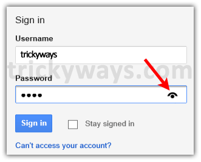

بعض المواقع وتطبيقات الهواتف المحمولة تعطينا إمكانية **إظهار كلمة السر** في الحقل الخاص بها للتأكد من أننا أدخلنا كلمة السر الصحيحة. في هذا المقال سنتعلم معا طريقة إظافة هذه الخاصية إلى استماراتنا Forms بكل بساطة، فالقليل من كود الجافاسكريبت سيفي بالغرض كما سنرى.

[](../images/show-and-hide-password.png)

## إضافة مكتبة الجيكويري

سنضيف مكتبة الجيكويري لأنها تسهل علينا التنقل بين عناصر الصفحة، لست مجبرا على إضافتها فيمكنك القيام بنفس المهمة باستعمال الجافاسكريبت الخام، ولكن الكود سيكون أطول). على كل حال فمكتبة جيكويري لم تعد محل جدال الآن فالعديد من منصات التدوين وجل المواقع تعمل بها وتستفيد من مزاياها.

```html
<script
  type="text/javascript"
  src="https://cdnjs.cloudflare.com/ajax/libs/jquery/2.2.2/jquery.min.js"
></script>
```

## إضافة ملف bootstrap.min.css

صراحة هنا أضفنا ملف بوتستراب فقط لجلب أيقونة العين التي تظهر على يمين حقل كلمة المرور، وبالتالي يمكنك إضافة أي مكتبة أخرى تعمل بها أو فقط تعوض الأيقونة بكلمتي "إظهار" و"إخفاء"، هذا يعتمد على حاجيات وميول كل واحد منا.

```html
<link
  rel="stylesheet"
  type="text/css"
  href="https://cdnjs.cloudflare.com/ajax/libs/twitter-bootstrap/3.0.0/css/bootstrap.min.css"
/>
```

## شيفرة HTML

```html
<div class="field">
  <input type="password" name="password" id="password" />
  <i class="glyphicon glyphicon-eye-open"></i>
</div>
```

هنا أضفنا عنصر عبارة عن `<div>` وبداخله حقل كلمة السر وبجانبه الأيقونة (العين).

## إضافة الستايل

```css
.field {
  width: 300px;
  position: relative;
  margin: 20px;
}
.field input {
  width: 100%;
  line-height: 40px;
  text-indent: 10px;
}
.field .glyphicon {
  position: absolute;
  right: 10px;
  top: 11px;
  font-size: 20px;
  color: #1c90f3;
  cursor: pointer;
}
.field .glyphicon.active {
  color: #ccc;
}
```

هنا فقط أضفنا بعض الستايل Style لتحسين مظهر الحقل، لا أقل ولا أكثر.

## إظهار وإخفاء كلمة السر

```js
$('.field .glyphicon').on('click', function() {
  var attr =
    $(this)
      .prev()
      .attr('type') == 'password'
      ? 'text'
      : 'password';
  $(this)
    .prev()
    .attr('type', attr);
  $(this).toggleClass('active');
});
```

الآن نأتي إلى المرحلة الأهم، وهي كتابة كود الجافاسكريبت لإظهار وإخفاء كلمة السر.

1. أولا: ننتظر القيام بالنقر على أيقونة العين.
2. ثانيا: ننشئ متغير اسمه attr، إذا كانت كلمة السر ظاهرة نعطيه قيمة password وإذا كانت كلمة السر على وضعها الطبيعي أي مخفية نعطيه القيمة text من أجل إظهارها.
3. ثالثا : نقوم بإضافة وإزالة الكلاس active لأيقونة العين فقط من أجل تغيير لونها من الأزرق إلى الرمادي أو العكس.

### خاتمة

كما رأينا الأمر بسيط جدا وليس معقدا فقط بعد المهارات في مكتبة جيكويري والمهمة باتت منجزة. تجدون أسفله النتيجة النهائية للشرح الذي قمنا به :

<iframe width="100%" height="300" src="//jsfiddle.net/tutomena/n8neoao1/14/embedded/js,html,css,result/dark/" allowfullscreen="allowfullscreen" frameborder="0"></iframe>
