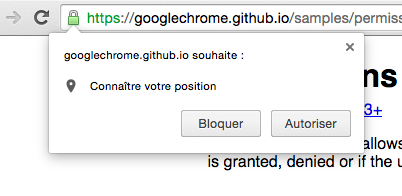
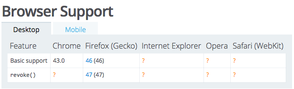

نشهد في هذه الأيام، مع تقدم وتطور تقنيات الويب وتطبيقاته بالموازاة مع ثورة الهواتف الذكية وتطبيقات الموبايل، ظهور العديد من الواجهات الجديدة في متصفحات الويب Web APIs ويتم التعامل معها عن طريق الجافاسكريبت طبعا.

آخر هذه الواجهات الجديدة هي واجهة الصلاحيات **Permissions API**، ففي كثير من الأحيان مثلا نحتاج معرفة مكان تواجد المستعمل أو الزائر (إحداثيات المكان Geolocation API) لإعطائه نتائج أفضل أو لأهداف إحصائية، كما أننا قد نحتاج صلاحيات استخدام الكاميرا في جهازه أو نظام الإشعارات Notifications ولذلك كنا مجبرين في كل حالة من هذه الحالات على استخدام الواجهة API الخاصة بكل خدمة من أجل طلب الحصول على الرخصة من المستعمل كما أنها لا تمكنك من معرفة صلاحيتك في استخدامها إلا إذا طلب واستعلمت ذلك من المستخدم.

## واجهة Permissions API

مع واجهة الجافاسكريبت الجديدة **Permissions API** أصبح بإمكاننا معرفة صلاحياتنا في استعمال كل هذه الخدمات دون طلب ذلك من المستعمل.

navigator.permissions.query({ name: 'geolocation' }).then(function(result) {
console.log(result);
});

هنا نمرر للدالة query اسم الخدمة التي نود التأكد من صلاحياتنا في استعمالها، في هذه الحالة خدمة تحديد الموقع الجغرافي Geolocation، هذه الدالة بدورها تقوم بإرجاع ما يسمى في الجافاسكريبت **بالوعد** **Promise** وبداخله نستطيع معرفة هل بإمكاننا استعمال خدمة Geolocation أم لا (ويتم معرفة هذا انطلاقا من اعدادات المتصفح) عن طريق الكائن result الذي يحتوي بداخله على خاصية تدعى state وتقبل ثلاث قيم وهي :

- **granted** : أي أنه يمكنك الولوج لخدمة Geolocation دون طلب الإذن من المستخدم.
- **prompt** : يجب عليك أولا طلب الإذن من المستخدم للتمكن من الولوج للخدمة.
- **denied** : المستخدم لا يسمح لأحد بأن يلج لهذه الخدمة (الإطلاع على موقعه الجغرافي في هذه الحالة).

إذا في داخل دالة **الوعد** يمكنك عمل شرط للتأكد من قيمة result.state :

navigator.permissions.query({name:'geolocation'}).then(function(result) {
if (result.state == 'granted') {
//أنت مرخص لك بالولوج لخدمة تحديد المواقع
} else if (result.state == 'prompt') {
//لست مرخصا لاستعامل خدمة تحديد المواقع، أطلب من المستخدم أن يعطيك الترخيص.
}

});

الشيء الجميل والرائع كذلك بداخل هذه الدالة هو أنك تستطيع الإستماع لحدث Event تغير قيمة result.state وذلك عن طريق الحدث onchange وذلك كما يلي :

navigator.permissions.query({name:'geolocation'}).then(function(result) {
if (result.state == 'granted') {
//أنت مرخص لك بالولوج لخدمة تحديد المواقع
} else if (result.state == 'prompt') {
//لست مرخصا لاستعامل خدمة تحديد المواقع، أطلب من المستخدم أن يعطيك الترخيص.
}

result.onchange = function() {  
 console.log('صلاحية تحديد الموقع الجغرافي تغير إلى : ', this.state);
};

});

هنا كلما غيرت الإعدادات من متصفحك سيتم معرفة ذلك عن طريق الحدث onchange وستتغير قيمة state دون إعادة تحميل الصفحة طبعا.

الشيء الذي يجب تذكره من هذا كله هو أنه باستعمالك واجهة الصلاحيات الجديدة ليس عليك طلب الرخصة من المستخدم إلى إذا كنت فعلا مضطرا لذلك (إذا كانت قيمة state تساوي prompt ).

## طلب الرخصة من المستخدم

لطلب الرخصة من المستخدم للولوج إلى احدى الواجهات التي ذكرنا بعضها أعلاه، واجهة الصلاحيات **Permissions API** تضع بين أيدينا الدالة permissions.request وتستعمل بنفس الطريقة التي استخدمنا بها الدالة permissions.query غير أنها لحد الساعة ليست مدعومة من طرف أي متصفح كونها ما تزال قيد التطوير.

### خاتمة

الواجهة لاتزال قيد التطوير، فقط غوغل كروم 43 وفايرفوكس 46 يدعمونها جزئيا لحد الساعة، ولكن الأمر المؤكد أن بعد بضعة أشهر ستكون **JavaScript Permissions API** مدعومة من كل المتصفحات المعروفة لأنها بصراحة تبدو قيمة للغاية وتجعل أمر التعامل مع الصلاحيات والرخص أسهل وأكثر انسيابية.

#### المراجع :

- [https://davidwalsh.name/permissions-api](https://davidwalsh.name/permissions-api)
- [https://developer.mozilla.org/en-US/docs/Web/API/Permissions](https://developer.mozilla.org/en-US/docs/Web/API/Permissions)
- [https://developers.google.com/web/updates/2015/04/permissions-api-for-the-web?hl=en](https://developers.google.com/web/updates/2015/04/permissions-api-for-the-web?hl=en)

إذا كانت لديكم تساؤلات أو استفسارات لا تترددوا في طرحها في صندوق التعليقات أسفله.
