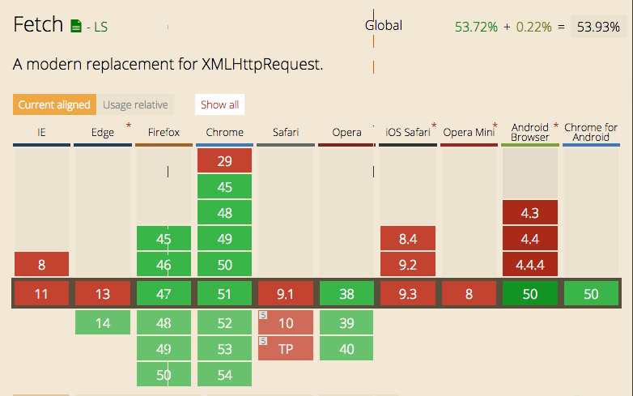

تعتبر **Fetch API** من الواجهات الجديدة في الجافاسكريبت والتي جاءت ربما لتحل محل الواجهة القديمة **XMLHttpRequest**.

Fetch API جاءت بنفس فكرة XHR إلا أن هناك بعض الفروق الأساسية بينهما لعل أبرزها اعتماد **Fetch API** على الوعود Promises في عرض النتائج عوض دوال الرد Callbacks التي اعتمد عليها دائما **XMLHttpRequest**.

## XMLHttpRequest

// Just getting XHR is a mess!
if (window.XMLHttpRequest) { // Mozilla, Safari, ...
request = new XMLHttpRequest();
} else if (window.ActiveXObject) { // IE
try {
request = new ActiveXObject('Msxml2.XMLHTTP');
}
catch (e) {
try {
request = new ActiveXObject('Microsoft.XMLHTTP');
}
catch (e) {}
}
}

// Open, send.
request.open('GET', 'http://tutomena.com/ajax-endpoint', true);
request.send(null);

هذا مجرد استعمال بسيط لواجهة **XHR** وهي نوعا ما معقدة للوهلة الأولى خاصة فيما يتعلق بالتوافقية مع مختلف المتصفحات ولو أن هناك العديد من المكتبات (جيكويري مثلا...) جعلت من أمر استعمالها يسيرا وسهلا ولكن في المشاريع الكبرى تظل هناك بعض الإشكاليات خاصة مع [دوال الرد Callbacks](http://www.tutomena.com/web-development/javascript/promises-vs-callbacks-in-javascript/) على مستوى تنظيم الكود وجماليته.

## استعمال واجهة Fetch API

// Simple response handling
fetch('/some/url').then(function(response) {
}).catch(function(err) {
// Error :(
});

كما تلاحظون استعمال واجهة Fetch API هو أسهل وأجمل، خاصة مع استعمال [دوال الوعود Promises API](http://www.tutomena.com/web-development/javascript/promises-vs-callbacks-in-javascript/). في داخل دالة then الأولى نضع الكود والشيفرة في حال نجاح عملية الإستدعاء، بينما دالة catch الثانية تستدعى عندما يكون هناك خطأ أثناء العملية.

## إمكانية تسلسل الوعود Chaining Promises

function status(response) {  
 if (response.status >= 200 && response.status < 300) {  
 return Promise.resolve(response)  
 } else {  
 return Promise.reject(new Error(response.statusText))  
 }  
}

function json(response) {  
 return response.json()  
}

fetch('users.json')  
 .then(status)  
 .then(json)  
 .then(function(data) {  
 console.log('Request succeeded with JSON response', data);  
 }).catch(function(error) {  
 console.log('Request failed', error);  
 });

نلاحظ في هذا المثال أننا استعمالنا دالة then عدة مرات وهذا من ميزات واجهة [الوعود في الجافاسكريبت Promises API](http://www.tutomena.com/web-development/javascript/promises-vs-callbacks-in-javascript/). دالة then الأولى تقوم بجلب البيانات من ملف users.json ثم تقوم بعمل return للإجابة في حال نجاح عملية جلب البيانات من الملف users.json وتقوم بتمرير هذه الإجابة لدالة then التي تأتي بعدها والتي تقوم بتحويل هذه الإجابة response من نص إلى كائن JSON نتعامل معه بالجافاسكريبت ثم تقوم بتمريره هي الأخرى لدالة then التي تأتي بعدها لتقوم الأخيرة بالعمليات التي تريدها على هذا الأوبجكت (data).

أما دالة catch فهي تستدعى في حال وجود خطأ أثناء العملية برمتها فما إن يحدث خطأ في جلب ملف users.json حتى يتم استدعاؤها مباشرة.

## الإعدادات

طبعا يمكن تمرير عدد من البارامترات لدالة **fetch** كنوع الطلب (`GET`, `POST`, `PUT`, `DELETE`, `HEAD`) وإعدادات الهيدر إلخ... كما يتضح في المثال أسفله :

fetch('/users.json', {
method: 'POST',
mode: 'cors',
redirect: 'follow',
headers: new Headers({
'Content-Type': 'text/plain'
})
}).then(function() { /* handle response */ });

هذا مجرد تقديم بسيط لهذه الواجهة وكيفية عملها، علما أنها ماتزال حديثة العهد وليست بعد مدعومة بشكل كامل من طرف جميع المتصفحات المعروفة.

للتعمق أكثر واكتشاف ميزات أخرى لهذه الواجهة الواعدة يرجى زيارة المراجع التالية :

- [https://davidwalsh.name/fetch](https://davidwalsh.name/fetch)
- [https://developers.google.com/web/updates/2015/03/introduction-to-fetch](https://developers.google.com/web/updates/2015/03/introduction-to-fetch)
- [https://developer.mozilla.org/en/docs/Web/API/Fetch_API](https://developer.mozilla.org/en/docs/Web/API/Fetch_API)
