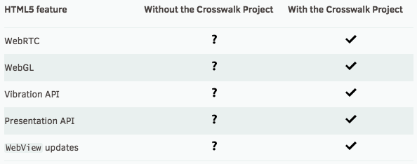

يوما بعد يوم يزداد اهتمام مطورو الويب بتطبيقات الموبايل بفضل ثورة **التطبيقات الهجينة Hybrid Applications** التي تقودها منصة **أباتشي كوردوفا** Apache Cordova حيث تعطينا إمكانية برمجة تطبيقات أندرويد، iOS، ويندوز فون باستعمال اللغات والأدوات التي ألفناها في مشاريع الويب الإعتيادية، الحديث عن : جافاسكريبت، HTML و CSS باستعمال WebView الخاص بالموبايل.

ولكن في كل مرة نتكلم عن WebView يجرنا الحديث إلى معضلة التوافقية Compatibility التي يعلمها مطور الويب أكثر من غيره، فكل WebView لديه مواصفات تختلف من جهاز لآخر و تختلف أيضا حسب إصدار نظام التشغيل.

شخصيا وقعت في هذا المطب عندما انتهيت من برمجة [تطبيقي الأول](https://play.google.com/store/apps/details?id=com.alrabeeh.anziapps) وكنت في كل مراحل التطوير أجرب التطبيق فقط على الموبايل الخاص بي والذي يعمل بنظام أندرويد 5.0.1 الحديث، فكانت كل الأمور تبدو لي على ما يرام إلى أن قمت بنشر التطبيق على غوغل بلاي فأخبرني أحد أصدقائي لديه هاتف يعمل بنظام أندرويد أقدم (4.1) أن التطبيق لا يظهر عنده بالشكل المتوقع فلما جربت التطبيق في نفس الإصدار وجدت الأمر صحيحا، وبعد سويعات من البحث ومحاولة إيجاد مصدر المشكل وجدت أن الإشكال في خاصية _\-webkit-calc_ التي لا تدعمها WebView في إصدارات الأندرويد القديمة وبالتالي لم تكن تظهر لائحة التصنيفات في التطبيق لأن إرتفاعها كان يساوي 0، مما اضطرني لإيجاد حلول بديلة تعمل على كلتا المنصتين.

آنذاك لم أكن أعرف عن [مشروع Crosswalk](https://crosswalk-project.org/) أي شيء و لكن بعد البحث وجدت ضالتي فيها (ولو أن لها سلبيات يجب أخذها في عين الإعتبار سنذكرها لاحقا)، لقد جاءت هذه الإضافة لتحل مشكل التوافقية لأنها تضع بين أيدينا WebView موحد مبني على إمكانيات المشروع المفتوح المصدر Google Chromium الخاص بغوغل والذي يدعم كافة أو معظم الواجهات APIs والخصائص الحديثة في الجافاسكريبت وHTML5 وكذلك CSS3 مع الإرتقاء بالأداء والفعالية.

[](../images/crosswalk-runtime.png)

هذه الإضافة تغنيك بعد ذلك عن التفكير في موضوع التوافقية ووضع أكواد لكل جهاز وإصدار على حدة.

## تثبيت إضافة Crosswalk مع كوردوفا

ليس هناك أسهل من تثبيت هذه الإضافة في منصة كوردوفا، كل ما عليك فعله هو تنفيذ هذا السطر في نافذة الأوامر Command Line :

```
cordova plugin add cordova-plugin-crosswalk-webview
```

بعد ذلك يمكن لك بناء تطبيقك كالمعتاد باستعمال الأمر :

```
cordova build android
```

إلا أنه في هذه الحالة ستحصل على ملفي APK وليس ملف واحد، السبب هو أن Crosswalk تعتمد على البيئة الهندسية لنظام أندرويد المستعمل (x86 أو ARM) وبالتالي يتم بناء ملف APK لكل حالة على حدة.

> لا تقلق متجر Google Play يمنحك إمكانية نشر أكثر من ملف APK على حسب نوعية هندسة المعالجات المستعملة في إصدارات أندرويد في الهواتف المستهدفة من طرف التطبيق.

```
path/to/hello/platforms/android/build/outputs/apk/android-x86-debug.apk/
path/to/hello/platforms/android/build/outputs/apk/android-armv7-debug.apk/
```

## سلبيات Crosswalk

كما أشرت، هذه الإضافة لديها سلبيات لا يمكن تجاهلها لعل أهمها :

- حجم التطبيق يزداد حيث تضاف إليه حوالي 18MB هي حجم بيئة Crosswalk.
- التطبيق سيستهلك أكثر الذاكرة العشوائية للجهاز (RAM).
- التطبيق بعد التنصيب يحجز حوالي 58MB من المساحة التخزينية للجهاز.

إذن أنت أمام طريقين:

1. إما التضحية ببعض من خفة تطبيقك وزيادة حجمه مقابل توافقية تامة مع مختلف الأجهزة المستهدفة
2. أو التمسك بما لديك وانتهاج سياسة التجريب والتصحيح على أجهزة وإصدارات مختلفة.

ربما في ما يستقبل من الأيام ستكون هناك قابلية للتخصيص في بيئة Crosswalk من أجل اختيار العناصر والواجهات التي نحتاجها فقط للتحكم في حجمها، ولكن حاليا هذا غير متاح، على الأقل لحد كتابة هذه الأسطر.

### المراجع :

- [https://www.grafikart.fr/blog/app-hybride-cordova-crosswalk](https://www.grafikart.fr/blog/app-hybride-cordova-crosswalk)
- [https://crosswalk-project.org/documentation/cordova.html](https://crosswalk-project.org/documentation/cordova.html)
