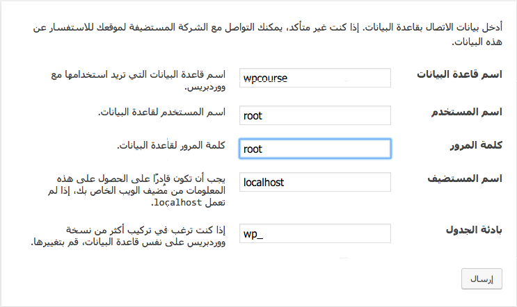
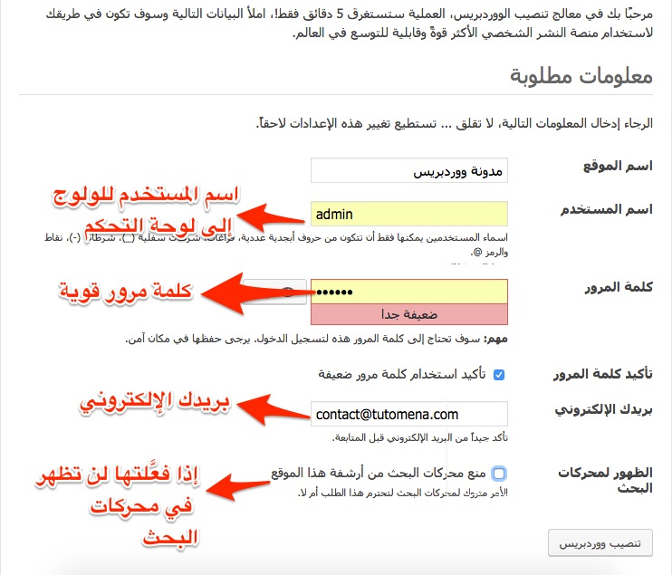
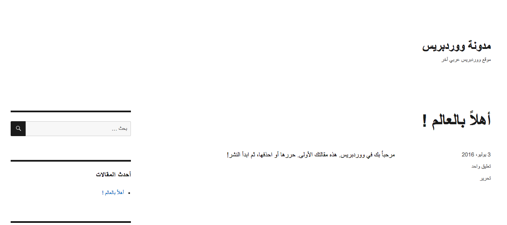

في هذا الجزء من سلسلة **بناء قالب ووردبريس من الصفر** سنبدأ من الصفر، لنرى كيف نقوم بتنصيب نظام إدارة المحتوى ووردبريس محليا، قبل ذلك يجدر بك كمطور أن تتوفر على الأدوات التالية للبدء في العمل :

- تثبيت سيرفر محلي (WAMP بالنسبة لمستعملي نظام ويندوز، MAMP لمستخدمي الماك، و XAMPP لعشاق اللينوكس)
- محرر أكواد (مثلا : Sublime Text).

بعد ذلك قوم بتحميل مجلد ووردبريس من الموقع الرسمي، في هذا المشروع سنعمل على النسخة العربية. قم بنقل ملفات ووردبريس إلى مجلد www في حال كنت من مستخدمي WAMP أو مجلد htdocs إن كنت من مستخدمي MAMP أو XAMPP.

الآن سنفتح المشروع على المتصفح من أجل البدء في عملية التنصيب. سيطلب منا ووردبريس عددا من المعلومات :

1. اسم قاعدة البيانات
2. اسم المستخدم لقاعدة البيانات
3. كلمة المرور
4. اسم المستضيف لقاعدة البيانات (localhost)
5. بادئة الجدول (من الأفضل أن تتركها كما هي : wp\_)

## قاعدة البيانات

هذه المعلومات التي ستحتاجها لبدء عملية التنصيب، وهي عملية في منتهى السهولة والسلاسة:

## معلومات خاصة بالمدونة

بعد ذلك سيطلب منك اسم المدونة واسم المستخدم وكلمة المرور (كلمة مرور قوية) للولوج إلى لوحة التحكم :

[caption id="attachment_688" align="aligncenter" width="742"]](../images/wordpress-install.jpg) معلومات خاصة بالمدونة\

بعد الضغط على زر **تنصيب ووردبريس** ستظهر لك رسالة على أن التثبيت تم بنجاح، هذا كل ما هناك :-)

بعد ذلك يمكنك فتح المدونة مع القالب الإفتراضي لووردبريس، كما أنه يمكنك الولوج للوحة التحكم لاستكشافها عبر الرابط التالي :

http://localhost/wp-ar/wp-admin

مع تعويض http://localhost/wp-ar/ باسم النطاق الذي تستخدمه.

هكذا تظهر الصفحة الرئيسية للمدونة مع القالب الإفتراضي لووردبريس :

القالب كما ترون ليس بالجذاب ولا بالجميل ولذلك سنقوم ببناء قالب ووردبريس خاص بنا ويلبي احتياجاتنا. هذا ما سنبدأ فيه في الجزء القادم من السلسلة إن شاء الله. تابعونا :-)
