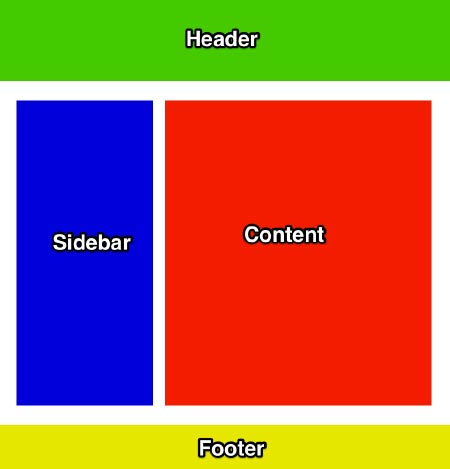
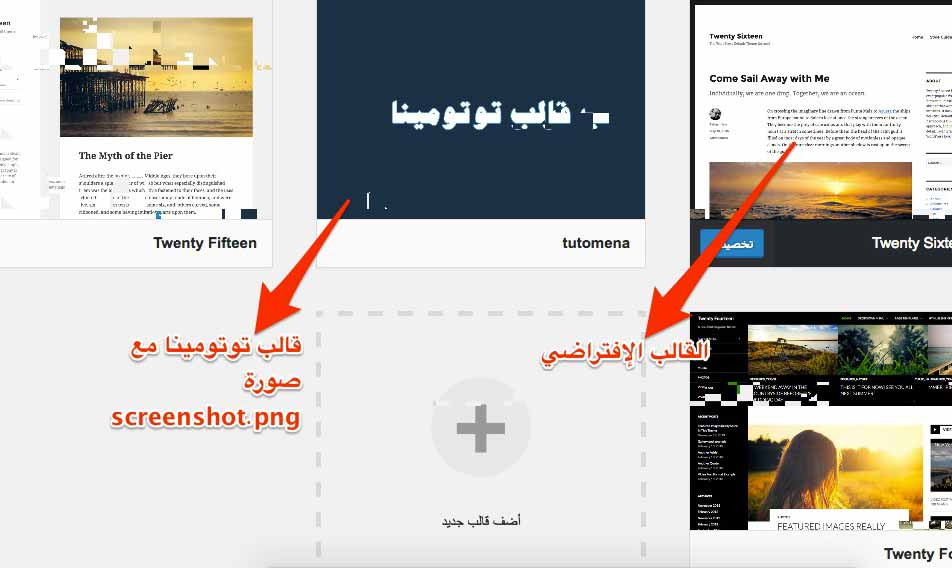

في هذا الدرس إن شاء الله سنبدأ في بناء قالب ووردبريس مثل الذي نستعمله مدونة توتومينا، سنحاول تبسيط الأمور قدر الإمكان، فالدورة موجهة للناس المبتدئين في ووردبريس قبل كل شيء. بعدما قمنا بتثبيت ووردبريس محليا في [الدرس السابق](http://www.tutomena.com/web-development/%d8%a8%d9%86%d8%a7%d8%a1-%d9%82%d8%a7%d9%84%d8%a8-%d9%88%d9%88%d8%b1%d8%af%d8%a8%d8%b1%d9%8a%d8%b3-%d9%85%d9%86-%d8%a7%d9%84%d8%b5%d9%81%d8%b1-%d8%a7%d9%84%d8%ac%d8%b2%d8%a1-1/)، اليوم سنقوم بإنشاء مجلد نسميه كما نشاء (نسميه مثلا tutomena) وذلك في مجلد themes على المسار التالي :

/htdocs/wp-ar/wp-content/themes

هذا هو المجلد الذي سيحتوي على جميع الملفات والعناصر التي تخص القالب الجديد، من ملفات CSS، جافاسكريبت، ملفات PHP الخاصة بالقالب إلخ...

## هيكل القالب

صفحات القالب ستكون في الشكل النهائي على هذه البنية كمعظم قوالب ووردبريس والمواقع بصفة عامة:

كما ترون هكذا يكون هيكل غالبية المواقع والمدونات، سنعمل على هذا الهيكل بحيث :

- المنطقة الخضراء (Header) : هي رأس الصفحة ستضم meta tags، اللوغو، القائمة الرئيسية للموقع إضافة لروابط أخرى في حال أردنا إضافتها. هذه المنطقة تتكرر في جميع الصفحات من دون تغيير ومحتواها سيكون داخل الملف _header.php_ الذين سنقوم بإنشائه لاحقا.
- المنطقة الزرقاء (Sidebar) : هو الشريط الجانبي للقالب وبدورها نجدها تتكرر في جميع الصفحات تقريبا، وتضم عددا من العناصر المهمة مثل مربع البحث، لائحة التصنيفات، آخر المقالات وتسمى هذه العناصر في الووردبريس **بالودجات** **Widgets**. محتوى هذه الصفحة سيتم وضعه داخل ملف اسمه _sidebar.php_، هكذا سيعرف ووردبريس أن ما بداخل هذا الملف هو الشريط الجانبي.
- المنطقة الصفراء (Footer) : قدم الصفحة وبدورها تتكرر ونراها في كل صفحات الموقع من دون استثناء ومن دون تغيير. تضم عددا من الأمور التي لها أهميتها مثل القائمة الثانوية للموقع، روابط لمواقع التواصل الإجتماعي إلخ... يتم وضع الشفرة البرمجية الخاصة بهذه المنطقة في ملف اسمه _footer.php_
- المنطقة الحمراء (Content) : هذه المنطقة هي روح الموقع وأهم جزء فيه، المنطقة التي تتغير بتغير الصفحات، هناك سيتم عرض تفاصيل التدوينات، لائحة التدوينات، نتائج البحث إلخ.... هنا يتم عادة (ليس دائما) وضع الكود الخاص بالمنطقة في ملف اسمه _content.php_

كما ذكرنا سابقا كل هذه الملفات وغيرها تكون داخل المجلد tutomena.

## ملف style.css ضروري

عنصر آخر مهم جدا في قالب الووردبريس هو ملف _style.css_ الذي يحتوي على كافة المعلومات المتعلقة بالقالب مثل اسم القالب الذي يظهر في لوحة التحكم للمستخدم ، صاحب القالب، رابط صاحب القالب إلخ... على شكل تعليق يبدأ من أول سطر في هذا الملف.

إذن لنبدأ بإنشاء هذا الملف لتبدو الأمور أكثر وضوحا :

/*
Theme Name: tutomena
Theme URI: http://www.tutomena.com
Author: Tutomena
Author URI: http://www.tutomena.com
Description: ضع هنا وصفا للقالب
*/

هذه أهم المعلومات التي يتضمنها ملف _style.css_، هناك معلومات أخرى يمكنك الإطلاع عليها على [هذا الرابط](https://codex.wordpress.org/Theme_Development).

## الصورة التعريفية للقالب

بعد حفظ هذا الرابط سنقوم بإضافة صورة تعريفية للقالب نسميها screenshot.png وأبعادها **1200x900**، هذه الصورة ستظهر عند الذهاب للوحة التحكم في لائحة القوالب المنصبة على الموقع.

## آخر الملفات الثلاثة الضرورية لكل قالب ووردبريس

ثم آخر ملف إجباري نضيفه هو _index.php_ وسنتركه حاليا فارغ تماما.

الآن سنقوم بتفعيل القالب الجديد من لوحة التحكم عبر هذا الرابط :

http://localhost/wp-ar/wp-admin/

ثم الذهاب إلى **مظهر** > **قوالب**.

لتظهر لنا لائحة القوالب الإفتراضية (تأتي مع ووردبريس) المنصبة في الموقع :

لتفعيل قالب توتومينا، نقوم بتمرير الفأرة على صورة القالب ليظهر زر "تفعيل" ثم نضغط عليه ليتم تفعيل القالب.

القالب لحد لآن يحتوي فقط على ثلاث ملفات : ملف style.css، ملف index.php فارغ، وصورة القالب screenshot.png لذلك عند تجريب الموقع على المتصفح ستظهر لنا صفحة بيضاء من دون محتوى.

بإذن الله في الدرس القادم سوف نشتغل على رأس الصفحة (الهيدر Header)، إلى ذلك الحين لا تنسوا التفاعل مع هذه الدورة والإدلاء بآرائكم وانطباعاتكم في صندوق التعليقات أسفله وعلى صفحتنا على فيسبوك.
