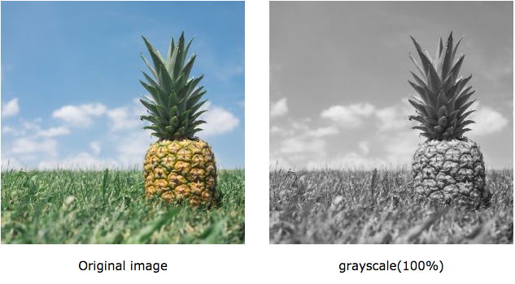

بحثت مؤخرا في غوغل عن كيفية جعل صورة معينة باللونين الأسود والأبيض فقط (Black/White) عن طريق CSS3 حيث كنت أود جعل الصورة بدون ألوان وبمجرد تمرير مؤشر الفأرة عليها تعود لها ألوانها الطبيعية.

كنا ننجز هذه المهمة بالطرق التقليدية وهي بوضع صورتين في كود html وإظهار إحداهمها حسب الرغبة، ولكن هذا الحل ليس مثاليا على الإطلاق حيث تزيد من وزن الصفحة وتظطر في كل مرة إلى تحرير الصورة في الفوتوشوب لتحويلها للأسود والأبيض ثم بعد ذلك تقوم بتحميلها رفقة صديقتها صاحبة الألوان الطبيعية.

## تحويل صورة إلى الأسود والأبيض باستعمال الخاصية [_filter : grayscale_]

لحسن حظي وجدت ما كنت أبحث عنه ومنذ الآن لن تكون هناك مهمة أسهل من التحكم في ألوان الصورة، الموضوع كله بهذين السطرين من الكود :

img.white-black {
-webkit-filter: grayscale(100%);
filter: grayscale(100%);
}

خاصية _filter_ تقبل [عدة قيم](http://www.w3schools.com/cssref/css3_pr_filter.asp) من بينها _grayscale_ والأخيرة تمكننا من تحويل ألوان الصورة إلى الأسود والأبيض، القيمة بين القوسين محصورة بين 0% و 100%، تفقد الصورة ألوانها كلما اقتربنا من 100 بينما تعود لوضعها الطبيعي كلما عدنا إلى 0.

وستلاحظون مفعول خاصية CSS3 هذه في الصورة أدناه :

جربوها في متصفحاتكم مع ضرورة إضافة البادئة _\-webkit-_ (كما في المثال أعلاه) لتعمل الطريقة على متصفحي كروم وسافاري.
