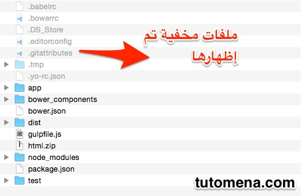

كوني أحد مستعملي نظام التشغيل ماك، بحثت عن طريقة لإظهار الملفات المخفية **Hidden files** ووجدت حلا سهلا للغاية لذلك، كل ما عليك فعله هو فتح نافذة الأوامر **Terminal** وكتابة الكود التالي :

_defaults write com.apple.finder AppleShowAllFiles -boolean true ; killall Finder_

بعد ذلك إظغط على الزر OK وستظهر لك الملفات المخفية كلها.

إذا أردت إعادة إظهارها مرة أخرى يكفي إعادة تنفيد نفس الأمر مع تغيير القيمة _true_ إلى *false *كما يلي :

_defaults write com.apple.finder AppleShowAllFiles -boolean false ; killall Finder_

تمت تجربة هذه الطريقة على نظام  **OS X Yosemite**.
