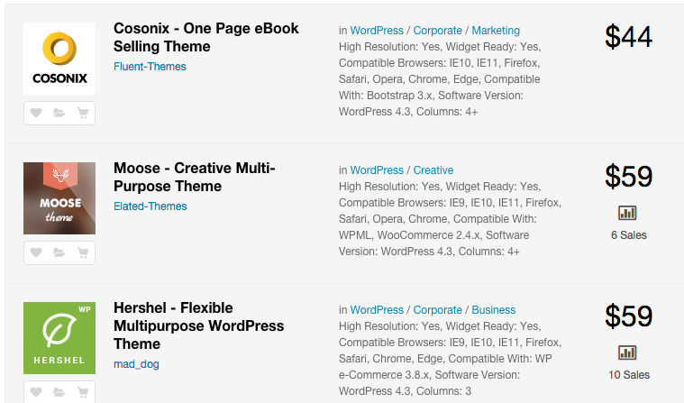

# الفوارق بين نظام إدارة المحتوى ووردبريس ومنصة التدوين بلوغر

من حين لآخر أرى بعض المهتمين بالويب وتقنيات التدوين من المبتدئين يسألون في المنتديات والمجموعات على فيسبوك عن الفرق بين نظام إدارة المحتوى **ووردبريس** وخدمة **بلوغر**. وقررت أن أحاول الإجابة على تساؤلاتهم المشروعة في هذا المقال وتفصيل الموضوع بأفضل شكل ممكن حتى تتوضح الفكرة للجميع.

سنعتمد في هذه المقارنة على عدة معايير وأوجه الإختلاف فيها بين ووردبريس وبلوغر حتى يكون الموضوع منظم وسهل الفهم والإستيعاب.

## الملكية

كما تعلمون، **بلوغر** خدمة مملوكة للعملاق غوغل ومستضافة في خوادمه (**Self-Hosted**)، وهي مجانية ومتاحة للجميع. بما أنها مملوكة لغوغل فإن الأخير له كامل الحرية في التدخل فيها وقتما وكيفما شاء كتغيير شروط استخدامها أو حتى إنهاء الخدمة وسحبها نهائيا كما فعل مع خدمات عديدة من قبل. وقد يلجأ القائمون على حظر حسابك إذا استدعى الأمر ذلك، مثلا إذا قمت بخرق شروط استخدام الخدمة إلخ...

في الجهة الأخرى نجد أن **ووردبريس** نظام حر مفتوح المصدر، يمكن لأي إنسان أن يقوم بتحميله من [الموقع الرسمي](https://ar.wordpress.org/) والبحث عن استضافة في أي مكان وإطلاق الموقع. هذه ميزة في ووردبريس لأننا نقوم بفتح المدونة وإغلاقها في الوقت الذي نشاء مع الولوج الحر والكامل لقاعدة البيانات والتعديل عليها كما يحلو لنا.

## التخصيص

بلوغر خدمة جامدة إلى حد بعيد، ليس بمقدورنا التعديل على موقعنا إلا قليلا جدا وذلك نظرا للخصائص والصلاحيات المحدودة التي وضعت في متناول المستخدم.

بينما في نظام ووردبريس يكون المطور في فسحة من أمره، بإمكانه تطوير إضافات أو استدعاء إضافات جاهزة من بين آلاف متوفرة لجعل ووردبريس نظاما مرنا يستجيب لمعظم متطلبات العملاء على اختلاف اختصاصاتهم.

_مثال : مع ووردبريس تستطيع إنشاء متجر إلكتروني متكامل عن طريق الإضافة **WooCommerce** بينما هذا الأمر_ _مستحيل مع بلوغر :)_

## المظهر

بفضل **نظام القوالب** في ووردبريس، تستطيع تقديم موقعك بالكيفية التي تريدها، بل هناك مئات القوالب الجاهزة مدفوعة ومجانية تستجيب لمعظم الحالات التي قد تصادفك. بينما في بلوغر تستطيع تغيير القالب **سطحيا** فقط أي أنك لن تضيف ميزات ووظائف أخرى غير التي تسمح بها غوغل افتراضيا وهي أصلا محدودة جدا كما أسلفنا.

[caption id="attachment_392" align="aligncenter" width="759"]](../images/wordpress-premium-themes.png) قوالب ووردبريس مدفوعة على موقع Themeforest.net\

## الأمان

هذه نقطة قوة منصة بلوغر، يكفي أن نعرف بأن غوغل يقف خلها لندرك حائط الأمان الذي يحيط بها. مع بلوغر لن تفكر بإمكانية اختراق الموقع أو الخادم التي يستضيفك، من هذه الناحية بلوغر واثق من نفسه يمشي ملكا :)

هذا ليس تقليلا من شأن الحماية التي يحظى بها ووردبريس ولكن مهما كانت استضافتك قوية وآمنة فلن تكون بقوة وسرعة وأمان خوادم غوغل. كما أن المشاريع المفتوحة المصدر دائما ما تكون عرضة لهجمات القراصنة ومحاولاتهم التخريبية :D

## الدعم

يحظى نظام إدارة المحتوى ووردبريس بدعم أكثر من رائع من طرف مجتمعه الذي يقدر عدد منتسبيه بالملايين، فكل مشكل تقع فيه مع برمجيات ووردبريس ستجد له حلا في الحين بمجرد إجراء عملية بحث بسيطة على محرك البحث.

بينما فيا الجهة الثانية لا يحظى بلوغر بذلك الدعم الذي يستحق التنويه، ربما لأن **معظم** مستخدميه من المبتدئين الذين لا يفقهون كثيرا في التقنية وكذلك لأن هذه الخدمة ليست إحدى خدمات غوغل التي تدر عليها أرباحا كبيرة حتى تخصص لها دعما قويا.

## المستقبل

مستقبل **بلوغر** لا يبدو واضحا ومضمونا، ولا يتوقع المتابعون أي تحديث لغوغل لهذه الخدمة على المدى القريب، بل إن عملاق **وادي السيليكون** قد يلجأ، كما ذكرنا سابقا، لإنهاء هذه الخدمة وقبرها نهائيا كما فعل مع سابقاتها Google Reader، غوغل فيديو، Google Buzz... لوى رأى القائمون على الأمور هناك أن هذه المنصة لا تخدم كثيرا النتائج المالية للشركة ولا سمعتها.

أما **ووردبريس** فليطمئن عشاقه، لأن الآفاق المنظورة تبشر بخير كثير لهذا النظام، كيف لا وهو كما قلنا لا يرتبط بأي جهة معينة إرتباط بلوغر بغوغل، كذلك نظرا للدعم الكبير الذي يحظى به من طرف المطورين من جميع أنحاء العالم. يكفي أن نشر إلى أن حوالي **خمس** مواقع الإنترنت مبنية على نظام ووردبريس.

### خاتمة

خلاصة الكلام حسب رؤيتي المتواضعة :

إذا كنت تنوي القيام بأولى خطواتك في عالم التدوين ونشر المحتوى فبلوغر قد يكون خيارا مقبولا لك، أما إذا كنت تخطط لإنشاء مشروع احترافي ذو آفاق مستقبلية فووردبريس هو الخيار الأفضل دون شك والعدد الكبير من المشاريع الناجحة التي اعتمدت على هذا النظام كفيل بإقناعك بهذا الخيار.

---

ترجمة بتصرف للمقال :

- [http://www.wpbeginner.com/opinion/wordpress-vs-blogger-which-one-is-better-pros-and-cons/](http://www.wpbeginner.com/opinion/wordpress-vs-blogger-which-one-is-better-pros-and-cons/)
