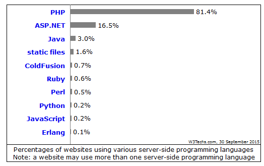

لا شك أن **لغة **البرمجة **PHP** هي الأكثر استعمالا والأوسع انتشارا في مجال برمجيات الويب، ليس لأنها الأقوى والأكثر اكتمالا فجميع المطورين يعلمون أنه لا يمكن أصلا الحديث عن لغة برمجة مثالية. PHP وصلت لهذه المكانة بفضل عدة عوامل تظافرت معا لتجعلها اللغة التي تدعم زهاء [80% من المواقع على شبكة الإنترنت](https://w3techs.com/technologies/details/pl-php/all/all) وهذا الرقم كبير جدا حيث أننا نتحدث عن مئات الملايين من المواقع والتطبيقات.

[caption id="attachment_926" align="aligncenter" width="524"] الصورة من موقع w3techs.com\

ما هي إذن هذه العوامل والأسباب التي ساعدت **لغة PHP** على اعتلاء العرش دون مزاحمة ؟ وما هو السر في هذا القبول الكبير الذي تلقاه عند المطورين بجميع فئاتهم ؟

## سهولة التعلم

تحظى PHP بمجتمع داعم **Support community** ضخم جدا، يضم عشرات الآلاف من المطورين يجيبون على كل الأسئلة التي تطرحا مهما بلغ مستواك في البرمجة. هذه النقطة تصب أيضا في مصلحة المطورين الجدد الذين يجدون في لغة البرمجة PHP أفضل خيار للبدء في تعلم أساسيات برمجيات الويب.

## الإنتقال من HTML إلى لغة البرمجة PHP سهل جدا

من السهولة بمكان تعديل صفحة html ساكنة وتحويلها إلى صفحة php ديناميكية، كل ما عليك فعله هو تغيير امتداد الملف من .html إلى .php وبعدها يمكنك استعمال أكواد **بي إتش بي** كما يحلو لك داخل الملف. لن تكون في حاجة إلى إطار عمل أو تعديلات على بيئة العمل باستثناء ضرورة التوفر على خادم محلي بطبيعة الحال (WAMP، XAMPP، MAMP).

## سهولة الرفع والنشر

معظم الإستضافات تدعم بشكل افتراضي **لغة PHP** على خوادمها، وبالتالي مهما كانت الإستضافة التي تود رفع موقعك عليها، مجانية أو مدفوعة، فإنك لن تجد صعوبة تذكر في عملية النشر، الأمر يشبه عملية النسخ واللصق التي تقوم بها كل يوم على جهازك.

معظم منافسي **لغة البرمجة PHP** يفشلون في هذه النقطة، فاستضافة موقع مدعوم بأحد إطارات العمل _Rails_, _Django_ أو حتى _J2EE_ لن يكون أسهل شيء تقوم به في حياتك! وهذا عائق في حد ذاته أمام المطورين المبتدئين وقليلي الخبرة.

## أشهر أنظمة إدارة المحتوى مدعومة من PHP

[ووردبريس](https://www.tutomena.com/web-development/wordpress-evolution-story/)، **دروبال** و**جوملا** : كل هذه الأنظمة طورت بواسطة لغة البرمجة PHP، [ووردبريس لوحده يدعم 30% من مجموع المواقع والمدونات على الشبكة العنكبوتية](https://www.tutomena.com/news/wordpress-top-cms-2018/). هذا ساعد كثيرا على اتجاه عدد هائل من المطورين لتعلم هذه التقنيات والعمل بها، الشيء الذي يساعد بصفة مباشرة PHP على البقاء في قمة الهرم.

## لغة البرمجة PHP قديمة العهد

تم إطلاق أول إصدار من PHP في عام 1995 وبعدها جاءت الإصدارات الأخرى وتطورت هذه اللغة في الوقت الذي لم يكن فيه آنذاك منافسون جادون لمزاحمتها إذا استثنينا _Java JSP_, _Coldfusion_ و *Perl CGI* اللواتي حاولنا اقتسام كعكة الويب مع PHP ولكن في النهاية كانت للأخيرة الكلمة العليا.

### خاتمة

الأسباب التي أوصلت **لغة البرمجة PHP** للقمة كثيرة ومتداخلة ولا يمكن حصرها وتفصيلها في مقال واحد، ولكن الشيء المهم هو أن النتائج واضحة أمامنا جميعا، لا يمكن لأحد إنكار أن صناعة الويب تعتمد في هذه الأيام بشكل كبير على هذه اللغة والتقنيات المتعلقة بها. المتابعون والمتخصصون في هذا المجال مقتنعون بأن هذا النجاح سيستمر لسنوات عديدة قادمة، في انتظار ظهور بديل أو بدائل تهز بشكل جدي عرش لغة [راسموس ليردورف](https://en.wikipedia.org/wiki/Rasmus_Lerdorf).

إلى ذلك الحين دعونا نستمتع ونواصل المسيرة مع **PHP** :)
