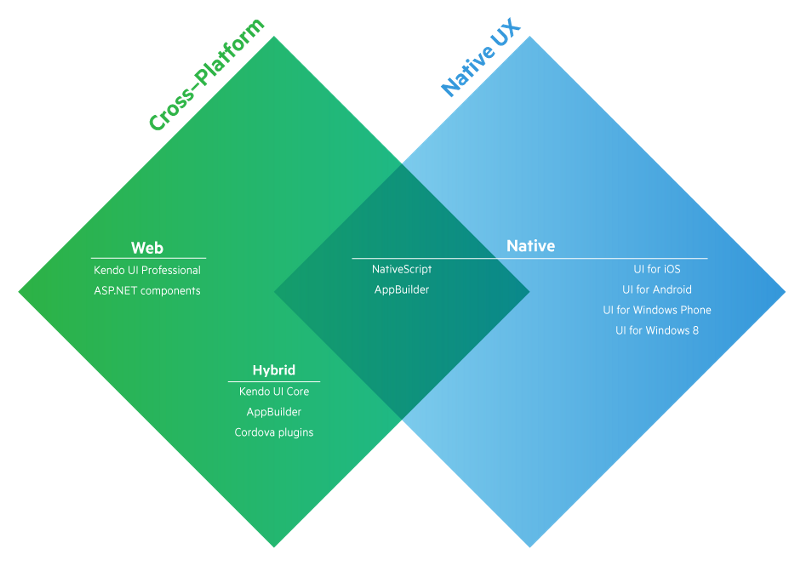

# تعرف على منصة NativeScript لتطوير تطبيقات الهواتف الذكية

منذ عشر سنوات تقريبا، شهد سوق **الهواتف الذكية** ثورة كبيرة انعكست آثارها بشكل مباشر على عادات المستخدمين في الولوج لشبكة الإنترنت. فبعدما كان المستخدمون يضطرون للجلوس أمام حواسبهم من أجل الدخول إلى مواقعهم المفضلة أو الإطلاع على بريدهم، أصبحوا الآن يفعلون كل كذلك وهم في طريقهم نحو العمل في الصباح الباكر أو قبل الخلود للنوم ليلا وذلك انطلاقا من هواتفهم وأجهزتهم اللوحية.

لقد أصبحت التطبيقات الذكية جزءً لا يتجزأ من ثورة الموبايل، فالهاتف الذكي من دون تطبيقات لن ينفعنا كثيرا، كما أن شركات ومقاولات كبرى أولت اهتماما كبيرا جدا لظهورها على مختلف أنظمة الهواتف الذكية، بل إنه في السنوات الأخيرة ظهرت تطبيقات تحقق أرباحا بمئات الملايين من الدولارات آخرها لعبة **بوكيمون جو**.

المطورون بدورهم وجدوا أنفسهم مرغمين في الركوب على موجة هذه الثورة، فأصبحنا نسمع في السوق بما يسمى مطوري تطبيقات الهواتف Mobile Applications Developers ويتقاضون أجورا مرتفعة مقارنة بباقي المطورين. تعمل الهواتف الذكية بأنظمة تشغيل مختلفة، أبرزها وأكثرها انتشارا نظام **أندرويد** الذي طورته غوغل ثم نظام **iOS** الذي تطوره وتحتكره شركة آبل العملاقة وهو النظام الذي تعمل به هواتف آيفون وأجهزة آيباد اللوحية.

هنا يجد المطورون أنفسهم أمام  مفترق طرق يوجب عليهم اتخاذ القرار في أي من النظامين سيتخصص، هل في أندرويد المدعومة تطبيقاته بلغة البرمجة **جافا** أم في نظام iOS الذي تطور تطبيقاته إما بلغة **objective-c** أو بلغة **swift** التي طورتها آبل مؤخرا لكي تكون هي وريث objective-c في برمجة تطبيقات الأجهزة التابعة لشركة آبل (macOS, iOS, watchOS, tvOS).

لهذا السبب اجتمع مطورو وعشاق لغة البرمجة جافاسكريبت وتساءلوا : مادمنا كنا نستطيع تطوير تطبيقات ويب مدعومة بالجافاسكريبت وتعمل على جميع المنصات والأجهزة، فلماذا لا نجد مسلكا الآن لنتمكن من فعل نفس الشيء مع تطبيقات الموبايل ؟ ليس هناك مستحيل!

## أباتشي كوردوفا Apache Cordova

أول محاولة ناجحة كانت تطوير منصة **Phonegap**، وسميت فيما بعد **أباتشي كوردوفا**، وتمكننا من برمجة تطبيقات موبايل هجينة تعمل على جميع المنصات انطلاقا من اللغات التي اعتدنا العمل بها في الويب : جافاسكريبت، CSS وHTML.

أباتشي كوردوفا أداة رائعة ومحاولة أكثر من ممتازة، ولكن تعتريها عدد من النواقص لعل أهمها أنها تستعمل ال **WebView** الخاص بالجهاز ويمكن تصور ال WebView على أنه متصفح مدمج بالجهاز وفيه يتم تنفيذ أكواد الجافاسكريبت و CSS وHTML التي كتبناها، وكما تعرفون فالمتصفحات لا تعمل كلها بالشكل المتوقع فكل متصفح له دعمه الخاص لعدد من العناصر والواجهات APIs في الجافاسكريبت كما أنك مثلا قد تطور تطبيقات بواسطة كوردوفا وتجده يعمل كما هو متوقع في الأجهزة التي تعمل بنسخ حديثة من **أندرويد** بينما تجده على عكس المنتظر في نسخ أقدم، كل نسخة أندرويد جديدة تأتي بنظام WebView أحدث ويدعم عناصر وأشياء جديدة لا يدعمها النظام القديم.

هناك عدد من الأدوات، مثل [إضافة Crosswalk](http://www.tutomena.com/web-development/tools/crosswalk-cordova-plugin/)، تم تطويرها لتجاوز هذا المشكل ونجحت في ذلك ولكنها جاء بإشكاليات أخرى مثل تسببها في زيادة حجم التطبيق بشكل ملحوظ.

استعمال ال WebView كذلك يعني أنه لا يمكننا العمل بالواجهات الرسومية الأصلية Native UI لكل نظام، حتى ولو جاءت عدد من إطارات العمل مثل Ionic، Sencha Touch لمنح مطوري كوردوفا واجهات رسومية أقرب إلى الأصلية ولكنها تظل مجرد CSS وHTML ولن تكون في مستوى الإحساس Feeling الذي نشعر به عند استخدام **واجهات المستخدم** الأصلية.

## تطبيقات الموبايل الأصلية مع NativeScript

بعد كل تلك الآثار الجانبية التي ظهرت مع منصة أباتشي كوردوفا، واصل مطورو الجافاسكريبت اجتهادهم لإيجاد أكثر الحلول نجاعة حتى توصل مطورو شركة Telerik (هل تعرفها ؟ :)) لحل يمكنهم من برمجة **تطبيقات موبايل أصلية** سموه **NativeScript**.

منصة **NativeScript** تمنحنا فرصة برمجة **تطبيقات أصلية** باستعمال لغة الجافاسكريبت و جزء من ال CSS (ليس كل ال CSS) والأمر الجديد أنها عوضت استعمال أكواد ال HTML بأكواد XML لإنشاء واجهات رسومية UI أصلية. فلسفة NativeScript هي برمجة التطبيق مرة واحدة ويعمل على مختلف المنصات **Cross-platform app** (أندرويد و iOS لحدود الساعة). وبنيت هذه المنصة على محركي الجافاسكريبت V8 و JavaScriptCore للتعامل مع اللغات الأصلية لكل نظام على حدة ( جافا بالنسبة لأندرويد و objective-c بالنسبة ل iOS).

[](../images/nativescript-native-mobile-applications-1.png)

```js
var time = new android.text.format.Time();
time.set(1, 0, 2015);
console.log(time.format('%D'));
```

المثال أعلاه يوضح كيف أنه استطعنا استخدام كائنات جافا Java Objects داخل الجافاسكريبت وكأننا مزجنا بين اللغتين. تم هذا بفضل واجهة جافا الأصلية **J**ava **N**ative **I**nterface التي تعد بمثابة جسر Bridge يمكن كائنات الجافا من المرور للضفة الأخرى عند C++ ومعروف بأن محرك V8 تم بناؤه بلغة البرمجة C++.

بينما في حالة تطبيقات iOS فإنه لا نحتاج لهذا الجسر لأنه يمكن ل C++ الإستدعاء المباشر للواجهات الأصلية Native APIs ل objective-c **افتراضيا**.

هذه التفاصيل معقدة نوعا ولكن فقط ما يجب معرفته هو أن NativeScript يعتمد على محركات الجافاسكريبت JavaScript Engines والتعديل عليها من أجل الوصول للواجهات الأصلية لأنظمة المحمول التي يدعمها.

هذه التقنية نفسها استخدمها [Nodejs](http://www.tutomena.com/web-development/javascript/what-is-nodejs/) للتعديل على محرك الجافاسكريبت V8 وإضافة ميزات وواجهات جديدة له.

وإذا كنت راغبا في الحصول على مزيد من التفاصيل حول كيفية عمل NativeScript، قم بزيارة [هذا الرابط](http://developer.telerik.com/featured/nativescript-works/).

الشيء الجميل أنه يمكننا استخدام إطار العمل الشهير Angular 2 مع منصة NativeScript وهذا [افتراضيا](http://docs.nativescript.org/angular/tutorial/ng-chapter-0)، أي أنك لن تبدل أي مجهود في محاولة الدمج بين التقنيتين. هذا سيسهل علينا العديد من المهام التي جاء Angular لتبسيطها.

المثال التالي لكيفية الحصول على نسخة تطبيق معين باستخدام NativeScript :

```js
appversion.getVersionName().then(function(version) {
  console.log(version);
});
```

ثلاثة أسطر للحصول على نسخة التطبيق على جميع المنصات، أليس هذا رائعا ؟

لاحظ ماذا عليك فعله لكي تحصل على نفس النتيجة على أندرويد باستعمال جافا :

```java
import android.content.pm.PackageInfo;
import android.content.pm.PackageManager;

PackageInfo packageInfo = getApplicationContext()
.getPackageManager()
.getPackageInfo(getApplicationContext().getPackageName(), PackageManager.GET_META_DATA);

System.out.println(packageInfo.versionCode);
```

وعلى iOS باستخدام لغة البرمجة objective-c :

```objective-c
NSString version = [[NSBundle mainBundle] objectForInfoDictionaryKey: @"CFBundleShortVersionString"];
NSLog(@"%@", version);
```

المهمة أصعب مما كانت عليه مع NativeScript، وهذا مجرد مثال صغير لإيجابيات هذه المنصة.

### خاتمة

هذا باختصار خلاصة المجهود الذي قام به مطورو الجافاسكريبت حتى الآن لبرمجة **تطبيقات موبايل أصلية** باستخدام تقنيات الويب المعتادة. NativeScript يبدو خيارا يستحق التجربة وقد ظهر من بعده منافس آخر بنفس الفكرة وبلفلسفة مختلفة : إنه [React Native](https://facebook.github.io/react-native/) الذي تقف خلفه شركة Facebook العملاقة ويعتمد على مكتبة **React.js** في كتابة وترتيب أكواد الجافاسكريبت. قد نقوم في قادم الأيام بكتابة مقال حول الفلسفة التي جاء بها **React Native** وأوجه الإختلاف بينه وبين **NativeScript**.

إلى ذلك الحين لا تترددوا في إبداء آرائكم حول الموضوع في صندوق التعليقات، كما سنكون دائما سعداء بالإجابة على استفساراتكم وأسئلتكم.

---

### المراجع

- [https://www.smashingmagazine.com/2016/07/cross-platform-native-apps-single-code-set-telerik-nativescript/](https://www.smashingmagazine.com/2016/07/cross-platform-native-apps-single-code-set-telerik-nativescript/)
- [http://developer.telerik.com/featured/nativescript-works/](http://developer.telerik.com/featured/nativescript-works/)
- [https://medium.com/@saniyusuf/why-you-should-be-excited-about-telerik-nativescript-14da8bee607b](https://medium.com/@saniyusuf/why-you-should-be-excited-about-telerik-nativescript-14da8bee607b)
