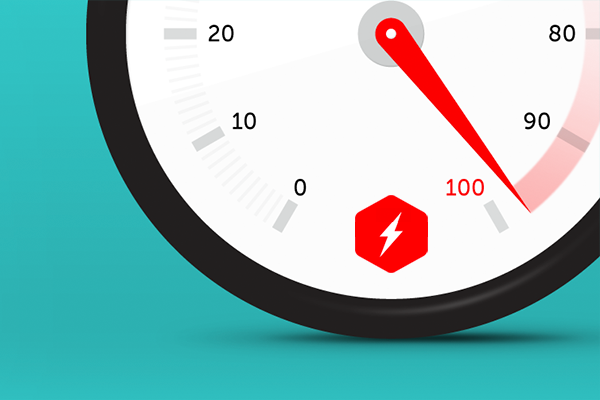

# نصائح لتحسين موقعك على محركات البحث

إذا كنت تملك موقعا إليكترونيا وتتابع إحصائياته على Google Analytics فحتما ستلاحظ أن أفضل الزيارات لموقعك، من حيث معدل الإرتداد المنخفض وتفاعل الزوار، هي التي جاءتك من محركات البحث وعلى رأسها بكل تأكيد **غوغل**.

عناكب وروبوتات غوغل وكيفية تصنيف وترتيب صفحات المواقع هي أمور سرية لم تخبر غوغل أحد عن تفاصيلها، ومع ذلك فإن هناك عدد من السلوكيات ثبتت فعالياتها في الإرتقاء بموقعك أو مدونتك على [محركات البحث](http://www.tutomena.com/blog/%d8%a2%d9%84%d9%8a%d8%a9-%d8%b9%d9%85%d9%84-%d9%85%d8%ad%d8%b1%d9%83%d8%a7%d8%aa-%d8%a7%d9%84%d8%a8%d8%ad%d8%ab-%d8%a8%d8%af%d9%88%d9%86-%d8%aa%d8%b9%d9%82%d9%8a%d8%af/) وتصدر صفحاتها الأولى في نتائج البحث. وسنذكر هنا عددا من النصائح والخطوات التي يجب على كل مدون وصاحب موقع إلكتروني اتباعها **لتحسين ظهور موقعه على محركات البحث **(أو ما يصطلح عليه **بالسيو** **SEO**) والحصول على النتائج المبهرة التي يتمناها.

## 1. انشر محتوى ذو جودة عالية

أهم شيء في أي موقع هو المحتوى، هو بمثابة الطعام بالنسبة لمحركات البحث والنقاط الأخرى التي سنذكرها هي مجرد وصفات وتوابل لجعل الطعام ألذ وأكثر قبولا لدى عناكب هذه المحركات. ركز على أن يكون المحتوى الذي تقدمه في مدونتك ذو قيمة مضافة وحذاري حذاري من النسخ واللصق وإلا حكمت على موقعك بالإعدام.

[caption id="attachment_977" align="aligncenter" width="800"] المحتوى هو الملك\

نقطة أخرى يجب الإنتباه إليها وهي أنه كلما كان الموضوع طويلا ومفصلا كلما كان ذلك أفضل وزاد من فرصه في الظهور أولا في نتائج البحث.

## 2. الكلمات المفتاحية

تجنب قدر الإمكان الخوض في المواضيع العامة الفضفاضة التي لا تستهدف أي موضوع محدد، التخصص وإيجاد الكلمات المفتاحية المناسبة من الأمور الهامة والحاسمة لجعل موقعك يظهر في صفحة غوغل الأولى.

استعمل أداة Google Keyword Tool لدراسة الكلمات المفتاحية المتاحة وتجنب دائما الكلمات التي عليها منافسة شديدة من الناشرين والشركات الكبرى، فمثلا عوض التركيز على كلمة "هاتف سامسونغ"، والتي ستجد حتما منافسة شديدة حولها، قم باستهداف الكلمة المفتاحية "هاتف سامسونغ غالاكسي s7" وهكذا حتى تجد الكلمة المفتاحية التي عليها **إقبال جيد** وفي نفس الوقت **لا تخضع لمنافسة شرسة**.

قم بوضع الكلمة المفتاحية في عنوان الموضوع وكذلك يستحسن أن تضعها في أحد العناوين الفرعية للموضوع، كما لا تنسى ذكرها في الفقرة الأولى كذلك، وكلما كان الموضوع طويلا كلما ظهرت الكلمة المفتاحية أكثر تلقائيا.

## 3. ضع عناوين وتوصيفات فريدة وغير مكررة

ضع عنوانا فريدا للمقال ولا تكرر عناوين لمواضيع سابقة في مدونتك، نفس الشيء بالنسبة لوصف المقال Meta description. يستحسن ألا يتجاوز طول العنوان 55 حرفا ولا تنسى ضرورة وضعه في وسم **H1** وكذلك الإشارة للكلمة المفتاحية داخل وسم الوصف Meta Description.

## 4. ضع خريطة للموقع SiteMap

إن وضع رابط لخريطة موقعك يساعد على أرشفة صفحات موقعك وهي في غاية الأهمية **لتحسين موقعك على محركات البحث**. إذا كنت تستخدم نظام إدارة المحتوى ووردبريس فستجد عددا من الإضافات الجيدة لتوليد خريطة الموقع وتحديثها كلما قمت بنشر موضوع جديد أو تحديثه وأهمها إضافة **Google XML Sitemaps** وهي نفسها التي أستخدم في مدونة توتومينا. بعدها توليد الخريطة قم بالذهاب لحسابك على **Google Webmaster tools** وأضف رابط الخريطة في المكان المخصص لذلك.

## 5. قم بإصلاح أخطاء 404 في موقعك بشكل دوري

تأكد من أن جميع روابط موقعك تعمل بشكل سليم ولا توجد هنا أي أخطاء 404 لصفحات مفقودة أو غير موجودة، هذه الأخطاء تؤثر سلبا على **تجربة المستخدم User Experience** وبالتالي على سمعة موقعك لدى محرك البحث. إذا كنت أحد مستخدمي **ووردبريس** فهناك عدد من الإضافات تقوم بفحص موقعك وكشف الروابط التي لا تعمل وتقوم بتحويلك لصفحات ذات صلة بالتي طلبتها في حالة فقدانها. كما أن هناك عدد من إضافات **غوغل كروم** تقوم بتفحص موقعك وكشف **الروابط المكسورة**.

## 6\. رَوِّجْ لموقعك عن طريق النشر في مواقع أخرى

إذا كنت مدونا في مجال برمجيات الويب أو التصميم فاذهب إلى مواقع متخصصة في نفس المجال وذو تصنيف جيد على محركات البحث وقم بالنشر فيها من حين لآخر، وقم ببناء روابط خلفية Backlinks قوية نحو موقعك. هذا ما يسمى ب Guest Blogging وهي وسيلة جد فعالة في الترويج لمدونتك وزيادة مصداقيتها لدى محركات البحث.

## 7. قم بتهيئ الصور جيدا لمحرك البحث

الصور مهمة جدا في الرفع من جودة وقيمة المحتوى الذي تقدمه، كلما كان المحتوى متنوعا وغنيا بأنواع مختلفة من الوسائط والمعطيات كان ذلك أفضل. روبوتات محرك البحث لا تستطيع قراءة ما في الصور إلا عن طريق السمة ALT الذي [يستخدم لوصف الصورة](http://www.tutomena.com/web-development/optimizing-images-for-seo/) في جملة قصيرة وكذلك اسم ملف الصورة File Name مهم جدا بحيث يجب أن يكون دالا عما بداخل الصورة وتجنب دائما التسميات الإعتباطية.

## 8. روابط خارجية نحو مواقع قوية

قم بإنشاء روابط خارجية نحو مواقع ذات تصنيف ومصداقية مرتفعين، هذا يعطي انطباعا جيدا لمحرك البحث عن جودة محتواك بشرط ألا تبالغ في بناء تلك الروابط.

## 9. قم بتسريع موقعك قدر الإمكان

**تجربة المستخدم** تبدأ في التبلور بداية من تحميل الصفحة، فإذا كانت سرعة التحميل جيدة فسيكون ذلك نقطة إيجابية لصالحك في معركة إرضاء وإسعاد المستخدم، أما إذا كان الموقع ثقيلا فذلك يعني أوتاماتيكيا عدم رضى الزائر الذي لن يظل ينتظر طويلا من أجل الدخول لموقعك، وهذا بكل تأكيد يسيء لتجربة هذا المستخدم كما أنه يزيد من **معدل الإرتداد** لديك **Bounce Rate** وبالتالي تردي سمعة الموقع.

## 10. على موقعك أن يكون متوافقا مع جميع الأجهزة

سواء قام الزائر بالدخول لموقعك من هاتف محمول، جهاز لوحي أو حاسوب مكتبي فعملية التصفح يجب أن تكون طبيعية وأن تظهر صفحات الموقع كلها بشكل جيد وتكون **متجاوبة** **Responsive** مع جميع هذه الأجهزة. غوغل أدخلت **معيار التوافقية** هذا في خلطتها السحرية لتصنيف وأرشفة المواقع وأعلنت عنه رسميا قبل نحو عامين.

## 11. الروابط الداخلية مهمة

ما قلناه عن دورالروابط الخارجية نحو مواقع ذات **أثوريتي** **Authority** مرتفع صحيح أيضا بالنسبة للروابط الداخلية، حاول أن تضع رابطا نحو مقال ذات صلة في موقعك لتدعم بها موضوعك الحالي، هذا سيساعد في إبقاء الزوار في موقعك لأطول فترة ممكنة وبالتالي خفض معدل الإرتداد للموقع. ولكن تجنب دائما الإطناب في استخدام هذه الروابط ودع الأمور تبقى دائما في إطارها الطبيعي.

## 12. انشر محتوى جديد باستمرار وبكيفية منتظمة

قم بتجديد محتواك بصفة مستمرة وبانتظام، المحتوى الجيد والمتجدد يعبر عن جديتك في هذا العمل وهذا ما يرفع من مدى مصداقيتك وسمعتك في محرك البحث. واعلم جيدا أن نشر موضوع واحد أو اثنين كل أسبوع أفضل من نشر 10 مواضيع في أسبوع واحد ثم الإنقطاع عن النشر لأشهر ثم العودة مرة أخرى.

في فترات النشاط والحيوية التي تدون فيها بغزارة حاول حفظ تدويناتك على شكل مسودات ونشرها بشكل دوري وفق جدول زمني منتظم فسوف تفيدك كثيرا في فترات الخمول والكسل التي يمر منها كل واحد منا.

### خاتمة

هذه تقريبا الخلطة التي يجب على كل مدون وصاحب موقع استعمالها والبدء بها **لتحسين ترتيبه على محركات البحث**. **السيو** مجال واسع جدا للإجتهاد المستمر، فعناكب غوغل وغيرها تطور باستمرار وتدخل معايير جديدة على الخط، وعلى مدراء المواقع والمدونات البقاء دائما على أهبة الإستعداد وتحسين مواقعهم باستمرار. والخطوة الوحيدة التي يجب دائما البدء بها والتي لن يطالها التغيير هي : **أنشر محتوى جيد وحصري**.
