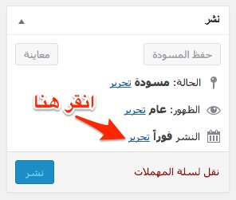
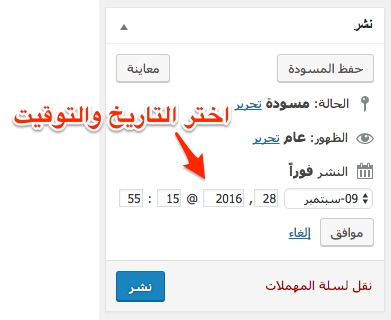

# تعلم كيفية جدولة المنشورات في نظام ووردبريس

**جدولة المنشورات** (Scheduling Posts) من الأمور المهمة في كل مدونة، حيث أنه في فترات نشاطك القصوى كمدون تستطيع كتابة 3 إلى 4 تدوينات في اليوم الواحد، وبالتأكيد فإنه ليس من الحكمة نشرها كلها في ذات الوقت.

أهم شيء بالنسبة للمدون هو أن يحافظ على متوسط عدد التدوينات الذي يقوم بنشرها كل يوم وألا يلجأ للنشر المكثف على فترات ثم ينقطع فترات أخرى، هذا سيضر بسمعة مدونته على محركات البحث كما أنه سيفقده عددا لا بأس به من الزوار في حال لم يعد هناك محتوى جديد على المدونة.

سنرى في هذا الدرس كيفية **جَدْوَلَةِ مسوداتك** ونشرها تلقائيا في **التاريخ والتوقيت** الذي تقوم باختياره وذلك على نظام إدارة المحتوى **ووردبريس** الذي يقوم باستخدامه أغلب المدونين على شبكة الإنترنت.

## الخطوة 1

قم بفتح منشور جديد أو إحدى المسودات التي سبق لك حفظها، ثم قم بالضغط على كلمة "**تحرير"** الموجودة في الصندوق الأول في أعلى يسار الشاشة، كما في الصورة التالية :

## الخطوة 2

بعد ذلك ستظهر لك إعدادات التاريخ والتوقيت، قم باختيار التوقيت الذي يلائمك.

## الخطوة 3 : إتمام عملية جدولة المنشور

بعد اختيار التاريخ والتوقيت سيستبدل زر "**نشر**" بزر "**جدولة**" وسيظهر التاريخ والتوقيت الذي سينشر فيه الموضوع عوض "**النشر فورا**" التي كانت موجودة.

اضغط على الزر "**جدولة**" لإتمام عملية الجدولة.

## إلغاء الجدولة

يمكن إلغاء الجدولة لسبب أو لآخر عن طريق النقر على "**تحرير**" كما في الخطوة الأولى ثم بعد ذلك نقوم بالنقر على الرابط "**إلغاء**" وبعدها الضغط على الزر "**تحديث" **بالخلفية الزرقاء.
