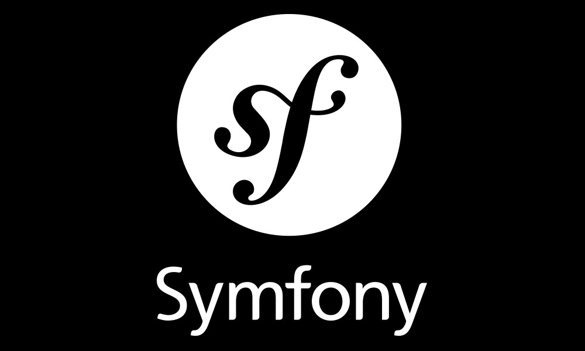

# إطارات عمل PHP الأوسع انتشارا

تشتهر **لغة البرمجة PHP** بكونها الأكثر استعمالا في مجال برمجيات الويب ناحية الخادم (Server-side programming languages)، وتلعب **إطارات العمل** (Frameworks) الخاصة بهذه اللغة دورا كبيرا في هذا الإنتشار الواسع نظرا للمميزات العديدة التي تقدمها للمطور وتسعى من خلالها لجعل حياة الأخير أكثر سهولة وفعالية.

في هذا المقال سنستعرض **أُطُر عمل PHP** الأكثر استعمالا وانتشارا في عام 2016.

## [لارافيل Laravel](https://laravel.com/)

منذ إنشاء [إطار العمل لارافيل](http://www.tutomena.com/web-development/php/%d8%a5%d8%b7%d8%a7%d8%b1-%d8%a7%d9%84%d8%b9%d9%85%d9%84-%d9%84%d8%a7%d8%b1%d8%a7%d9%81%d9%8a%d9%84/) في عام 2011، استطاع أن يحجز لنفسه مكانا بين أفضل وأكثر **إطارات عمل PHP** شهرة في العالم. بمجرد تجربة **لارافيل** ستكتشف روعته والجمالية التي يضفيها على البرمجة بواسطة PHP وكأنك تحمل ريشة ترسم بها لوحتك الجملية. والمميز كذلك مع هذا الفريمووك أنه يتمتع بمجتمع داعم قوي ورائع يقوده موقع [laracasts.com](http://laracasts.com) المذهل بكل ما للكلمة من معنى، حيث تجد فيه منتديات للدعم وعددا لا محدودا من دروس PHP عموما ولارافيل خصوصا من إعداد المطور المعروف [Jeffrey Way](https://twitter.com/jeffrey_way) الذي يمكن تشبيه فيديوهاته بكونها تحفا فنية أكثر من كونها دروسا تعليمية.

قم بزيارة الموقع وستكتشف بنفسك أنني لم أبالغ أبدا في هذا الوصف.

## [سيمفوني Symfony](https://symfony.com/)

إطار العمل سيمفوني غني عن التعريف، ربما يكون العملاق والسيد الأول في هذه اللائحة. لارافيل يستخدم عددا من مكونات سيمفوني مثل مكون المسارات **Router Component** وكذلك **Console Component** الذي تعتمد عليه برمجية _artisan_ التي يستخدمها مطورو لارافيل في نافذة الأوامر Commande Line، إضافة لمكونات أخرى قابلة لإعادة الإستخدام في مشاريع أخرى مستقلة.

يشكل سيمفوني كذلك الدعامة الأساسية التي بنيت عليها النسخة الجديدة لنظام إدارة المحتوى المعروف **دروبال** 8، وهذا إن دل على شيء فإنما يدل على السمعة الممتازة والإمكانيات الكبيرة التي يتمتع بها هذا الفريموورك.

## [CodeIgniter](https://www.codeigniter.com/)

يعد CodeIgniter من أسرع إطارات عمل PHP وأكثرها بساطة. فعلى عكس المنافسين الآخرين، لا يسعى CodeIgniter لوضع كل ما ستحتاجه في كل المشاريع بجميع أنواعها فعوضا عن ذلك يمنحنا إمكانية إضافة مكونات أخرى حسب ما تقتضيه الحاجة وهذا حتى يبقى محافظا على بساطته وسرعته وكذا على السهولة في التعلم التي يمتاز بها عن غيره من إطارات العمل.

جدير بالذكر كذلك أن إطار العمل CodeIgniter يشتغل بنمط MVC المعروف ولكن لا يفرض هذا النمط على المطورين، أين أنك تستطيع العمل عليه دون اتباع نمط MVC بحذافيره.

## [Yii Framework](http://www.yiiframework.com/)

منذ حوالي 9 سنوات ظهر إطار العمل **Yii**، وهو معروف بسرعته المثالية ودعمه القوي لتقنية الأجاكس، حيث يمكنك من عمل نظام تعدد الصفحات مثلا وكذا البحث بواسطة الأجاكس من دون صعوبات تذكر.

Yii يمكننا من خلال واجهة **Gii** الرسومية من توليد عدد من الكلاسات (CRUD, Controllers, Models, Forms ...etc) دون كتابة أي سطر برمجي كما ترون في الصورة أسفله.

هذا الإطار قابل للإمتداد والتطويع عن طريق الإضافات الخارجية التي يمكن إضافتها عن طريق Composer والعمل بها بصفة طبيعية.

## [فالكون Phalcon](https://phalconphp.com/)

حسب علمي، يعتبر Phalcon أسرع إطارات العمل الخاصة بلغة البرمجة PHP لحد الساعة، والسبب الأول في ذلك أنه يثبت في الخادم على شكل إضافة Extension تماما مثل باقي الإمتدادات المعروفة (Mysql، PDO ، OpenSSL إلخ) والصورة التالية توضح كيفية إضافة مكتبة فالكون _php_phalcon.dll_ إلى ملف php.ini لخادم محلي (WAMP) بويندوز.

 امتداد Phalcon تم تطويره بواسطة لغة البرمجة C وأحد أهم عيوب هذه الإستراتيجية أن الدعم في الإستضافات سيكون محدودا للغاية وخاصة المشتركة منها Shared Hostings. من وجهة نظري الخاصة أرى بأن Phalcon يمكن أن يكون ملائما لبناء واجهات REST APIs بالنظر إلى سرعته الفائقة، و تبقى استراتيجية فالكون مثيرة للإهتمام وحاول مطوروه إحداث شيء جديد يدفع PHP وإطاراتها نحو الأمام.

**إطار العمل Phalcon** يتبع أيضا نمط MVC، وكما أنك لم تكن مجبرا على تعلم لغة البرمجة C للعمل بالكلاسات والدوال التي يمنحها امتداد _php_pdo_mysql_ فلن تكون كذلك مجبرا بتعلم C إذا أردت تجربة Phalcon. شخصيا، أنصح الجميع بتجربة هذا الفريموورك وبعدها فليخرج كل واحد بقناعاته الخاصة.

## [CakePHP](https://cakephp.org/)

يعتبر CakePHP من أقدم أطر عمل لغة البرمجة PHP، فقد تم إصدار أول نسخه منه عام 2005، وإلى الآن ما يزال هذا الإطار يحظى بمكانة جيدة بين المنافسين وهذا يدل على قيمته وفلسفته التي لا تزال تغري عددا كبيرا من المطورين.

CakePHP يعتمد بدوره على نظام MVC ويقف خلفه **مجتمع نشيط ومتفاعل**، هذا يعني أنه ليس عليك القلق في رحلتك التدريبية على هذا الإطار لأنك ستجد دائما من يساعدك، يكفي أن تطلب ذلك.

## [Zend Framework](https://framework.zend.com/)

لطالما كان **Zend Framework** جزءًا لا يتجزأ من منظومة أطر عمل PHP، ويعتبر من أقواها وأكثرها استقرارا بالنظر إلى كون الشركة الداعمة التي تقف خلفه هي نفسها [Zend](http://www.zend.com/) التي تدعم لغة البرمجة PHP.

يمنحنا Zend Framework كل ما نحتاجه من مقومات لبناء تطبيقات ويب قوية ومتماسكة، وهذه لائحة لأقوى المواقع التي تم تطويرها باستعمال إطار العمل Zend :

- [BNP PARIBAS](https://group.bnpparibas/)
- [BBC](http://www.bbc.co.uk/)
- [WEBEX.com](https://www.webex.com/)

## [Slim](http://www.slimframework.com/)

إذا كنت ترغب في بناء تطبيق ويب محدود، سريع وغير ضخم فإن **إطار العمل Slim** قد يكون خيارك الأفضل، يعتبر هذا الإطار من فصيلة إطارات العمل المصغرة **Micro-framework** التي تم تطويرها لإنجاز مشاريع لا تتطلب إمكانيات كبيرة. هذا الإطار كذلك يمكن الإستعانة به لو أردت بناء واجهة REST API لأحد تطبيقاتك بالنظر إلى سرعة التنفيذ العالية التي يتمتع بها والتي يتفوق بها على جميع إطارات العمل التي ذكرتها باستثناء **Phalcon**.

مطورو لارافيل أنفسهم قاموا بتطوير إطار عمل مصغر أسموه [Lumen](http://www.tutomena.com/web-development/php/lumen-micro-framwork-by-laravel/) وذلك لنفس الأهداف التي جاء من أجلها إطار العمل Slim، والإثنان يبدوان خياران جيدان.

### خاتمة

هذه تقريبا أبرز **أطر عمل PHP** التي تستحوذ على حصة الأسد في السوق، تعلم واحد منها على الأقل قد يكون كافيا لاحتراف تطوير تطبيقات الويب والولوج لميدان الشغل. وكما تعلمون، فمجال الويب متجدد باستمرار وخريطة إطارات العمل هذه قد تتغير في غضون أشهر وبالتالي يصبح التعلم و**التكوين الذاتي المستمر** أمرا لا مناص منه للحفاظ على مكانتك **كمطور ويب محترف**.
