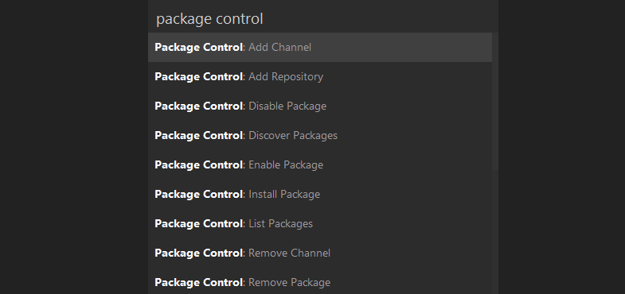
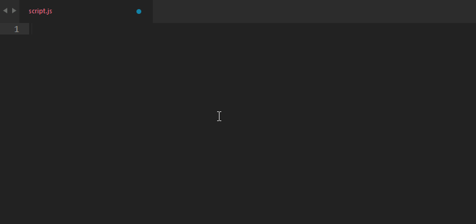
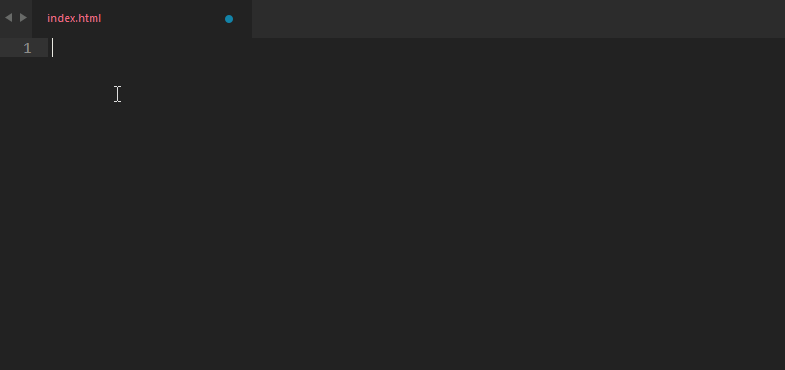
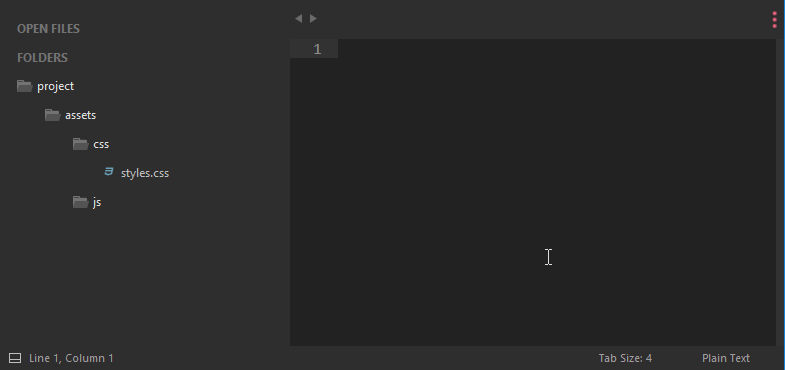
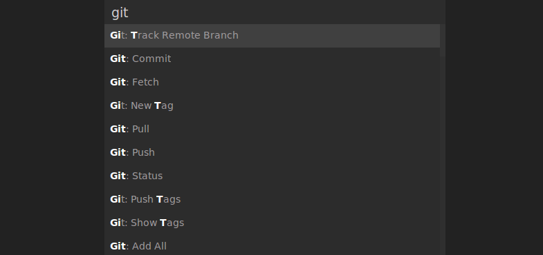

# إضافات Sublime Text رائعة لمطوري الويب

إذا كنت تستعمل **محرر Sublime Text** لكتابة الشيفرات البرمجية، فأنت واحد من بين مئات الآلاف من المبرمجين والمطورين الذين اتخذوا نفس القرار باستخدام هذا المحرر الذي يتسم بسرعته وبساطته وكذلك قابليته للإمتداد عن طريق مئات الإضافات المتوفرة.

في هذا المقال سنتعرف على عدد من الإضافات التي يستحسن لكل مطور ويب تثبيتها على محرر Sublime Text فهي كما سنرى تساعدنا في تبسيط عديد المهام المتكررة في كل مشروع.

## [Package Control](https://packagecontrol.io/packages/Package%20Control)

هذه أول إضافة عليك تنصيبها في **محرر سابليم**، هي بمثابة npm بالنسبة ل [Node.js](http://www.tutomena.com/web-development/javascript/what-is-nodejs/) و [Composer](http://www.tutomena.com/web-development/tools/composer-dependencies-manager/) للغة البرمجة PHP. ستمكنك هذه الإضافة من البحث عن الإضافات الأخرى ل **Sublime Text** دون اللجوء لغوغل وستكون عملية التنصيب أسهل وأسرع مما سيكون عليه الأمر لو قمت بهذه العلمية يدويا. ولو جربت ذلك من قبل فستعرف ما أقول.

## [JavaScript & NodeJS Snippets](https://packagecontrol.io/packages/JavaScript%20%26%20NodeJS%20Snippets)

كما يبدو واضحا من الإسم، هذه الإضافة تمكننا من كتابة عدد من أكواد جافاسكريبت فقط باستعمال اختصارات معينة لكل شيفرة برمجية. فعوض كتابة السطر `document.getElementsByTagName('tag');`  يمكنك فقط كتابة الحرفين **gt** ثم الضغط على الزر TAB ليكمل Sublime Text العمل عوضا عنك :)

## [Emmet](https://packagecontrol.io/packages/Emmet)

هذه تقريبا هي الإضافة الأكثر استخداما من طرف مستعملي محرر Sublime Text بعدد تحميلات فاق المليونين. تمكن هذه الإضافة من تسهيل كتابة أكواد html، نفس فكرة الإضافة السابقة ولكن **Emmet** تستهدف أكواد HTML بالتحديد.

## [Advanced New File](https://packagecontrol.io/packages/AdvancedNewFile)

عند تنصيب محرر Sublime Text لأول مرة فإنك لن تستطيع مثلا نسخ (Duplicate) ملف معين أو إنشاء ملف جديد وتسميته من داخل المحرر وليس من خلال نافذة الملفات الخاصة بنظام التشغيل الذي تعمل عليه.

مع إضافة AdvancedNewFile أصبح بإمكانك فعل هذا وأكثر، يكفي تنصيبها لترى الأشياء الجملية التي تمت إضافتها للمحرر.

## [Git](https://packagecontrol.io/packages/Git)

إذا كنت تعمل **بنظام التحكم في النسخ Git** فأنت بالتأكيد بحاجة لتسطيب إضافة Git على **محرر سابليم**. هذه الإضافة ستمكنك من وصول سريع وتنفيذ سهل لعدد من أكثر أوامر git استعمالا، وذلك من داخل المحرر من دون استخدام نافذة الأوامر Commande Line.

## [SublimeCodeIntel](https://packagecontrol.io/packages/SublimeCodeIntel)

إذا فتحت ملفا للجافاسكريبت ووجدت عددا من الدوال مستعملة في هذا الملف ولكنك لا تعرف أين تم إنشاء هذه الدوال وما هو الملف المصدر لها Source file، فاطمئن ولا تحاول البحث في جميع ملفات المشروع عن طريق Ctrl + F، يكفي أن تقوم بتثبيت الإضافة SublimeCodeIntel على محررك وبعدها سيكون عليك فقط تمرير مؤشر الفأرة على الدالة المعنية وسيظهر لك مسار الملف المصدر، انقر عليه وسيتم فتحه على المحرر :)

هذه الفكرة موجودة بشكل افتراضي في عدد من بيئات العمل الشهيرة مثل NetBeans ، PhpStorm وكذلك Eclipse.

الإضافة تدعم عددا من لغات البرمجة الأكثر انتشارا وليس الجافاسكريبت وحدها.

---

ترجمة بتصرف [للمقال](http://tutorialzine.com/2016/10/15-awesome-sublime-text-plugins-for-web-development/).

الصور من المقال الأصلي.
