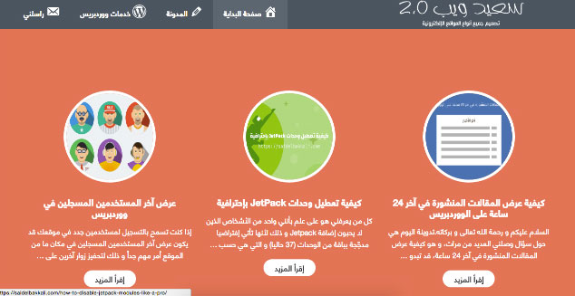
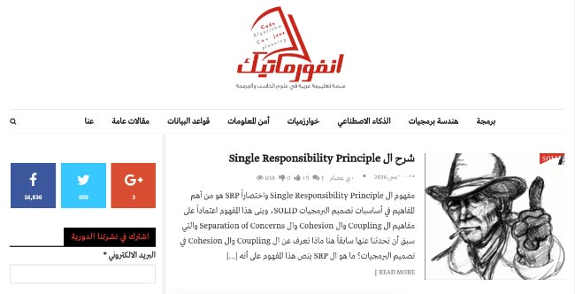
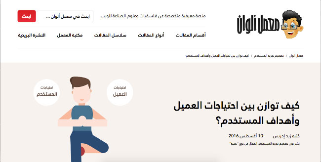
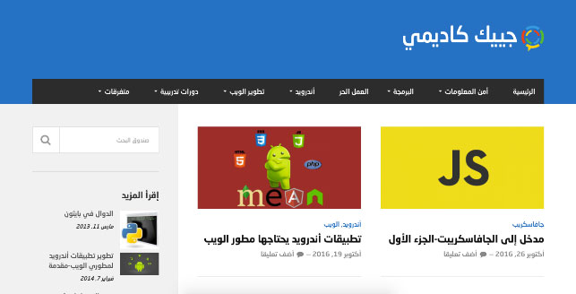

يعج **الويب العربي** بعديد **المدونات والمواقع المتخصصة** في مجال التقنية والمعلوميات، ولكن قليلة هي المدونات المتخصصة في برمجيات وتطوير الويب والتي تتوفر فيها بعض من مواصفات الإحتراف ومواكبة الجديد في المجال وطرح دروس ومقالات ذات مستوى متقدم.

السبب في هذا الشح الواضح في المحتوى التقني الإحترافي العربي هو [إحجام المطورين والمبرمجين العرب عن التدوين](http://www.tutomena.com/blog/%d8%a7%d9%84%d9%85%d8%a8%d8%b1%d9%85%d8%ac%d9%88%d9%86-%d8%a7%d9%84%d8%b9%d8%b1%d8%a8-%d9%84%d8%a7-%d9%8a%d8%af%d9%88%d9%86%d9%88%d9%86/) ومشاركة معارفهم مع الآخرين. ولكن مع ذلك حاولت البحث من هنا وهناك ووجدت عددا، قد يكون قليلا، من المدونات العربية الإحترافية والتي خرج أصحابها عن المألوف عندنا وبدؤو في نشر ومشاركة محتويات حصرية رائعة لا يمكن إلا أن تدعم وتطور من مستوى المحتوى العربي على الإنترنت.

وكرسالة شكر مني لأصحابها، قررت تخصيص هذه المقالة للتعريف بهذه المدونات والمواقع مع الإعتذار مسبقا لكل من لم أذكر مدونته في هذا الموضوع إما بسبب النسيان أو عدم معرفتي بها لحين كتابة هذه الأسطر.

## [موقع سعيد البقالي](https://saidelbakkali.com)

هذا من المواقع الأكثر احترافية في هذه اللائحة بكل صراحة، صاحبه، مغربي الجنسية، متخصص في تصميم وتطوير المواقع الإلكترونية باستخدام نظام إدارة المحتوى **ووردبريس**. الموقع يتوفر على مدونة تعج بعدد من المواضيع والدروس الإحترافية تخص ووردبريس بكل تفاصيله.

إذا كنت من هواة ومحبي **ووردبريس** فإني أنصحك بمتابعة هذا الموقع والإستفادة من الكنوز التي يوفرها والموجهة طبعا لجميع المستويات.

## [موقع تكناوي](http://technawi.net/)

هذا الموقع أكثر شمولية، فهو يهتم إلى جانب البرمجة بكل ما له علاقة بالمعلوميات من التعامل مع مختلف أنظمة التشغيل، أمن المعلومات، أندرويد، قواعد بيانات إلخ... الموقع ينشر فيه عدد من الإخوة من جنسيات عربية مختلفة، كل في مجال اختصاصه، ولقد تعرفت عليه منذ عدة أعوام ويستحق بكل تأكيد أن يكون من ضمن الحاضرين في هذه اللائحة.

## [موقع انفورماتيك](http://informatic-ar.com/)

موقع انفورماتيك من المواقع التي يود كل واحد منا أن يكثر أمثاله في الويب العربي، مقالات في منتهى الإبداع والإحترافية. مفاهيم متقدمة ومواضيع حصرية يسبق يضعها كتاب هذا الموقع في متناول القارئ العربي لأول مرة.

ربما لا تكون أكثر منشورات هذا الموقع سهلة الفهم والإستيعاب بالنسبة للمبتدئين، ولكنها تظل قيمة للغاية، فالمحترفون أيضا وذوي المستويات المتقدمة في حاجة لمحتوى عربي يناسب تطلعاتهم وخبراتهم.

ربما يكون عتابي الوحيد على هذا الموقع هو عدم النشر وإغناء الموقع بانتظام، في بعض المرات يستغرق الأمر أسابيع طويلة لنشر مقال جديد.

## [موقع رماز](http://www.remmaz.com/)

رماز منصة تفاعلية لتعليم برمجة تطبيقات الويب، فكرة الموقع ممتازة وسابقة على المستوى العربي. العيب الوحيد في هذه المنصة هو النقص الواضح في المحتوى، فلحد الساعة يوجد فقط مسار واحد لتعلم لغتي HTML و CSS، بينما هناك مسار ثانٍ قيد الإنشاء لتعلم مكتبة **جيكويري**.

## [مجتمع تقانة](http://taqana.net/)

من المواقع العربية التي وقعت في غرامها ولو أنه ليس متخصصا في تطوير الويب فقط. محتويات هذه الموقع في غاية الروعة والإتقان ولا تمل من قراءتها وبعضها يدور حول موضوع تطوير الويب وتقنياته.

حزنت كثيرا لأن الموقع لم يعد ينشر مؤخرا، ولقد اتصلت بمديره وأكد لي بأنه لم يعد يملك الوقت لإدارته، وعبرت له عن أملي في إيجاد حل لعودة الموقع لنشاطه الإعتيادي مجددا.

## [أكاديمية حسوب](https://academy.hsoub.com)

هذا الموقع غني عن التعريف ومن مستوى عال جدا، وهذا ليس بغريب إذا علمنا أن **شركة حسوب** الرائدة في الويب العربي هي التي تقف خلفه. مقالات ودروس هذا الموقع تحرر وتعد من طرف مطورين عرب محترفين وبالتالي أضمن لك مسبقا جودتها واحترافيتها.

## [معمل ألوان](http://www.colorslab.net/)

هذه المدونة مختلفة، فهي متخصصة في تصميم وتطوير **تجربة استخدام** تطبيقات الويب. المقالات والدروس متميزة وتعطي قيمة مضافة [للمحتوى العربي الإلكتروني](http://www.tutomena.com/blog/arabic-content-on-the-web/) بكل تأكيد.

إذا كنت مصمم ويب وتحتاج لجرعات دورية باللغة العربية لتطوير مستواك والإطلاع على آخر المستجدات في الميدان فهذا الموقع بكل تأكيد هو ما تبحث عنه.

## [جييك كاديمي](http://www.geekcademy.com/)

يقدم موقع **geekcademy.com**، للأخ عبد المجيد شرفاوي من الجزائر، دروسا ومقالات متميزة تخص كل ما له علاقة بالويب من لغات برمجة، أمن معلومات، العمل الحر وكذلك عدد من الدورات التدريبية في المجالات السالفة الذكر.

انقطع الموقع عن النشر مدة ليست باليسيرة ولكنه، مشكورا، عاد للنشاط والنشر مؤخرا وأنصح الجميع بمتابعة ما يقدمه.

### خاتمة

هذه القائمة لأهم **المدونات العربية** التي أعرفها والمتخصصة في **تقنيات تطوير الويب**، مثل هذه المواقع والمدونات لا يمكن إلا أن تشعرنا بالأمل والتطلع نحو مستقبل أفضل للغتنا العربية في الويب. معظم أصحاب هذه المدونات لا يسعون لمكاسب مادية آنية من وراء مدوناتهم، كل ما يصبون إليه هو **إغناء المحتوى التقني العربي** ولكي يثبتوا للجميع أن لغة الضاف كغيرها من اللغات يمكن أن تكون لغة العلوم والتقنيات الحديثة.

إذا نسيتُ ذكر إحدى المدونات أوالمواقع التي تراها، عزيزي القارئ، تستحق التواجد في هذه القائمة فلا تتردد في الإشارة إليها في صندوق التعليقات أسفله.
