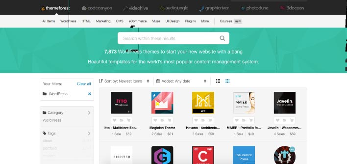

# لماذا ووردبريس هو الخيار الأفضل لتصميم وإنشاء موقعك أو مدونتك ؟

معظم المواقع والمدونات على شبكة الإنترنت تستخدم **نظام إدارة المحتوى ووردبريس**، فالأخير يدعم ما يقرب من **ربع** عدد المواقع على الشبكة العنكبوتية. هذا التفوق والسيطرة راجعان لعدة أسباب وعوامل تقنية واقتصادية، فمعظم الشركات والكيانات الناشئة ترى في ووردبريس الخيار الأقل تكلفة والأكثر فعالية لبدء نشاطها على الإنترنت.

فما هي إذن هذه العوامل والمسببات التي أعطت ووردبريس هذا التميز والإنتشار لدى مختلف أصناف وفئات العملاء ؟

## تعلم ووردبريس سهل

يتميز ووردبريس عن غيره بسهولة التعلم والإستخدام، فبخطوات قليلة وبسيطة ستتمكن من إنشاء موقعك وتثبيت القالب الذي يعجبك من بين مئات القوالب المجانية والمدفوعة الجاهزة لتحديد شكل وصورة موقعك دون الحاجة للتعاقد مع مصمم أو مطور للقيام بهذه الأمور. في كل يوم ينظم المئات لمجتمع ووردبريس الهائل حيث ستجد المساعدة لتجاوز أي عقبة قد تواجهك في جميع مراحل إعداد الموقع، لن تجد أي مشكل من هذه الناحية.

## تكلفة الإنطلاق زهيدة

ووربريس عبارة عن سكريبت مفتوح المصدر ومتوفر للجميع مجانا، لن تدفع أي فلس من جيبك إلا لو أردت شراء قوالب أو إضافات غير مجانية، أو ربما في حالة تعاقدك مع مطور محترف لإضافة بعض المزايا والوظائف الخاصة للموقع، فوودربريس نظام قابل للتخصيص والتطويع وهذه كذلك أحد نقاط قوته :) قد تكون كذلك في حاجة لدفع بعض الدولارات لحجز استضافة لموقعك وهذا الأمر بديهي عند إطلاق أي موقع على الإنترنت.

## أعداد هائلة من المستخدمين

كما أشرت إليه في المقدمة، يدعم الووردبريس حوالي 25% من مجموع المواقع الإلكترونية أي أننا نتحدث عن 70 إلى 80 مليون موقع يعمل بنظام ووردبريس. هذه الأرقام الكبيرة تشكل تحفيزا وعامل اطمئنان للإنطلاق مع ووردبريس، فأنت ستكون واحدا من بين عشرات الملايين من المستخدمين والمطورين والمصممين الذي يعملون في مجال صناعة الووردبريس، وبالتالي لن تحس بالوحدة ولن تكون مضطرا لتواجه بمفردك الإشكاليات والصعوبات التي قد تواجهك في أي مرحلة من مراحل إنشاء موقعك.

## قابلية التخصيص

ذكرت أن استخدام وتغيير القوالب في **ووردبريس** يعتبر مهمة سهلة حتى ولو كنت لا تفقه شيئا في البرمجة، والجميل كذلك مع ووردبريس توفره على [نظام إضافات](http://www.tutomena.com/blog/most-popular-wordpress-plugins/) رائع وسلس حيث يمكنك إضافة وحدات ومميزات جديدة لموقعك ببعض النقرات وقليل من الإعدادات إن لزم الأمر. يصل عدد الإضافات المعلومة لنظام ووردبريس إلى حوالي 18 ألف إضافة ما بين مجانية ومدفوعة، من بينها [إضافة WooCommerce](https://woocommerce.com/) التي تتيح لنا إمكانية إنشاء **متجر إلكتروني** متكامل على نظام الووردبريس، وتدعم حوالي 40% من مجموع المتاجر الإلكترونية على شبكة الإنترنت، رقم كبير أليس كذلك ؟

[caption id="attachment_1117" align="aligncenter" width="708"]](../images/wordpress-themes-themeforest.jpg) موقع ثيم فوريست لبيع قوالب ووردبريس\

## الإعتماد على PHP و MySql

نظام ووردبريس تم تطويره باستخدام لغة البرمجة PHP ونظام إدارة قواعد البيانات MySQL، وهي الثنائية الأشهر في عالم برمجيات الويب. ملايين المطورين يحترفون PHP/MySQL وهذا ما صب في مصلحة ووردبريس إذ لن تبحث كثيرا لتحصل على خدمات مطور ووردبريس محترف للتدخل في موقعك عند نقطة معينة.

## نظام ووردبريس آمن

بما أن الملايين يستخدمون هذا النظام فمن الطبيعي أن يكون عرضة لهجمات ومناوشات القراصنة، وهذه ضريبة الشهرة في كل المجالات، ولكن ووردبريس لا يدع لك مجالا للقلق في هذه الناحية لأن مطوريه يقومون بمجهودات جبارة وتحسينات أمنية دورية مع كل إصدار جديد تضمن لموقعك أقصى درجات الأمن والأمان.

## ووردبريس صديق لمحركات البحث

تتميز المواقع  المدعومة بنظام ووردبريس بسهولة تحسين ظهورها على محركات البحث، فالتعديل على ملفات القالب سهل ولا يتطلب سوى معرفة بسيطة بلغة HTML وقليلا من لغة البرمجة PHP. كما أن هناك [عدد من الإضافات المتميزة](https://sitesuccessful.com/best-ten-wordpress-plugins/) هدفها مساعدتك في تحسين موقعك على محرك البحث والحصول على زيارات مهمة بصفة منتظمة.

### خاتمة

ووردبريس لا يحتاج لحديث طويل لإثبات جدارته وقيمته في هذا الميدان، عمالقة الويب والإعلام من قبيل [TechCrunch](https://techcrunch.com/)، [BBC America](http://www.bbcamerica.com/)، [Xerox](https://www.xerox.com/en-us/blogs) و [Reuters](http://blogs.reuters.com/us/) مدعومون بهذا النظام وحققوا معه نتائج جيدة وشهرة واسعة وهذه التجارب بحد ذاتها هي إجابة على سؤال **لماذا ووردبريس!**
