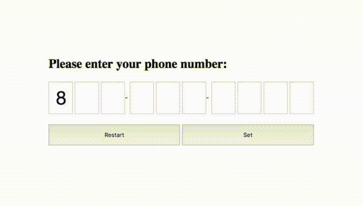
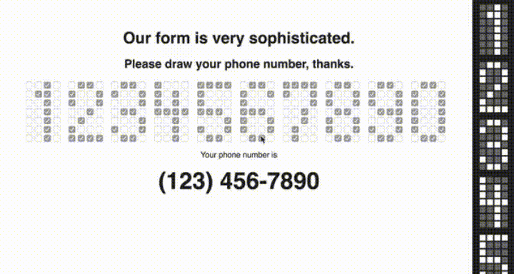
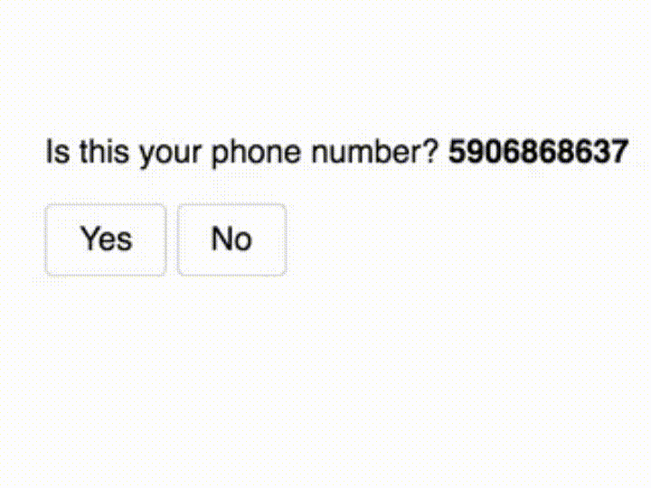
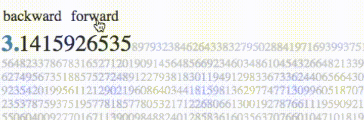
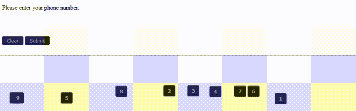
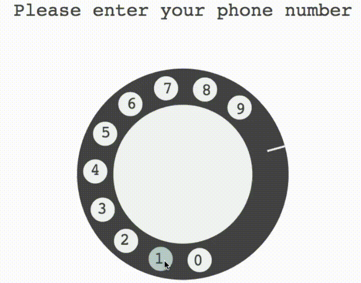
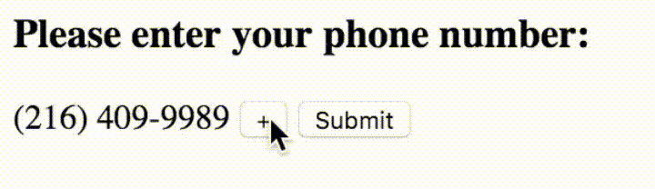

# هل يمكن تخيل تجربة المستخدم لو كان "إبليس" مصمم ويب ؟

هناك بعض الأعمال لا يقدر على فعلها إلا الشيطان، وإن حدث وفعلها أحد من البشر فإنها توصف بالأعمال الشيطانية.

في مجال الويب وتصميم واجهات المستخدم، قد نتخيل بعض الأفكار التي لن يفعلها إلا إبليس ولا نتمنى رؤيتها أبدا في المواقع التي نزورها، إليكم عينة منها في حالة طلب إدخال رقم الهاتف :

## هذه صعبة جدا ولا أريد تخيلها على أرض الواقع :'(

---

المصدر : [If Satan was a web designer…](https://uxdesign.cc/if-satan-was-a-web-designer-dc5cdf06dff9)
