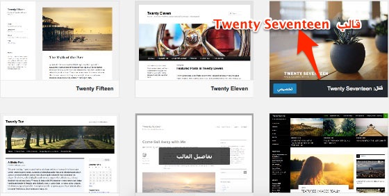
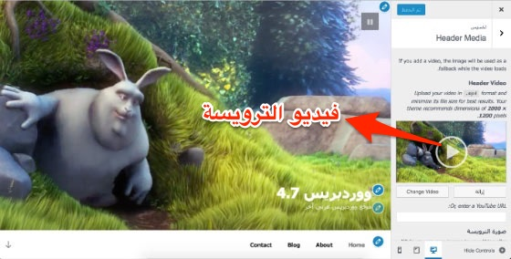
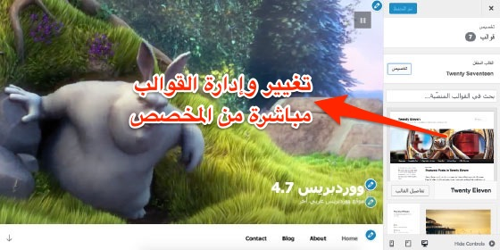
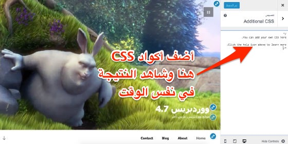
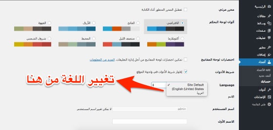
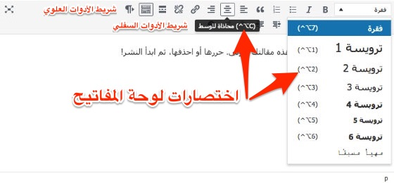

قبل بضعة أسابيع، أزيح الستار عن **النسخة التجريبية** 4.7 (**Beta**) لنظام إدارة المحتوى [**ووردبريس**](http://www.tutomena.com/web-development/%d9%84%d9%85%d8%a7%d8%b0%d8%a7-%d9%88%d9%88%d8%b1%d8%af%d8%a8%d8%b1%d9%8a%d8%b3/)، وفي انتظار الإصدار الرسمي لهذه النسخة في السادس من دجنبر المقبل قررنا إطلاعكم على قائمة لأبرز المستجدات والمزايا التي جاء بها **ووردبريس 4.7**.

يمكنكم تجريب النسخة التجريبية في بيئتكم المحلية عن طريق الإضافة [WordPress Beta Tester](http://wordpress.org/plugins/wordpress-beta-tester/ 'WordPress Beta Tester').

## 1\. Twenty Seventeen - قالب افتراضي جديد

نسخة ووردبريس 4.7 هي آخر إصدار كبير لووردبريس في عام 2016، وكما جرت العادة سيشمل هذا الإصدار قالبا افتراضيا جديدا وقد تمت تسميته **Twenty Seventeen.**

القالب الجديد، على عكس القوالب السابقة، موجه بشكل أكبر للمواقع التجارية (Business Websites) بدلا من المدونات، وقد جاء مع بعض المحتوى الإفتراضي _Starter Content_ لسهولة تجريب القالب. هذا المحتوى عبارة عن عدد من الصفحات والصور إضافة لبعض القوائم التي ستجدها في القالب بمجرد تفعيله.

وبطبيعة الحال، القالب **متجاوب** مع جميع الأجهزة وينهج سياسة **المحمول أولا** (mobile-first) في هذا الصدد.

## 2\. دعم الفيديو في الترويسة (Video Headers Support)

فيما مضى لم يكن باستطاعتنا إضافة فيديوهات لترويسة الموقع *Website Header* مع القوالب الإفتراضية لووردبريس، هذه الميزة كانت متوفرة في بعض القوالب المدفوعة بطريقة أو بأخرى. قالب Twenty Seventeen أصبح أول قالب ووردبريس افتراضي يمنحنا هذه الإمكانية باستخدام بسيط لبعض دوال ووردبريس تماما كما كان عليه الحال من قبل مع إضافة الصور للترويسة.

عن طريق المخصص Customizer سيكون بمقدرونا تحميل أي فيديو بصيغة mp4 أو إضافة رابطه على اليوتيوب أو Vimeo.

## 3\. تغيير القوالب من المخصص

مع **ووردبريس 4.7** أصبح بإمكاننا تغيير وإدارة القوالب المنصبة مباشرة من المخصص ومعاينة التغيرات في نفس المكان. هذه الميزة أعجبتني والحقيقة التي باتت واضحة للجميع أن مطوري ووردبريس أصبحوا يعتمدون بشكل متزايد على المخصص في الآونة الأخيرة نظرا لسلاسته وسهولة التعامل معه.

## 4\. إضافة ستايل CSS من المخصص

قم بإضافة أكواد CSS مباشرة من المخصص وشاهد النتائج في الوقت ذاته :)

الجدير بالذكر أن هذه الأكواد تخص القالب المفعل فقط ولن يتم تطبيق هذا الستايل على بقية القوالب في حال تم تفعيلها.

## 5\. الأعضاء أصبحوا قادرين على تغيير لغة لوحة التحكم

حاليا عندما تقوم بستطيب ووردبريس فإن جميع أعضاء موقعك أو مدونتك سيرون لوحة التحكم بنفس اللغة التي تم اختيارها من طرفك. ولكن مع ووردبريس 4.7 سيصبح بإمكان أي عضو مهما كانت صلاحياته اختيار لغته المفضلة في لوحة التحكم انطلاقا من البروفايل الخاص به كما في الصورة أعلاه.

## 6\. تحسينات في محرر ووردبريس

تمت إضافة العديد من التحسينات على المحرر في **ووردبريس 4.7** والهدف بطبيعة الحال هو جعل كتابة المقالات وإضافة المحتوى أكثر سهولة وسلاسة، فلقد تم نقل مربع اختيار الفقرات والعناوين من شريط الأدوات السفلي إلى الشريط العلوي الذي يظهر افتراضيا عند فتح المحرر لأول مرة. كما أصبحنا نستطيع رؤية اختصارات لوحة المفاتيح في نصوص التلميحات Tooltips.

الجديد كذلك أنه تم حذف زر "**_تحته خط_**" نهائيا من المحرر، كما تم نقل زري **الخط الأفقي** و "**يتوسطه خط**" من شريط الأدوات العلوي إلى السفلي.

## 7\. تحسينات أخرى في ووردبريس 4.7 تهم المطورين

### 1. Post Type Templates

في السابق كان بالإمكان تعيين قالب (Template) لصفحة محددة وذلك للحصول على مظهر وتصميم مختلف عن باقي الصفحات، ولكن لم يكن ممكنا فعل هذا مع الأنواع الأخرى من المنشورات (Post Types). مع ووردبريس 4.7، سيختلف الوضع وسيكون بإمكان المطور تخصيص طريقة تقديم كل نوع على حدة من دون مشاكل أو مجهودات كبيرة.

### 2. **Rest API Content Endpoints**

سيتم دمج واجهة REST في نواة Core نظام إدارة المحتوى ووردبريس عوض الإعتماد على الإضافة [WORDPRESS REST API](https://wordpress.org/plugins/rest-api/) المعمول بها حاليا.

#### خاتمة

هذه تقريبا أبرز المميزات والتحسينات التي سنراها مع إصدار **ووردبريس 4.7** المرتقب، منذ نسخة و[وردبريس 4.4](http://www.tutomena.com/web-development/php/whats-new-on-wordpress-4-4/) لم نرى تحسينات وإضافات بهذه الأهمية.

إذا أعجبك الموضوع لا تنسى تسجيل إعجابك [بصفحتنا على الفيسبوك](https://www.facebook.com/tutomena/) ومتابعة [حسابنا على تويتر](https://twitter.com/tutomena)، هذا سيشجعنا على المواصلة وتقديم المزيد.
