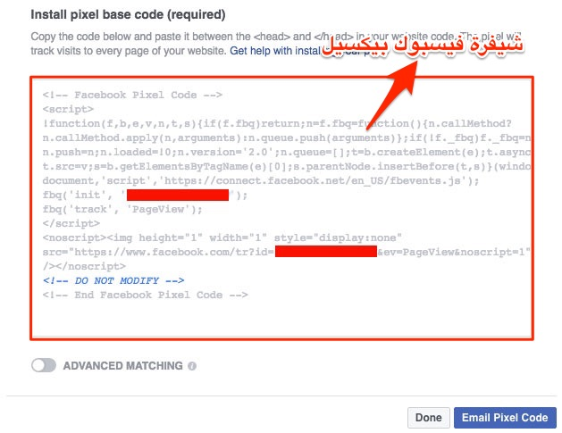
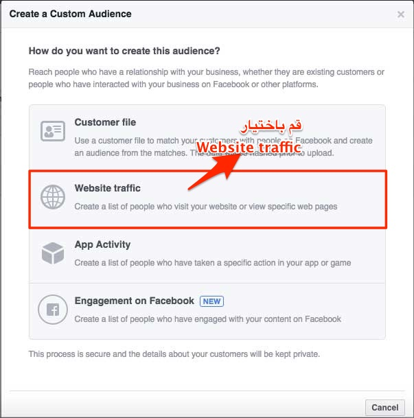
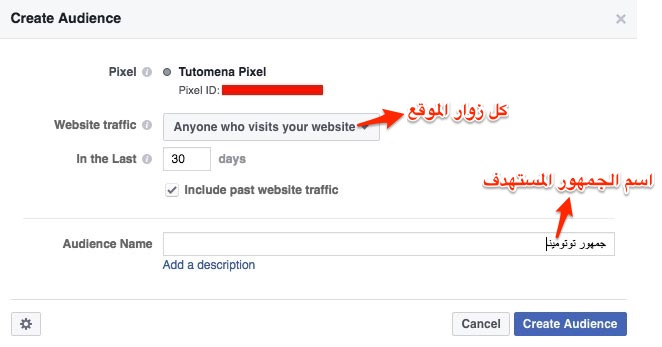
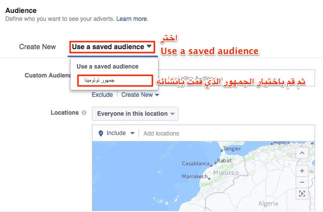

هل عندك متجر إلكتروني وتريد تتبع الأشخاص الذين قاموا بإضافة أحد المنتجات إلى السلة ولكنهم غادروا الموقع قبل أن يشتروا ؟ أو هل تريد ببساطة استهداف زوار موقعك مهما كان اختصاصة بحملات إعلانية ؟ لا داعي للقلق صديقي، فالأمر ممكن وبسيط جدا مع خدمة الإعلانات لفيسبوك.

من المعلوم أن فيسبوك باتت تسيطر على حصة كبيرة في سوق الإعلانات على شبكة الإنترنت وأصبحت المنافس الأول للعملاق الآخر غوغل وخدمته **Google Adwords**. في هذا المقال سنرى كيفية **استهداف زوار موقعك عن طريق إعلانات فيسبوك**.

## كلمة السر

إذا كنت تدير موقعا إلكترونيا فبالتأكيد أنت تعرف خدمة Google Analytics التي تمكننا من تتبع إحصائيات عن زوار الموقع وعدد من المعلومات الأخرى المهمة كمصدر الزوار، معدل الإرتداد، نسبة الزوار الجدد إلخ... كل ما عليك فعله لتفعيل هذه الخدمة هو التسجيل في موقع Google Analytics وبعدها ستحصل على شيفرة على شكل كود جافاسكريبت تقوم بوضعه بحيث يظهر على جميع صفحات موقعك التي تريد تتبعها.

المبدأ ذاته تتبعه شركة فيسبوك عن طريق ما يسمى **فيسبوك بيكسيل Facebook Pixel** وهو ليس أكثر من شيفرة جافاسكريبت تقوم بوضعها في الشيفرة المصدرية لصفحات موقعك وبعدها سيتولى باقي المهمة المتمثلة في جمع البيانات من زوار موقعك وتحديد هوياتهم.

## الحصول على كود فيسبوك بيكسيل

أول مع عليك فعله هو توليد شيفرة فيسبوك بيكسيل عن طريق [مدير إعلانات فيسبوك](https://www.facebook.com/ads/manager/pixel/facebook_pixel/)، وبعدها ستحصل على الشيفرة كما في الصورة التالية :

يستحسن إختيار اسم واضح ذات دلالة وله علاقة بنشاط موقعك، مع العلم أنه يمكنك تغييره  لاحقا متى أردت ذلك.

بعد توليد الشيفرة، قم بنسخها ولصقها داخل الوسم `<head>` الخاص بصفحات موقعك. وإذا كنت لا تجيد فعل ذلك فيمكنك إرسال الشيفرة عن طريق الإيميل لأحد أصدقائك أو زملائك ممن يمتلكون المهارات اللازمة لذلك عن طريق الضغط على الزر _Email Pixel Code._

جذير بالعلم أنه **لا يمكنك** توليد أكثر من شيفرة فيسبوك بكسيل واحدة لكل حساب Facebook Ads.

## إنشاء الجمهور المستهدف

الخطوة التالية بعد إضافة **كود فيسبوك بيكسيل** لموقعك هي إنشاء **الجمهور المستهدف** عن طريق مدير إعلانات فيسبوك. لفعل ذلك قم باتباع المراحل التالية :

1. توجه ل **All Tools** ثم بعد ذلك قم بالضغط على الرابط **Audiences**.
2. بعدها قم بالضغط على **Create Audience** ثم على \***\*Custom Audience.\*\*** 
3. قم باختيار **\*\*\*\***Website traffic.**\*\*\*\***
4. رابعا، اختر نوع الترافيك الذي تود استهدافه، هل ستستهدف **كل الزوار** أم فقط زوار **صفحات معينة** من موقعك أم أنك ستستهدف جميع زوار موقعك **باستثناء** زوار صفحات معينة، كل ذلك عن طريق القائمة المنسدلة **Website traffic.** بعد ذلك ضع اسما واضحا ودلاليا لجمهورك المستهدف حتى تتعرف عليه بسهولة إذا ما أردت إعادة استخدامه لاحقا. باقي الإعدادات يمكنك تركها على حالتها الإفتراضية. وعند الإنتهاء قم بالضغط على الزر Create Audience وسيصبح زوار موقعك عبارة عن ترافيك جاهز للإستهداف متى أردت ذلك.
5. بعد هذا، أنت الآن تستطيع استخدام هذا الجمهور للإستهداف في إعلاناتك على فيسبوك، فقط عند البدء في إنشاء إعلان جديد قم باختيار الجمهور الذي أنشأناه (_جمهور توتومينا_) كترافيك مستهدف للإعلان وبعدها فيسبوك سيتولى باقي المهمة.

---

أتمنى أن يكون هذا الموضوع نال إعجابكم وأن تستفيدوا منه للقيام بحملات إعلانية ناجحة ومستهدفة على فيسبوك. وإذا كانت لديكم ملاحظات أو إضافات حول الموضوع فلا تترددوا بمشاركتها مع زوار موقع توتومينا عن طريق صندوق التعليقات أسفله.
