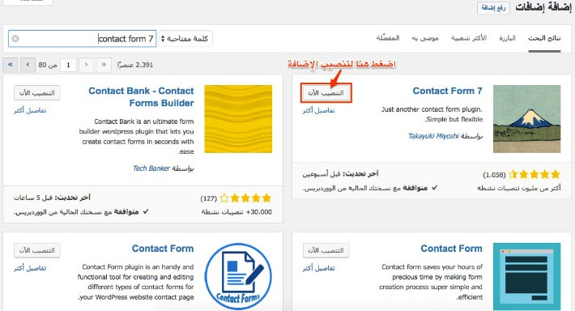
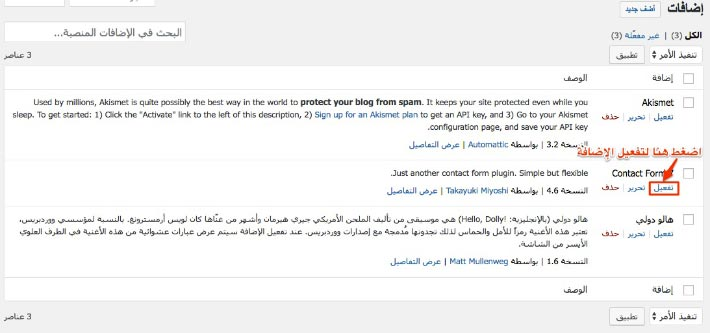
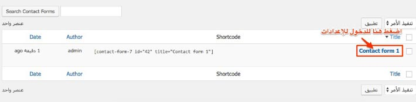
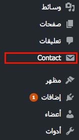
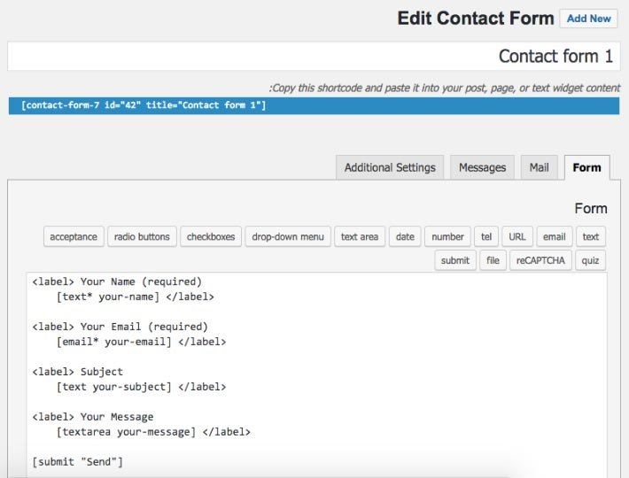
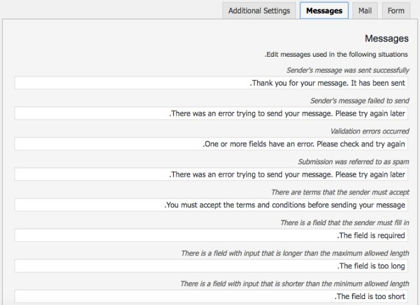
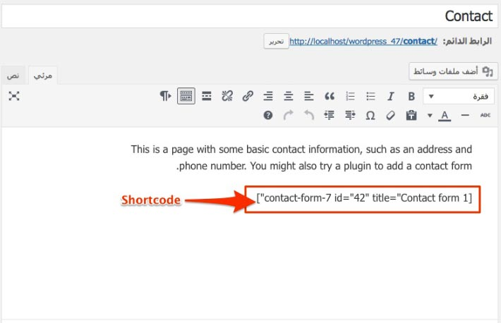
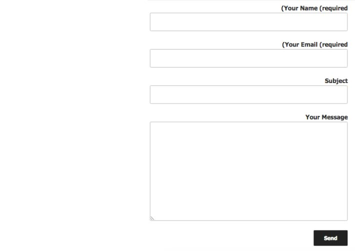

إذا كنت مستخدما للووردبريس وتود إضافة استمارة للمراسلة (Contact Form) لموقعك أو مدونتك فلن تجد أفضل من إضافة Contact Form 7 المعروفة والتي تعتبر من بين [أكثر إضافات ووردبريس استخداما](http://www.tutomena.com/blog/most-popular-wordpress-plugins/) نظرا لسهولة التعامل معها وفعاليتها الكبيرة.

في هذا الدرس سنشرح كيفية تثبيت هذه الإضافة خطوة بخطوة وإنشاء استمارة اتصال بواسطتها.

## تحميل إضافة Contact Form 7

كخطوة أولى، سنقوم بتحميل الإضافة وذلك من خلال صفحة **_إضافات_** > **_أضف جديد_** في لوحة التحكم الخاصة بموقعنا ثم البحث عن **Contact Form 3** :

قم بالضغط على **"زر التنصيب"** الآن للبدء في عملية تنصيب الإضافة.

## تفعيل الإضافة

عند إنتهاء التنصيب قم بالضغط على زر "**تفعيل**" الخاصة ب **CF7** بعد الذهاب لصفحة الإضافات المنصبة وفق المسار _**إضافات**_ > _**إضافات منصبة**_.

## إعدادات الإستمارة

بعد تفعيل الإضافة، يتم إنشاء **استمارة مراسلة** (Contact form) بشكل افتراضي وتحتوي على عدد من الحقول المطلوبة عادة في معظم المواقع(_الإسم، الإيميل، الموقع، الموضوع، الرسالة_).

الإستمارات الخاصة بإضافة Contact form 7 تجدونها في صفحة _**Contact**_ > _**Contact Forms**_، علما أنه بعد عملية التفعيل يتم إضافة عنصر جديد Contact في القائمة الجانبية للوحة التحكم.

للبدء في استخدام الإستمارة يجب إجراء بعض التعديلات على هذه الإعدادات.

عند فتح صفحة إعدادات الإضافة تجدونها على الشكل التالي :

### التبويب Form

في الصورة أعلاه تظهر شيفرة HTML للإستمارة في التبويب _Form_ ويمكنكم التعديل عليها كما يحلو لكم مع مراعاة عدد من الأمور :

- مثلا في الوسم _[text* your-name]_ نفهم أننا نريد إضافة حقل نصوص من نوع ... وعلامة النجمة .. تعني أنه حقل إجباري.
- _you-name_ هو الخاصية **name** الخاصة بالحقل والتي يتم استخدامها من طرف PHP في الخادم. إذا قمت بتغيير قيمتها فلا تنسى تغييرها كذلك في إعدادات التبويب _Mail._
- النصوص Your Message، You Subject، Your Email، Your Name هي التي سوف تظهر للزائر فوق الحقول ويمكنكم تغييرها وترجمتها إلى لغة موقعكم.

### التبويب Mail

في هذا التبويب تجدون الإعدادات الخاصة بالرسالة التي سوف تصلكم في بريدكم الإلكتروني، وفيها يتم استخدام **الخاصيات Attributes** التي سبق وأن رأيناها في المرحلة السابقة (your-name، your-subject، your-email، your-message).

أهم الإعدادات هنا هو تعيين عنوان للبريد الإلكتروني الذي تودون أن تصلكم فيه رسائل مستخدمي استمارة المراسلة على موقعكم.

### التبويب Messages

في التبويب _Messages_ سوف تجدون عددا من الرسائل التي سوف تظهر لزوار الموقع في عدد من الحالات، مثلا الرسالة التي ستظهر بعد انتهاء عملية الإرسال ... إلخ. قوموا بترجمتها والتعديل عليها كما تحبون.

## إظهار استمارة المراسلة للزوار

لإظهار الإستمارة لزوار موقعنا، سنقوم بإنشاء صفحة جديدة في لوحة التحكم (مثلا صفحة _اتصل بنا_) ثم **ننسخ** شيفرة الشورت كود Shortcode الخاصة بالإستمارة وتجدونها في صفحة الإعدادات التي رأيناها سابقا (_[contact-form-7 id="42" title="Contact form 1"]_)، ونقوم **بلصقها** في محرر الصفحة.

في الأخير قم بحفظ الصفحة ومعاينتها لرؤية نتيجة عملك.

---

هذه ببساطة الخطوات التي سوف تتبعها لإضافة **استمارة مراسلة** لموقعك اذا كنت تستخدم **ووردبريس**. بعد ذلك يمكنك إضافة بعض الستايل لتخصيص مظهر الإستمارة وملاءمتها مع الهوية البصرية لموقعك.
