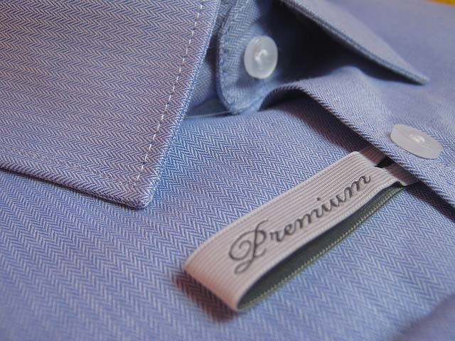

تعرف جيدا، صديقي المتابع، أن مستودع قوالب نظام إدارة المحتوى ووردبريس يحتوي على آلاف القوالب المجانية وتغطي جميع التخصصات والعدد يزداد شهرا بعد شهر بوتيرة سريعة. هذا ما دفعني يوما ما للتساؤل : لماذا علي استخدام قالب ووردبريس مدفوع وهناك الآلاف من القوالب المجانية ؟

بعد مرور عدة سنوات عملت فيها على عدة مشاريع ووردبريس وتم فيها استخدام قوالب ووردبريس مدفوعة، أظنني الآن أصبحت أملك الإجابة على سؤالي، ولهذا ارتأيت أن أشارك معكم هذه التدوينة لتكون جوابا لكل من يسأل نفسه هذا السؤال أو مايزال يتردد في شراء قالب ووردبريس لدعم موقعه.

إليكم خمسة أسباب ودوافع للإستعانة بقالب ووردبريس مدفوع :

## 1\. الجودة

قم بزيارة موقع **ثيم فوريست** ولاحظ نوعية القوالب المعروضة للبيع هناك وقم بمقارنتها مع أحسن القوالب المجانية التي تعرفها، الفرق واضح من النظرة الأولى.

تمتاز القوالب المدفوعة بجودتها الكبيرة وملاءمتها لأحدث التطورات والصيحات في عالم الويب، كما أنها تضمن لموقعك تميزا بصريا بين منافسيه وهذه نقطة لصالحك لأنه ليس بمقدور الجميع شراء قالب مدفوع وخاصة في عالمنا العربي حيث ثقافة **كل شيء بالمجان** لا تزال هي السائدة. هذا التميز يصبح في غير متناولك لو كنت تستخدم قالبا مجانيا، مثلا **_Twenty Sixteen_**، لأن المئات أو الآلاف من المواقع الأخرى تستخدمه وبالتالي قد يضيع موقعك وسط هذا الزحام.

القوالب المدفوعة كذلك تضمن لك تجاوب الموقع Responsive Design مع مختلف أنواع الأجهزة من الحواسب المكتبية إلى الهواتف المحمولة بجميع أبعادها، وهذه نقطة مهمة للغاية لظهور جيد على محركات البحث وكذلك الحفاظ على معدل ارتداد منخفض لزوارك والبقاء أطول فترة ممكنة على الموقع.

## 2. التخصيص

تكون القوالب المدفوعة عادة متميزة بكونها سهلة التخصيص حتى بدون أية معرفة بلغات HTML، CSS أو PHP، فهي تضع بين يديك عددا من التصاميم والخيارات القابلة للتفعيل والإعداد انطلاقا من لوحة التحكم بضغطة زر.

مطورو القوالب المدفوعة يفكرون فيما يمكن أن يجول في خاطر العميل فيقومون بإضافة أكبر قدر من الميزات والخاصيات للقالب حتى يستجيب لتطلعات الزبناء على اختلاف أذواقهم واختصاصاتهم.

## 3. الأمان

القوالب المجانية أو المقرصنة يمكن أن تحتوي على ثغرات أمنية قد تكون خطيرة، أما مطورو القوالب المدفوعة فهم يستثمرون جزءً كبيرا من وقتهم وأموالهم لتأمينها وجعلها على أكبر قدر من الإحترافية. وبالتالي ينصح دائما بالإبتعاد عن القوالب المقرصنة وإذا أردت استعمال قالب ووردبريس مجاني فقم بتحميله من [المستودع الرسمي](https://wordpress.org/themes/) فهناك على الأقل تضمن أن القوالب لا تحتوي على أي شيفرات خبيثة.

## 4. التحديثات

عندما تقوم باستخدام قالب ووردبريس مجاني فإنك في الغالب تقوم باستثمار بعض الوقت للتعديل عليه وتخصيصه ليلائم متطلبات موقعك. ولكن عند كل إصدار كبير من ووردبريس **غير متوافق مع قالبك** فأنت ستوضع أمام خيارين أحلاهما مر :

- **عدم التحديث،** وهذا قد يعرض موقعك لمخاطر أمنية، فكما تعرف أنه مع كل إصدار جديد يتم إصلاح الثغرات الأمنية المكتشفة وإضافة ميزات جديدة لووردبريس.
- **التحديث**، وهذا يعني إجراء تعديلات جديدة على القالب قد تكون جذرية، وإهدار أوقات وأموال في إعادة التخصيص.

الجميل مع القوالب المدفوعة أنك ستحصل دائما على تحديثات للقالب، فمثلا [قالب NewsPaper](https://www.tutomena.com/blog/newspaper-wordpress-theme-review/) على **ثيم فوريست** يعطيك خدمة تحديثات مجانية مدى الحياة بمجرد شراء القالب. هذا سيضمن لقالبك حياة أطول واستقرارا لموقعك من جميع النواحي.

## 5. الدعم

عندما تقوم بشراء **قالب ووردبريس مدفوع** فإنك ستحصل على دعم فني من مطوري القالب، ليس عليك أن تقلق من المشاكل التي ستواجهك أثناء التنصيب أو التخصيص، ما عليك سوى التوجه لمنتدى الدعم الخاص بالقالب وطرح أسئلتك ليقوم الفريق المكلف بالدعم بمساعدتك وإيجاد حلول لجميع المشاكل والعراقيل الذي قد تواجهك.

في حين أنك ستضطر للإعتماد على نفسك والبحث من هنا وهناك في غوغل إذا كنت تستخدم قالبا مجانيا، ولن يكون أحد مجبرا على الرد عليك أو مساعدتك، وستتضاعف متاعبك إذا كنت لا تملك أي خلفية في اللغات والتقنيات المستخدمة في تصميم قوالب وودربريس.

---

إذا كنت تنوي إطلاق مشروع جدي على الإنترنت، فأظن أنك ستعيد النظر في قناعاتك السابقة والتفكير بشكل أكبر في التوجه للإستعانة **بقوالب ووردبريس المدفوعة (Premium Wordpress Themes)** لإنشاء موقعك. هذه الثقافة لا تزال جديدة في منطقتنا العربية ولكن مع الوقت ستنتشر أكثر بالتوازي مع التطور الحاصل في الويب العربي.

- اقرأ أيضا: [أفضل قوالب ووردبريس الإخبارية في متجر ثيم فورست](https://www.tutomena.com/blog/best-wordpress-news-themes/)

_وأنت صديقي، ما هو رأيك في هذه المسألة ؟ هل أنت مع استخدام قوالب مدفوعة أم أنك مازلت من المدافعين عن مجانية الووردبريس ؟ دعنا نعرف جوابك في صندوق التعليقات أسفله :)_
