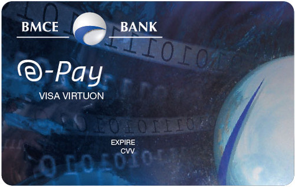
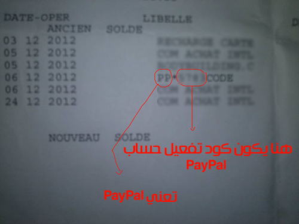

العديد من الإخوة يسألون في المنتديات ومجموعات الفيسبوك عن **بطاقة BMCE E-Pay** الخاصة بالبنك المغربي للتجارة الخارجية والمعروف اختصارا ب **BMCE Bank**. هذه البطاقة دولية وتمكن المغاربة من القيام بعمليات شراء ودفع على الإنترنت في حدود 10 آلاف درهم سنويا، أي أنه لا يمكن إخراج أكثر من 10 آلاف درهم مغربي (حوالي 1000 دولار) في السنة الواحدة بواسطة البطاقة.

[caption id="attachment_1299" align="aligncenter" width="500"] بطاقة BMCE E-Pay\

أغلب الأسئلة تتمحور حول علاقة البطاقة مع بنك بايبال الإفتراضي وكذا رسوم البطاقة ونسب الإقتطاع من المعاملات التي تتم بواسطتها. وهذا المقال يأتي كرد على جميع هذه الإستفسارات كوني أحد مستخدمي هذه البطاقة وبالتالي كل ما سأكتبه هنا هو خلاصة تجربتي مع بطاقة BMCE E-Pay.

## كيف تحصل على بطاقة فيزا BMCE E-Pay

عليك الذهاب لأقرب وكالة **للبنك المغربي للتجارة الخارجية** لطلب الحصول على **بطاقة BMCE E-Pay**، سيسألك الموظف هناك بعض المعلومات لملء استمارة طلب الحصول على البطاقة، وفي النهاية سيطلب منك العودة بعد أسبوع تقريبا للحصول عليها. شخصيا رجعت بعد 6 أيام وأخذت بطاقتي.

## تفعيل البطاقة

لن تستطيع استخدام البطاقة بمجرد الحصول عليها حتى تقوم بتفعيلها، وذلك عن طريق الإتصال بالرقم الهاتفي الذي يظهر خلف البطاقة واتباع التعليمات التي تعطى لك من طرف موظف مركز الإتصال التابع لبنك BMCE.

## الرسوم السنوية

بمجرد حصولي على البطاقة وجدت في كشف حسابي أنه تم اقتطاع **121 درهما**، وهذه هي الرسوم السنوية على البطاقة الدولية **BMCE E-Pay**.

## الإقتطاعات

يتم اقتطاع 2% (دون احتساب الرسوم) **من قيمة المعاملة** مع حد أدنى من الإقتطاع يساوي 10 دراهم، أي أنك مثلا إذا اشتريت تطبيق أندرويد من متجر بلاي ستور بقيمة **دولار واحد** فسيتم اقتطاع 10 دراهم من رصيدك إضافة لقيمة المعاملة، في هذه الحالة 1 دولار. (كأنك اشتريت تطبيقين :))

## تفعيل بايبال وربطه ببطاقة BMCE E-Pay

يمكنك تفعيل حسابك في **بايبال Paypal** وربطه مع بطاقة E-pay، الطريقة معروفة وصالحة لجميع أنواع بطائق الإئتمان (مثل **بايونير** وغيرها). بعدتفعيل بايبال ببطاقتك سيطلب منك الأول (بايبال) إدخال شفرة عبارة عن أربعة أرقام تظهر في كشف حسابك البنكي على الأغلب بعد يومين، لأن بايبال يقوم بسحب مقدار دولار واحد من حسابك بعد التفعيل ولكي يتأكد من أن الحساب هو حسابك يطلب من إدخال تلك الأرقام الأربعة التي تظهر عند كل معاملة في كشف حسابك البنكي.

ما إن تظهر هذه الأرقام في كشف حسابك قم بالذهاب إلى حسابك على بايبال وأدخلها في المكان المخصص لها حتى يتم ربط البطاقة بحسابك على بايبال.

الدولار الذي يتم سحبه في المعاملة التجريبية سيتم إرجاعه حالما تنتهي عملية الربط بنجاح.

## كيف يعمل بايبال مع BMCE E-Pay

عندما تريد شراء شيء بواسطة **حسابك بايبال** فإن الأخير يقوم بالتأكد إن كان لديك رصيد على حسابك، إذا كان لديك رصيد فإنه يقوم باقتطاع قيمة المعاملة منه، وإذا لم يكن لديك فيه أي رصيد فإنه يقوم باقتطاع المبلغ من رصيد بطاقتك الإئتمانية **BMCE E-Pay**.

## إرسال المال من Paypal لحسابك البنكي BMCE

إذا كنت تملك رصيدا على بايبال وتريد تحويله لحسابك البنكي فيكفي أن تقوم بالضغط على الرابط **Withdraw funds **وتقوم بتحديد المبلغ الذي تريد تحويله وبعدها سيقوم بايبال بإرسال المبلغ لحسابك البنكي مع اقتطاع 5 دولارات من المبلغ الذي تم تحويله مهما كانت قيمته.

قمت بتجربة هذه العملية عن طريق إرسال مبلغ 80 دولار من بايبال لحسابي البنكي، تم اقتطاع 5 دولار لصالح بايبال وتحويل 75 دولار (حوالي 754 درهما) للحساب البنكي. المبلغ وصل للحساب بعد 24 ساعة أو أقل.

### خلاصة

على العموم أرى بأن **بطاقة BMCE E-Pay** جيدة وتفي بالغرض خاصة للإستعمالات الشخصية، قد يكون مبلغ 1000 دولار كحد أقصى قليل خاصة إذا كنت تريد استخدام البطاقة في أعمالك التجارية لأن المغرب في هذا الصدد ما يزال متأخرا عن باقي الدول الرائدة في العالم، ولكننا نأمل أن تتحسن الأوضاع أكثر في المستقبل حتى تصبح **المعاملات المالية** عندنا أكثر سلاسة.
