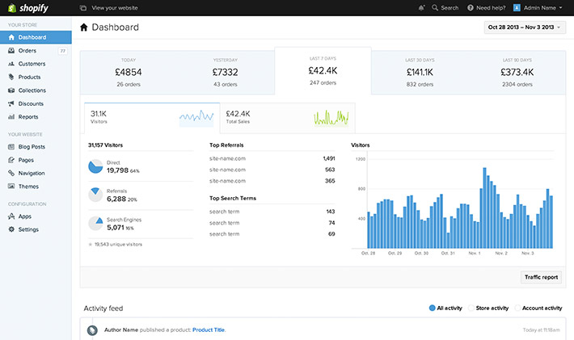
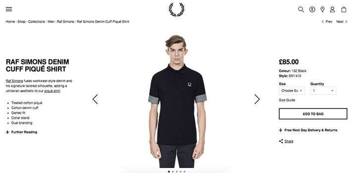

بدأ العديد من الشباب عندنا في المغرب، وفي المنطقة ككل، يكتشفون ويقتنعون بثقافة **العمل على الإنترنت** وتحقيق عائد مادي محترم يضمن لهم عيشا كريما بعيدا عن المشاكل التي يعاني منها الشباب العربي من بطالة وضعف فرص العمل إن وجدت.

العمل على الإنترنت يشمل مجالات عديدة لا يمكن تعدادها وتفصيلها في مقال واحد، ولكن ما يهمنا في هذا الموضوع هو مجال **التجارة الإلكترونية**، أي البيع والشراء على الإنترنت من خلال موقع إلكتروني يعرض فيه صاحب المشروع السلع والمنتوجات التي يريد بيعها. وكما تعلمون فإنشاء **متجر إلكتروني** ليس بالأمر السهل وليس تطويره في متناول جميع المطورين فضلا عن عامة الناس نظرا لما يستلزمه من متطلبات خاصة في ما يتعلق بالأمان وإتاحة طرق دفع آمنة لا تعرض حسابات وأموال الزبناء لخطر القرصنة والسرقة.

لهذا توجد عدد من [الحلول والأنظمة المعدة خصيصا **لإدارة المتاجر الإلكترونية**](http://www.tutomena.com/blog/open-source-ecommerce-cms/) بكل احترافية دون التفكير في الجوانب التقنية للموضوع. في مقالنا هذا سنتحدث عن اثنين من أهم الحلول التي يلجأ إليها عدد كبير من أصحاب المتاجر الإلكترونية على الإنترنت وهما : **شوبفاي Shopify** و **ماجنتو Magento**. الإثنان يؤديان نفس المهمة ولكن لكل منهما فلسفته الخاصة التي تميزه عن الآخر.

## شوبفاي Vs ماجنتو : التنصيب

**شوبفاي** منصة **ذاتية الإستضافة Self-Hosted**، هذا يعني أن التنصيب سهل للغاية ولا يتطلب أي مهارات تقنية، كما أنه ليس عليك القلق بشأن اختيار استضافة ملائمة لحجم مشروعك، شوبفاي يتولى ذلك نيابة عنك، والمقابل سيكون عليك دفع 29 دولار شهريا وهي الخطة (Plan) الأرخص عند شوبفاي، حيث أن هناك خططا شهرية أخرى للأعمال والمتاجر المتوسطة والكبيرة **Growing Businesses** يصل سعرها ل 299 دولارا في الشهر.

[alert type="info" icon-size="normal"]هناك خطة شوبفاي مجانية تدوم 14 يوم، لإعطائك فرصة لاكتشاف المنصة قبل شراء الخطة المدفوعة.[/alert]

في الجهة الأخرى، يعتبر نظام **ماجنتو** مشروعا مفتوح المصدر مثله مثل ووردبريس ولكنه خاص بإدارة المتاجر الإلكترونية وليس المدونات. هذا يعني أنك مطالب بشراء استضافة لموقعك، وتنصيب سكريبت ماجنتو في هذه الإستضافة ليس بسهولة تنصيب شوبفاي، وبالتالي قد تكون في الغالب بحاجة لمطور متخصص من أجل تنصيب موقعك وإعداده جيدا. هذا دون أن ننسى أن ماجنتو نظام ضخم ومتكامل وبالتالي يحتاج لإستضافة بمواصفات خاصة لأنه يقوم باستهلاك موارد الخادم Server Resources بشكل قد يكون مبالغا فيه مقارنة بووردبريس مثلا.

## سهولة الإستخدام

كلا الحلين يوفران لوحة تحكم سهلة الإستخدام وفي متناول المستخدم بغض النظر عن مستواه التقني. لا تقلق بشأن هذا الموضوع، فالمطورون هناك يعملون ليل نهار لمنح العملاء **تجربة مستخدم User Experience** على أعلى مستوى.

[caption id="attachment_1310" align="aligncenter" width="710"] لوحة التحكم الخاصة بشوبفاي\

## إدارة المحزن

في خطة شوبفاي المجانية (14 يوما)، لا يمكنك إضافة أكثر من 25 منتجا لمتجرك، بينما في الخطط الأخرى يمكنك إضافة عدد غير محدود من المواد.

أما في نظام ماجنتو فيمكنك ملء متجرك بالمنتوجات كما يحلو لك، إلا أنه عليك التركيز كثيرا على جودة الإستضافة التي تختارها فهي قد تلعب **دورا رئيسا** في إنجاح مشروعك أو إفشاله.

## طرق الدفع

يدعم شوبفاي أزيد من 70 بوابة للدفع _Payment Gateways_، وهذا أكبر بكثير مما يقوم ماجنتو بدعمه افتراضيا، ولكن لا يجب القلق على هذه النقطة كون ماجنتو نظام قابل للإمتداد _Extensible_ بحيث أنه بإمكانك إضافة طريقة الدفع التي تناسبك على شكل إضافة أو وحدة خارجية مستقلة تقوم بإضافتها لموقعك، قد تكون مجانية أو مدفوعة.

الجذير بالذكر أن شوبفاي يوفر بوابة دفع _Payment Gateway_ خاصة بالمنصة معروفة ب **Shopify Payments** وفي حالة استخدامك لها فإن شوبفاي لا تقوم باقتطاع أي فلس من مبيعاتك، بينما تقوم باقتطاع 2% من كل مبيعة في حالة استخدامك لطريقة دفع أخرى.

## القابلية للتخصيص

مجتمع ماجنتو نشيط ولذلك لن تجد أي صعوبة في إيجاد القالب الذي يروق لك، هناك عدد كبير من القوالب المجانية ولكني [أنصح دائما باستخدام القوالب المدفوعة](http://www.tutomena.com/blog/wordpress-premium-themes/) فهي أكثر أمانا وأعلى فعالية وكفاءة. يمكنك اختيار القالب الذي يعجب في متجر ثيم فوريس وبأسعار أقل ما يقال عنها أنها في متناول من يريد افتتاح متجر إلكتروني :)

وكما أشرنا سابقا، فنظام ماجنتو مفتوح المصدر وقابل للإمتداد عن طريق الوحدات والإضافات _Exstensions_، تماما كما هو الحال عند ووردبريس، يمكنك تخصيص متجرك بالشكل الذي تريده، الشرط الوحيد هو أن تجد مطورا محترفا ومتخصصا في ماجنتو حتى يقوم بالمهمة على أحسن وجه.

شوبفاي بدوره يوفر مجموعة رائعة من القوالب المجانية والمدفوعة، ولكن الأخيرة تظل أغلى من نظيراتها عند ماجنتو، فبإلقائك نظرة في [متجر قوالب شوبفاي](https://themes.shopify.com/) ستلاحظ أن الأثمنة في بعض الأحيان تفوق 180 دولارا، بينما لا يتجاوز سعر [قالب ماجنتو احترافي](https://themeforest.net/category/ecommerce/magento) 65 دولارا على [ثيم فورست](http://www.tutomena.com/web-development/%d8%a7%d9%84%d9%86%d8%ac%d8%a7%d8%ad-%d9%85%d8%aa%d8%ac%d8%b1-%d8%ab%d9%8a%d9%85-%d9%81%d9%88%d8%b1%d9%8a%d8%b3%d8%aa/). هذا دون نسيان [مستودع شوبفاي للتطبيقات](https://apps.shopify.com/) (مقابل الوحدات عند ماجنتو)، غرضه جعل شوبفاي أكثر قابلية للتخصيص، والشركة تمنح للمطورين فرصة تطوير تطبيقات شوبفاي خاصة بهم وعرضها للبيع أو التحميل المجاني على نفس المستوع.

[caption id="attachment_1314" align="aligncenter" width="711"] متجر الماركة الشهيرة Fred Perry مدعوم من ماجنتو\

## محركات البحث SEO

كلا النظامين يدعمان السيو بشكل جيد للغاية رغبة منهما في جعل متجرك يحصل على أكبر عدد ممكن من الزيارات العضوية Organic traffic. وللذهاب أبعد في هذا الموضوع يمكنك الإستعانة بأحد الإضافات المتوفرة لكل من النظامين كما ذكرنا في الفقرة السابقة.

## تعدد اللغات

في هذه النقطة يتفوق ماجنتو على شوبفاي، حيث أن الأول يدعم المتجر متعدد اللغات بينما الثاني لا يقدم دعما كاملا لذلك، إلا إذا تمت الإستعانة بأحد التطبيقات لطرف ثالث Third-party تجدونها بالبحث في مستودع تطبيقات شوبفاي.

## خاتمة

شوبفاي وماجنتو حلين رائعين لبدء مشروعك على الإنترنت، كبار الشركات العالمية لجأت لهذين النظامين لدعم أنشطتها التجارية على الشبكة العنكبوتية، فقط قم باختيار الحل الذي يناسبك: سهولة استخدام **شوبفاي** وخدماته التي نجد أكثرها مدفوع و**ماجنتو** بمجتمعه الأكثر انفتاحا وإضافاته المتنوعة مع مسؤوليات أكبر في الإستضافة وإعداداتها.
