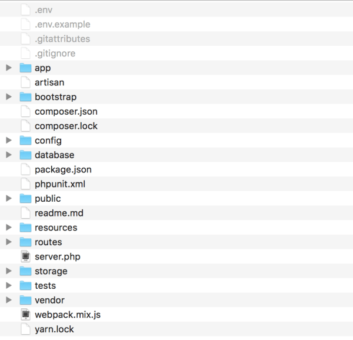

قد يصادفك يوما ما موقف تكون فيه مجبرا على تثبيت [إطار العمل لارافيل](http://www.tutomena.com/web-development/php/%d8%a5%d8%b7%d8%a7%d8%b1-%d8%a7%d9%84%d8%b9%d9%85%d9%84-%d9%84%d8%a7%d8%b1%d8%a7%d9%81%d9%8a%d9%84/) **Laravel** في أحد المجلدات الفرعية _Sub folders_ بالخادم عوض المجلد الرئيسي _Root folder_ كما هو شائع. في هذه الحالة، إذا لم تكن على دراية كاملة ببنية مجلدات لارافيل فسوف تقع في أخطاء قد تكون كارثية على أمن موقعك.

[caption id="attachment_1318" align="aligncenter" width="600"] بنية مجلدات لارافيل\

المجلد الذي يجب الإنتباه إليه والتركيز عليه جيدا هو "public"، هذا هو **المجلد الوحيد** الذي بإمكان زوار موقعك الوصول إليه عبر المتصفح، الملفات والمجلدات الأخرى تستخدم من طرف الخادم في الكواليس ولا علاقة للزائر بها، لا يجب عليه الوصول إليها في أي حال من الأحوال.

لنفترض أنك قمت بتثبيت لارافيل بجميع مجلداته وملفاته في مجلد فرعي على موقعك، كما يلي :

site.com/subfolder/public/

الموقع سيعمل بطبيعة الحال ولكن هذه ليست الطريقة العملية لفعل ذلك، فالموقع سيكون معرض لمشاكل أمنية بمجرد الدخول للرابط التالي :

site.com/subfolder/.env

الملف _.env_ حساس وفيه جميع المعلومات المتعلقة بإعدادات قاعدة البيانات وغيرها من المعلومات المهمة للموقع وإذا ما وقعت عليها عين أحد المتطفلين فقد يعبث بها ويسبب لك ولموقعك مشاكل ربما لا يمكن تداركها بعد ذلك.

إذن عليك ألا تدع مثل هذه الملفات معروضة للعموم، بل عليك إما حمايتها بملف ._htaccess_ أو تغيير مكانها وتحويلها للمجلد الرئيسي وهذه أفضل طريقة لحماية موقع مدعوم من لارافيل عند تثبيته في مجلد فرعي. غالبية الإستضافات تضع **المجلد الرئيسي** في هذا المسار :

/var/www/public_html

لنفترض أننا نريد إنشاء مدونة بواسطة لارافيل داخل الموقع الخاص بنا، المدونة ستكون على الرابط التالي :

site.com/blog/

ما علينا فعل هو إنشاء مجلد _blog_ داخل المجلد الرئيسي _public_html_ ثم ننسخ فيه الملفات الموجودة داخل المجلد _public_ الخاص بلارافيل.

بعد ذلك بنقل جميع المجلدات الأخرى (كل الملفات ما عدا مجلد _public_) لإطار العمل لارافيل إلى جذر الإستضافة في مجلد نسميه مثلا _laravel_.

var/www/laravel

يعني أن المجلدان _public_html_ و _laravel_ سيكونان في نفس المستوى.

والشيء الأخير الذي علينا القيام به هو تعديل المسارين التاليين في ملف _index.php_ داخل المجلد _blog_ (الذي نسخنا فيه ملفات المجلد _public_) كما يلي :

require __DIR__.'/../../bootstrap/autoload.php';
$app = require_once __DIR__.'/../../bootstrap/app.php';

بهذه الطريقة تضمن أن جميع ملفات لارافيل خارج المجلد _public_ ستكون في مأمن ولا يمكن الوصول إليها من المتصفح.
