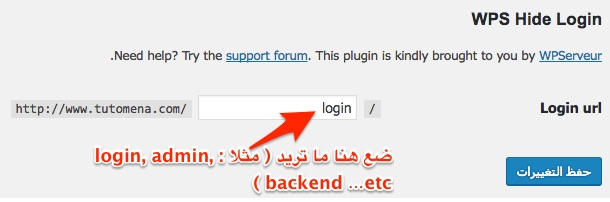

**إضافة WPS Hide Login** هي من الإضافات الرائعة لووردبريس والتي يمكنها لعب دور مهم في حماية موقعك من المحاولات الخبيثة لإختراق لوحة التحكم الخاصة به من طرف بعض المتطفلين. في هذا الدرس، سنرى فائدة هذه الإضافة ولماذا على كل مدون ومستخدم لنظام إدارة المحتوى **ووردبريس** أن يقوم بتثبيتها على موقعه.

## ما هي فائدة الإضافة WPS Hide Login ؟

إذا كنت تمتلك مدونة فبالتأكيد ستلاحظ أن نسبة من الزيارات لموقعك هي لروابط غير موجهة للعموم ولا علاقة للزوار بها، من بينها مثلا الرابط _/wp-admin_ الخاص بلوحة التحكم، لأن الجميع يعرفون أنه الرابط الإفتراضي الخاص بلوحة التحكم لجميع المواقع المدعومة من ووردبريس. كل من يحاول الدخول لهذا الرابط وهو غير مسجل فإنه يوجه تلقائيا لصفحة تسجيل الدخول على الرابط */wp-login.php* حيث تعرض له استمارة التسجيل باستخدام اسم المستخدم وكلمة المرور، وهذا ما يستغله بعض المتطفلين (قد يكون برناماجا خبيثا) لمحاولة قرصنة حساب مدير الموقع أو أحد أعضائه عن طريق تجريب عدد من كلمات المرور وأسماء المستخدمين، وربما تنجح محاولاتهم إذا لم يتم اختيار كلمات مرور معقدة.

دور **إضافة WPS Hide Login** هو تغيير هذا الرابط الإفتراضي لصفحة تسجيل الدخول wp-login.php وتعويضه برابط جديد خاص بك، هكذا لن يستطيع أي متطفل أو برنامج خبيث الوصول إلى صفحة تسجيل الدخول عبر الرابط الإفتراضي المعروف ولن يكون بوسعه إيجاد هذه الصفحة إلا إذا استطاع تخمين الرابط الجديد، ولهذا يفضل اختيار كلمة ذات دلالة يسهل تذكرها من طرفك وفي نفس الوقت يصعب تخمينها من طرف الآخرين.

## تثبيت الإضافة

أول شيء قم بتثبيت [الإضافة WPS Hide Login](https://wordpress.org/plugins/wps-hide-login/) وبعد ذلك اذهب لصفحة الإعدادات العامة للموقع والتي تجدها من خلال لوحة التحكم في هذا المسار : **_الإعدادات > عام_** ثم النزول لأسفل الصفحة.

[caption id="attachment_1325" align="aligncenter" width="610"] إعدادات الإضافة WPS Hide Login\

في الصورة أعلاه الحقل _Login url_ الوحيد لإعداد الإضافة، حيث تقوم بوضع الرابط الذي يحلو لك.

بعد حفظ التغييرات سيصبح الرابط الجديد هو رابط صفحة تسجيل الدخول بينما الرابط القديم wp-login.php لن يعمل بعد الآن وسيظهر لك خطأ 404 (الصفحة غير موجودة) يخبرك بأن الرابط لم يعد يعمل وهذا ما نريد بالضبط، كون الرابط الجديد الذي قمنا بإدخاله في إعدادات **WPS Hide Login** هو الذي سيتم استخدامه من الآن وصاعدا عوض الرابط الإفتراضي القديم.
