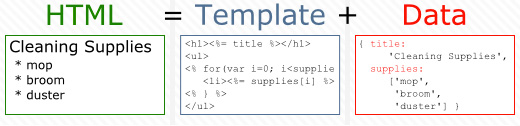
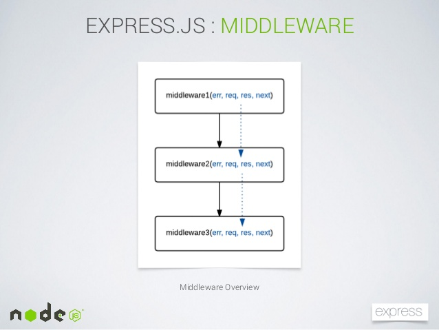

في مقال سابق أجبنا عن سؤال [ما هو Nodejs ؟](http://www.tutomena.com/web-development/javascript/what-is-nodejs/) ورأينا بأنه منصة تمكننا من تطوير تطبيقات ويب (وغير ويب) احترافية، سريعة وذات كفاءة عالية، فهي تتمتع بجميع نقاط قوة الجافاسكريبت المتمثلة في الأحداث Events وخاصية non-blocking I/O التي تمكن البرنامج من القيام بعدة مهام في نفس الوقت.

ولكن ليس من السهل دائما برمجة تطبيق ويبمن الصفر بواسطة **Node.js**، ففي المجال الإحترافي والعملي دائما ما نحتاج لأدوات تقوم بتسهيل عدد من المهام المتكررة والتي نحتاجها في كل المشاريع تقريبا. فعوض إهدار الوقت في كتابة شيفرة برمجية من الصفر لغرض معين، سيكون من الحكمة اللجوء لأحد الحلول الجاهزة التي تساعدنا على القيام بنفس المهمة باحترافية وفي وقت أقل.

## إطار العمل Express.js

**Express.js** هو أحد هذه الحلول التي جاءت لمساعدة عشاق **Node.js** على تطوير تطبيقات ويب على أساس متين ومنظم، إنه **إطار عمل صغير** (*Micro framework)* جلب معه عدد من المزايا التي يحتاجها قطعا أي مطور في مشاريعه.

> يجب الحذر عند مقارنة Express مع إطارات العمل المعروفة للغات برمجية أخرى، مثلا Symfony أو Laravel بالنسبة ل PHP و Django للغة بايثون، فهذه إطارات عمل ضخمة ومتكاملة، بينما Express.js هو إطار عمل صغير لا يوفر كل مقومات تلك الأطر.

في هذا المقال سنتكلم عن ثلاثة أمور ومزايا مهمة جاء بها **إطار العمل Express.js** لجعل حياة المطور أسهل وأكثر تنظيما.

## 1. Routing

من المزايا المهمة والأساسية التي يجب على كل إطارعمل توفيرها للمطورين هي إتاحة نظام لقراءة العناوين (routes) وهذه من أجمل الميزات التي نجدها في Express، نظام Routing الخاص به رائع وسهل الفهم والإستيعاب كما سنرى في الأمثلة أسفله.

أول ما يجب القيام به هو تثبيت إطار العمل Express عن طريق الأمر التالي :

```bash
npm install express
```

> بالطبع هذا الأمر لن يتم تنفيده إذا لم تقم بتثبيت [برنامج Node.js](https://nodejs.org/en/) على جهازك.

لنفترض بأن لدينا ثلاث صفحات في تطبيقنا ومساراتها كالتالي :

```
/
/about
/contact
```

للوصول لكل مسار على حدة من داخل ملف الجافاسكريبت، ومن دون إستخدام Express.js، سيتوجب علينا تدبر أمورنا على النحو التالي :

```js
var http = require('http');
var url = require('url');

var server = http.createServer(function(req, res) {
  var page = url.parse(req.url).pathname;
  res.writeHead(200, { 'Content-Type': 'text/plain' });
  if (page == '/') {
    res.write('أنت في الصفحة الرئيسية');
  } else if (page == '/about') {
    res.write('صفحة عن المشروع ؟');
  } else if (page == '/contact') {
    res.write('اتصل بنا');
  }
  res.end();
});
server.listen(8080);
```

نلاحظ بأننا أضفنا وحدتين (Modules) الأولى اسمها http للإتصال بالخادم، والثانية اسمها url لغرض قراءة الرابط وتفكيكه حتى نعرف الصفحة المطلوب عرض محتواها.

هذا جميل لحد اللحظة، ولكن ما ذا لو أردنا إضافة صفحات جديدة ؟ هل سنستمر في إضافة الجمل الشرطية if ؟ وماذا لو كانت عندنا بارامترات في المسار وأردنا قراءتها ؟! وماذا وماذا ... إلخ! الأمور ستتعقد أليس كذلك ؟

لا تقلقوا سنرى الآن كيف أن الأمر سهل وعملي مع إطار العمل Express.js.

أنظروا لهذه الشيفرة :

```js
var express = require('express');
var app = express();

app.get('/', function(req, res) {
  res.setHeader('Content-Type', 'text/plain');
  res.end('أنت في الصفحة الرئيسية');
});

app.get('/about', function(req, res) {
  res.setHeader('Content-Type', 'text/plain');
  res.end('صفحة عن المشروع ؟');
});

app.get('/contact', function(req, res) {
  res.setHeader('Content-Type', 'text/plain');
  res.end('اتصل بنا');
});

app.listen(8080);
```

الكود الآن أصبح أوضح وأكثر تنظيما، بل نستطيع الآن قراءة الروابط التي تحتوي على بارامترات بكل يسر :

app.get('/profile/:user_id', function(req, res) {
res.setHeader('Content-Type', 'text/plain');
res.end('البروفايل الخاص بالمستخدم رقم : ' + req.params.user_id);
});

في الرابط نقوم بتمرير الرقم أو id الخاص بالمستخدم وبناء عليه نعرض البروفايل الخاص به من قاعدة البيانات مثلا.

يمكننا كذلك إظهار صفحة 404 إذا كان الصفحة المطلوبة غير موجودة عن طريق إضافة الشيفرة التالية **أسفل** المسارات Routes.

```js
app.use(function(req, res, next) {
  res.setHeader('Content-Type', 'text/plain');
  res.send(404, 'الصفحة غير موجودة');
});
```

## 2. نظام القوالب Templates

ربما جربت من قبل شعور رؤية أكواد HTML مختلطة بأكواد جافاسكريبت، بالتأكيد إنه شعور سيء ومحبط، يكفي رؤية هذا لتعرف ماذا أقصد :

```js
res.write(
  '<!DOCTYPE html>' +
    '<html>' +
    ' <head>' +
    ' <meta charset="utf-8" />' +
    ' <title>' +
    page_title +
    '</title>' +
    ' </head>' +
    ' <body>' +
    ' <p>' +
    content +
    '</p>' +
    ' </body>' +
    '</html>'
);
```

هذا مجرد كود صغير فما بالك لو كان أكبر من ذلك! لا أريد تخيل تلك الذكريات المؤلمة :)

علينا أن نشكر **Express** لأنه وضع بين أيدينا نظام قوالب رائع يفصل كود **الجافاسكريبت** عن **HTML** حيث يضع الأخيرة في ملفات مستقلة جاعلا بذلك سير العمل أكثر تنظيما واحترافية.

يمكن استخدام عدة أنظمة للقوالب مع إطار العمل Express، مثلا Jade و Haml، ولكننا في هذا الشرح سنختار [EJS](http://www.embeddedjs.com/)، فهو بسيط ويفي بالغرض في غالب الأحيان. لنقم بتركيبه أولا :

```bash
npm install ejs
```

لن نكون مضطرين بعد اليوم لخلط الجافاسكريب مع ال HTML، إطار العمل Express يمكننا من استدعاء قوالب .ejs على الشكل التالي :

```js
app.get('/about', function(req, res) {
  res.render('about.ejs');
});
```

الملف `about.ejs` الذي يتم استدعاؤه وعرض محتواه يوجد في المسار `views/about.ejs`.

] نظام القوالب EJS

بالطبع يمكن تمرير متغيرات لهذه القوالب على هذا المنوال :

```js
app.get('/profile/:user_id', function(req, res) {
  res.render('profile.ejs', { etage: req.params.user_id });
});
```

هنا نقوم باستدعاء الملف profile.ejs بعد تمرير المتغير user_id له. المتغير يؤخذ من داخل ملف القالب profile.ejs ويستعمل كالتالي :

```html
<h1>عنوان الصفحة</h1>
<p>بروفايل المستخدم رقم : <%= user_id %></p>
```

المتغير قد يكون مصفوفة كذلك وتعرض المعلومات التي بداخله عن طريق حلقة التكرار for كما لو كنت في ملف جافاسكريبت اعتيادي. لنأخذ هذا المثال :

```js
//ملف الجافاسكريبت
app.get('/post/:post_id', function(req, res) {
var comments = ['هذا جميل!', 'موضوع رائع، شكرا.', 'محتوى رائع وجميل.'];
res.render('post.ejs', {comments: comments});
});

//ملف post.ejs
<%
for(var i = 0 ; i <= comments.length ; i++) {
%>

<p> <%= comments[i] %> </p>
<% } %>
```

هذا الكود قد يكون مألوفا عندك خاصة إذا كانت لك تجربة ولو قصيرة مع إطار العمل **سيمفوني** أوغيره.

يمكنكم زيارة الموقع الرسمي **[لنظام القوالب Embedded JavaScript](http://www.embeddedjs.com/)** لمعرفة المزيد حول إمكانياته ومميزاته.

## 3. Middlewares

ال **Middleware** (أو الوسيط) هو عبارة عن برنامج صغير له وظيفة معينة ومحددة. وإطار العمل Express مبني على مفهوم ال Middlewares و يويتوفر على عدة أنواع منها، نذكر منها ما يلي :

- **cookie-parser : **للتعامل مع الكوكيز.
- **cookie-session : **للتعامل مع الجلسات (sessions).
- **CSRF** : للحماية من ثغرات CSRF.

في [إطار العمل لارافيل](http://www.tutomena.com/web-development/php/%d8%a5%d8%b7%d8%a7%d8%b1-%d8%a7%d9%84%d8%b9%d9%85%d9%84-%d9%84%d8%a7%d8%b1%d8%a7%d9%81%d9%8a%d9%84/) هناك مفهوم ال Middlewares كذلك، و Express يقوم باستخدامه بشكل رائع.

]Express.js - Middlewares\ù

لنتخيل مثال **زائر غير مسجل** جاء لموقعك محاولا الدخول للوحة التحكم عن طريق الرابط /dashboard ، هذه طبعا محاولة تطفلية ولا يجب أن تتم بنجاح، لهذا سنقوم بإضافة middleware في **أعلى** شيفرتنا البرمجية وظيفته الأساسية هي التأكد من أن الذي يريد الدخول للوحة التحكم قد سجل دخوله (Logged In).

```js
var app = require('express')();

function checkLogin() {
  return false;
}
app.use(function(req, res, next) {
  if (checkLogin()) {
    next();
  } else {
    res.send('المرجو تسجيل الدخول أولا !!!');
  }
});

app.get('/dashboard', function(req, res, next) {
  res.send('هذه لوحة التحكم');
});

app.listen(8080);
```

أولا أنشأنا دالة اسمها checkLogin تقوم بالتأكد من أن الزئر مُعرَّف، ثم بعد ذلك نقوم بالتحقق من قيمتها في ال middleware داخل الدالة app.use() . إذا كان ما ترجعه الدالة checkLogin هو true نمر ل middleware التالي app.get("/dashboard") عن طريق الدالة next() ، وإذا كانت قيمة checkLogin()  هي false، أي أن الزائر غير مُعرَّف، يقوم ال middleware بإظهار رسالة خطأ على سبيل المثال.

> الشيء الذي يجب الإنتباه إليه جيدا هو أهمية الترتيب عند استخدام ال middlewares، ال middleware الذي يُستدعَى أولا هو الذي يتم تنفيذه أولا. الدالة next تقوم باستدعاء ال middleware التالي من حيث الترتيب في الكود.

هذا مجرد تقديم وشرح بسيطين لمفهوم ال middlewares لإطار العمل Express.js. ينصح دائما بالبحث واستزادة المعلومات في [الموقع الرسمي للفريموورك](https://expressjs.com/en/guide/using-middleware.html).

### خاتمة

رأينا إذن أن **إطار العمل Express** جميل ويبسط عددا كبيرا من المهام والوظائف المطلوبة في جل المشاريع، ويعالج عددا من الإشكالات التي يواجها عدد كبير المطورين مع Nodejs وتحديدا صعوبة التعامل معه وكتابة أكواده وتنظيمها وهذا المشكلة تتفاقم كلما زاد حجم المشروع.

إذا كنت، صديقي المتابع، استخدمت من قبل إطار العمل Express في مشاريعك فلا تتردد في مشاركة تجربتك معنا، سأكون سعيدا جدا بذلك فنحن في النهاية ندون لكي نفيد ونستفيد.

#### المراجع

- [https://openclassrooms.com/courses/des-applications-ultra-rapides-avec-node-js/le-framework-express-js](https://openclassrooms.com/courses/des-applications-ultra-rapides-avec-node-js/le-framework-express-js)
- [http://qnimate.com/express-js-middleware-tutorial/](http://qnimate.com/express-js-middleware-tutorial/)
- [https://expressjs.com/en/guide/using-middleware.html](https://expressjs.com/en/guide/using-middleware.html)
