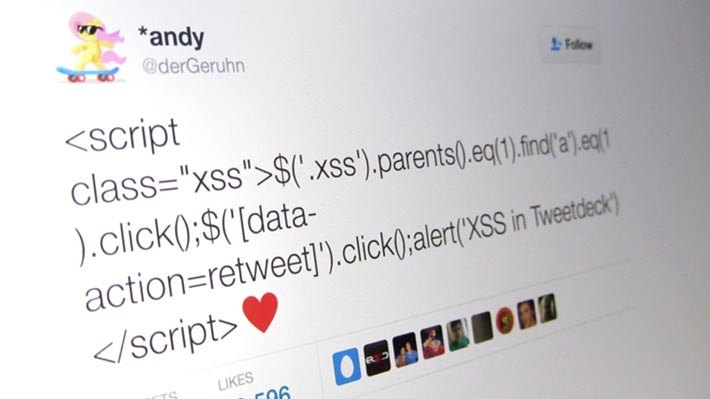

هل أصبحت، صديقي العزيز، قادرا على تطوير **تطبيقات ويب** تعمل بشكل سليم ولكنك مازلت مترددا في كونك قادرا على أن ترفع رأسك وتقول أنا **مطور ويب محترف** ومبرمج رائع ؟ إذن هذا الموضوع من أجلك، سأذكر لك عددا من العلامات والمعايير التي إن اجتمعت فيك علمت أنك عانقت الروعة وبلغت الإحتراف.

## 1\. تستخدم إطارات العمل

مهما كنت ماهرا في البرمجة، فإن اعتمادك على إطار عمل لا مفر منه، حيث يمكنك من التركيز على العمل مباشرة وتحسين الجودة عوض إضاعة الكثير من الوقت في إعادة اختراع العجلة. إطارات العمل توفر لنا مجموعة من الأدوات الجاهزة لتيسير العمل، وتفرض علينا عددا من الممارسات الجيدة والإحترافية تم وضعها في هذا الإطار نتيجة دراسةٍ ومجهودٍ كبيرين من قِبل القائمين عليه. كل هذا يا صديقي بالمجان، وبالتالي فلا عذر لك في عدم الإعتماد عليها ولن تجد تقريبا أي مطور ويب محترف لا يستعملها في مشاريعه. لا يهم أيها تستخدم، المهم هو أن تختار واحدا منها على الأقل لكل لغة برمجة ومن ثم تتقنه إتقانا حتى تحقق منه الإستفادة القصوى.

هذه لائحة لأشهر إطارات العمل الخاصة بلغات البرمجة الأكثر انتشارا وطلبا في السوق :

- لغة البرمجة PHP : [لارافيل وسيمفوني إضافة لزند فريموورك](http://www.tutomena.com/web-development/php/php-frameworks-2016/).
- لغة البرمجة بايثون : Django Framework.
- لغة البرمجة روبي : Ruby On Rails.
- لغة البرمجة جافاسكريبت : [أنغولار](http://www.tutomena.com/web-development/javascript/choose-angular/)، Vue.js، React.js.
- منصة Nodejs : [إطار العمل Express.js](http://www.tutomena.com/web-development/javascript/what-is-expressjs/).
- لغة البرمجة جافا : Spring MVC.

## 2. تستخدم نظاما للتحكم في النُّسَخ

أنظمة إدارة النسخ أصبحت تستخدم على نطاق واسع في السنوات الأخيرة، فإذا كنت تعمل مع فريق على نفس المشروع وتريدون دمج كل المهام التي عملتم عليها في نهاية النهار مع الإحتفاظ بنسخ منها والرجوع إليها متى أردتم ذلك، فإن الحل العملي الوحيد هو اللجوء لنظام إدارة نسخ أو ملفات. ولعل أشهر هذه الأنظمة هو [نظام Git](https://academy.hsoub.com/programming/workflow/git/%D9%85%D8%AF%D8%AE%D9%84-%D8%A5%D9%84%D9%89-%D9%86%D8%B8%D8%A7%D9%85-%D8%A7%D9%84%D8%AA%D8%AD%D9%83%D9%85-%D9%81%D9%8A-%D8%A7%D9%84%D9%86%D8%B3%D8%AE-git-r240/) ويعمل به معظم المطورين والمبرمجين حول العالم بجميع تخصصاتهم.

## 3. تعيد استخدام أكواد غيرك

إعادة اختراع العجلة والترفع عن استعمال أكواد غيرك والإستفادة منها من المشاكل والمعضلات التي يجب على كل مبرمج يرجو الإحتراف أن يتخلص منها. من الممكن أن تمضي ساعات أو نهارا كاملا في برمجة خاصية أو وظيفة معينة في مشروعك من الصفر وفي النهاية قد تصدم بأن غيرك لم يكلفه ذلك سوى دقيقة واحدة استغلها في البحث على غوغل ليجد شيفرة برمجية أو مكتبة تقوم بنفس الوظيفة وفي غالب الأحيان بكفاءة أعلى!

**الوقت يساوي المال** في ميدان الإحتراف، إذا أرت التعلم وتنمية مهاراتك فافعل ذلك في أوقات فراغك وليس في وقت العمل.

## 4. لا تنسى اختبار الكود

لا تغتر بنفسك عندما تقوم بتحميل الصفحة ولا يظهر لك أي خطأ، هذا لا يعني أبدا بأن الشيفرة البرمجية للمشروع خالية من الأخطاء والعيوب. من الأفضل أن تعتاد على اختبار _Testing_ الكود بعد كل تغيير تقوم به، والوسائل لفعل ذلك متعددة على حسب لغات البرمجة والتقنيات التي تستخدمها.

ونظرا لأهمية هذه الخطوة في دورة حياة أي برنامج، فإن معظم إطارات العمل المعروفة تدعم افتراضيا **اختبار الشيفرة البرمجية** للمشروع، [فإطار العمل لارافيل](http://www.tutomena.com/web-development/php/%d8%a5%d8%b7%d8%a7%d8%b1-%d8%a7%d9%84%d8%b9%d9%85%d9%84-%d9%84%d8%a7%d8%b1%d8%a7%d9%81%d9%8a%d9%84/) مثلا يأتي مع نظام **PHPUnit** الخاص باختبار أكواد لغة البرمجة PHP وهلم جرا بالنسبة لإطارات العمل الأخرى.

## 5. تأخذ النواحي الأمنية على محمل الجد

قبل الجانب الوظيفي، يعتبر الجانب الأمني الأهم في تطبيقات الويب وخاصة منها التي تأخذ بيانات الزوار الخاصة، المتطفلون وذوو الأفعال الخبيثة موجودون في كل زمان ومكان، لذلك عليك أن تعي جيدا كيف يفكرون وماهي أبرز الطرق التي يلجؤون إليها للإختراق، هذه الطرق متعددة منها هجمات **XSS**، **CSRF** وكذا **حقن قاعدة البيانات** SQL Injection إلخ...

 مثال لهجمة XSS ـ مصدر الصورة Flickr

من حسن الحظ أن **إطارات العمل Frameworks** تولي اهتماما بالغا للجانب الأمني وتغنيك عن بناء طبقات الحماية هذه بنفسك، ولكن هذا لا يمنع ضرورة معرفة هذه الهجمات وأنواعها وطرق الحماية منها.

## 6. تقوم بتوثيق شيفرتك البرمجية

المبرمجون المحترفون يعلمون جيدا أن الشفرة البرمجية التي يكتبونها سيتم قراءتها من قِبل الآخرين، سواء من طرف المستخدم النهائي إذا كان المشروع مفتوح المصدر، أو من طرف زملائه في العمل على المشروع. كل من يفتح ملفات المشروع يجب أن يفهم ما بداخلها وما هو الغرض من كل سطر برمجي قمت بكتابته.

الطريقة السهلة لجعل شيفرتك المصدرية سهلة الفهم هي ترك تعليقات (Comments) تشرح مهمة كل دالة أو تعبير تقوم بكتابته، هذا دون نسيان اختيار أسماء واضحة وذات دلالة للكلاسات والدوال وكذا المتغيرات التي تقوم بإنشائها داخل الكود.

بهذه الطريقة، إذا جاء مطور آخر يريد إكمال ما بدأته أو التعديل عليه، بعد مدة من الزمن، سيفهم جيدا ما قمت به وستسهل عليه مأمورية قراءة الكود واستيعابه.

## 7. تستمر في التعلم وتتابع المستجدات عن كثب

تعلمون جيدا، أحبابي، بأن مجال الويب وتقنياته متجدد بشكل كبير وسريع للغاية، وهذا يستدعي منا، كمطورين محترفين، الإنتباه جيدا لكل مستجد وماهي القيمة المضافة التي جاء بها. قبل عامين أو ثلاثة كان باني المهام **Grunt.js** هو المسيطر على كل منافسيه ولكن بعد فترة قصيرة جاء **Gulp.js** ليزاحمه بقوة قبل أن يأتي **Webpack** في العام الأخير ويسحب البساط منهما!

كل تقنية جديدة تقوم بتعلمها هي بمثابة استثمار بالنسبة لك، مع الأخذ بعين الإعتبار ضرورة التفكير جيدا ودراسة كل تقنية قبل الإنتقال إليها، ومن الأسئلة التي يجب عليك طرحها قبل استبدال أي قديم بجديد :

- ما هي القيمة المضافة التي يقدمها هذا الجديد ؟
- هل هذه التقنية الجديدة موثقة بشكل جيد (Well documented) ؟
- هل هناك مجتمع نشيط وداعم يقف خلفها ؟

وأفضل طريقة لإكتشاف الجديد وتقييمه هي متابعة المواقع والمدونات المتخصصة، ونحن نحاول في **توتومينا** أن نجعل من موقعنا مرجعا عربيا في هذا المجال خاصة في ظل النقص والندرة الشديدة اللذان يعاني منهما [المحتوى العربي كمصدر من مصادر التعلم](http://www.tutomena.com/blog/%d9%85%d8%af%d9%88%d9%86%d8%a7%d8%aa-%d8%b9%d8%b1%d8%a8%d9%8a%d8%a9-%d9%85%d8%aa%d8%ae%d8%b5%d8%b5%d8%a9-%d8%aa%d8%b7%d9%88%d9%8a%d8%b1-%d8%a7%d9%84%d9%88%d9%8a%d8%a8/).

## 8. تعرف جيدا كيف تدير وقتك

معظمنا يعاني من **ضعف الهمة** و**التكاسل**، نجلس ساعات طويلة أمام الحاسوب وفي آخر النهار نجد أننا لم ننجز شيئا ذا قيمة :( ولكن المطور المحترف لا يعاني من هذا المشكل إطلاقا، فتراه يحسن إدارة وقته ويخطط جيدا لكيفية إنجاز عمله، ويقوم برسم أهدافه والتخطيط لمشاريعه من بداية الأسبوع، المهام الكبيرة يقوم بتقسيمها لمهام أصغر ويبدأ بالأشياء السهلة فالأصعب.

لا يهم إذا كنت تعمل في مكتبك أو من المنزل، المهم هو أن تستغل كل يوم وساعة فيما ينفعك ويرتقي بك، تنظيم الوقت واحترامه يعود على الإنسان بصفة عامة بنفع كبير وقد يغير حياته بشكل كامل.

## 9. تملك مهارات في إدارة الخوادم وإعدادها

كونك مطور ويب لا يعفيك من تعلم كيفية إنشاء وإعداد خادم ويب من الصفر، العديد من الأدوات والتقنيات ظهرت في الآونة الأخيرة وتستدعي مستوى معين من التعامل مع إعدادات الخوادم وتهيئتها للعمل على تطبيقك في مرحلة التطوير أو استضافته في المرحلة النهائية، منها على سبيل المثال [**Vagrant**](http://www.tutomena.com/web-development/tools/vagrant/)، **Docker** و غيرهما.

## 10. تهتم بصحتك

الحفاظ على مردوديتك وعطائك في العمل يستدعيان بطبيعة الحال الحفاظ على صحتك، المطور المحترف يعي هذا جيدا، لهذا يتخذ دائما احتياطاته للبقاء في صحة جيدة، فنجده دائما يلبس نظاراته أثناء العمل على الحاسوب ولا يحشر وجهه في الشاشة بل يترك بينهما مسافة نصف متر على الأقل، وكلما كانت الشاشة كبيرة كان ذلك أفضل.

كما أنه ينصح بأخذ قسط من الراحة بعد الجلوس طويلا والمشي قليلا، هذا دون نسيان ضرورة ممارسة الرياضة ولو في نهاية الأسبوع مرة أو مرتين للتخلص من التوثر وضغط العمل.

## 11\. تتمتع بمهارة التواصل

من حين لآخر قد تضظر لإجراء اتصالات مباشرة مع العملاء، حينئذ يجب أن تظهر لهم بأنك ملم بكل الجوانب التقنية للمشروع وتعرف كيف تحلل وتقدم لهم حلولا وإجابات على تساؤلاتهم، وفي غالب الأحيان تكون اللغة الإنجليزية مهمة في هذا الصدد إذا كنت تتعامل مع الناطقين بلغة شكسبير، أما إذا كنت تستهدف السوق العربية الناشئة فإن لغة الضاد كافية. بالنسبة للإخوان في دول المغرب الكبير شمال إفريقيا فإن اللغة الفرنسية مهمة للغاية كون الشركات المتخصصة هناك تتعامل بالأساس مع عملاء من فرنسا.

وبصفة عامة، فاللغة الإنجليزية هي اللغة الرسمية للمجال التكنولوجي بصفة عامة، تعلمها وإتقانها سيعود عليك كمطور ويب بنفع كبير.

---

هذه جملة من العلامات التي يتميز بها أغلب المطورين المحترفين، إذا اجمتعت فيك كلها أو جلها فاعلم أنك **مطور تطبيقات ويب محترف**. وإذا كنت، صديقي المطور، ترى علامات أو معايير أخرى يلزم توفرها في أي مبرمج مواقع محترف، فلا تتردد في مشاركتها معنا في صندوق التعليقات أسفله.
