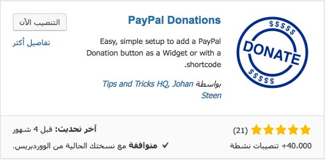
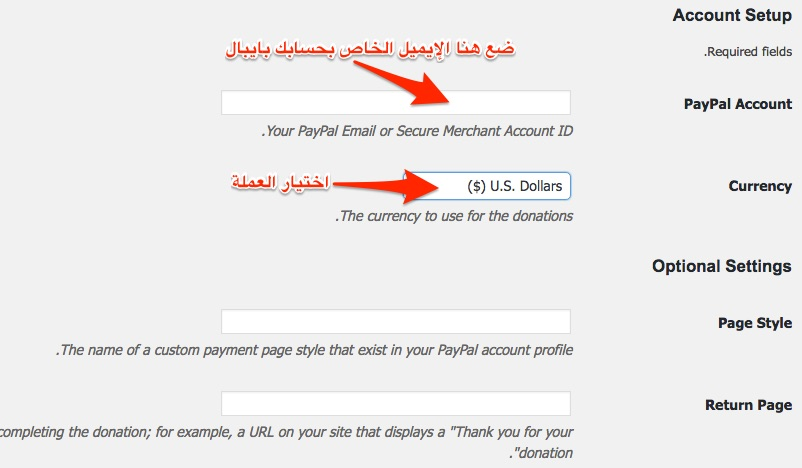
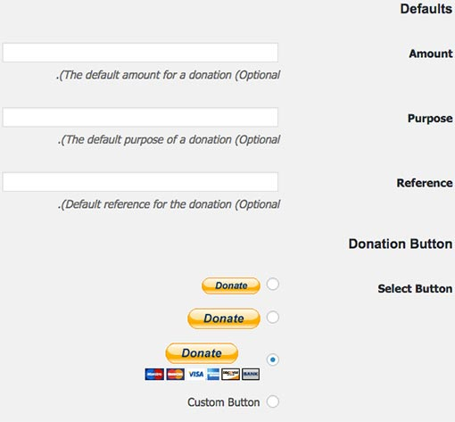
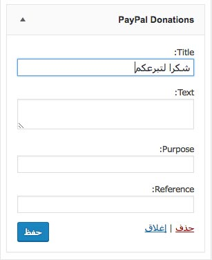

لربما تكون من أصحاب المدونات القلائل الذي يقدمون محتوى عربي راقي يستحق الإنتشار، وتريد تنويع مصادر دخلك ونحن نعلم جميعا أن سوق الإعلانات العربية ما يزال ضعيفا وغير قادر على أن يكون مصدر دخل أساسي يضمن استمرار تألق مدونتك. وكما تعلمون، لا يمكن لأي مدون أن يستمر في التدوين والعطاء إذا لم يكن له دخل يضمن له عيشا كريما.

أحد الحلول البديلة أو المساعدة التي يلجأ إليها عدد من المدونين وأصحاب المواقع، الذين يقدمون خدمات مجانية حول العالم، هو إتاحة الفرصة للمتابعين والزوار **للتبرع بمبلغ مالي** من اختيارهم كعربون امتنان وتقدير على ما يتم تقديمه لهم من خدمات مجانية ومحتوى وراقي.

ومن أسهل الطرق لتمكين الزوار من **التبرع لك هي عن طريق حسابك بايبال** وذلك بواسطة زر يظهر على موقعك ويحولهم لموقع بايبال من أجل القيام بعملية التحويل.

في هذا الموضوع سنشرح لكم كيفية القيام بذلك خطوة بخطوة.

## 1. إضافة Paypal Donations

كما قلت هذه الطريقة سهلة لإضافة زر بايبال للتبرع في مدونتك، يكفي أن تقوم بتحميل **الإضافة Paypal Donations** من لوحة التحكم الخاصة بموقعك ثم تقوم بتفعيلها.

هذه الإضافة تم تحميلها من **مستودع ووردبريس** أكثر من 40 ألف مرة، وبالتالي فهي تلقى قبولا واسعا لدى الناس نظرا لفعاليتها وسهولة التعامل معها كما سنرى.

## 2. ملء الإعدادات

بعد تفعيل **إضافة Paypal Donations**، سنتوجه لصفحة إعدادات الإضافة في هذا المسار : _الإعدادات_ > _Paypal Donations_.

[caption id="attachment_1402" align="aligncenter" width="802"] إعدادات إضافة ووردبريس Paypal Donations\

قم بوضع الإيميل الخاص بحسابك بايبال واختيار العملة، هذا هما الحقلان الإجباريان الوحيدان في صفحة الإعدادات. بقية الحقول اختيارية مثل :

- **Return Page** : رابط لصفحة تقوم بإنشائها يقوم بايبال بإعادة توجيه المتبرع إليها بعد إتمام عملية التحويل والغرض منها هو شكر المتبرع على حبه ووفائه وتقديره لما يقدمه موقعك أو مدونتك.
- **Page Style** : يمكنك تخصيص صفحة الدفع التي تظهر عند التحويل لموقع بايبال، مثلا تضع فيها اللوغو الخاص بموقعك. تستطيع إنشاء هذه الصفحة من داخل حسابك على بايبال وبعدها تضع الرابط في هذا الحقل.
- **Amount** : تحديد قيمة المبلغ المتبرع به. مثلا 10 دولار.
- **Select Button **: اختيارالشكل الذي تريد أن يظهر الزر عليه.

## 3. إظهار الزر في الموقع

بعد إعداد الإضافة، يمكنك إستخدام الكود القصير [paypal-donation] لإضافتها في المكان الذي تريد، وإذا كنت لا تريد أو لا تجيد التعديل المباشر على ملفات القالب فإنه يمكنك إضافتها عن طريق الودجات الخاص الذي تضعه الإضافة بين يديك.

الآن أصبح بإمكان جميع زوار موقعك رؤية **زر التبرع Donate** في موقعك وأصبح بإمكانهم تحويل مبالغ تحفيزية لحسابك على بايبال.
