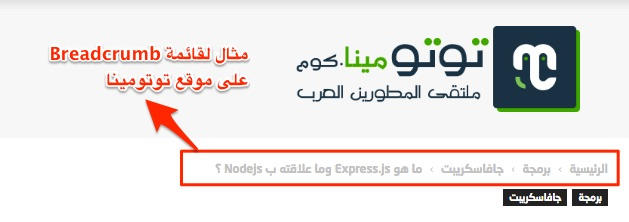

نحن نعيش مرحلة يشهد فيها مجال **برمجيات الويب** تطورا سريعا بشكل لا يصدق، ومع هذا التطور السريع ظهر سيل من **المصطلحات التقنية** التي قد يستشكل على المطور فهم معناها وخاصة إذا كان في بداية مشواره في الميدان، وهذا أمر طبيعي كون المعرفة تأتي بشكل تدريجي وتراكمي وتترسخ بالتجربة والتخصص. في هذا المقال سأقدم لكم تعريفات لعدد من المصطلحات التقنية في مجال البرمجة والتي دائما ما نسمعها في المجال العملي وتقع عليها أعيننا كثيرا في المواقع المتخصصة.

## Agile

Agile نعني بها مجموعة من **الممارسات** يقوم المبرمج أو الفريق البرمجي باتباعها من بداية المشروع إلى نهايته، وتقوم على عدد من المبادئ الأساسية مثل تقسيم المشروع إلى مجموعة من **الأجزاء الصغيرة** وتسليم كل جزء عند الإنتهاء من برمجته بعد تجريبه والتيقن من سلامته من أية أخطاء.

[**طريقة Agile**](http://informatic-ar.com/agile_in_natual/) تساعدنا في **كسب ثقة العميل** الذي يكون على دراية وبينة من كل مرحلة يتم انجازها من بداية المشروع إلى يوم التسليم. وكما هي طبيعة البرمجيات فلا توجد اي منهجية أو سيلة تضمن نجاح المشروع هكذا بدون أي عوامل أخرى ، وحنى لو استخدمت الإعيلي فقد تفشل في مشروعك اذا قمت به بشكل خاطئ،لكن باتباع الإعيلي بالشكل الصحيح فسوف تزيد نسبة النجاح بشكل أعلى من غيرها لأن الأمور سوف تتضح جداً منذ بدايات المشروع.

## Android

**أندرويد** Android عبارة عن **نظام تشغيل** Operating System خاص بالهواتف والأجهزة المحمولة، وهو مشروع مفتوح المصدر تم تطويره من طرف **شركة غوغل** وتستخدمه عدد من الشركات العالمية في منتجاتها أهمها شركة **سامسونغ** الكورية.

## API

يمكن ترجمة API على أنها واجهات برمجية **A**pplication **P**rogramming **I**nterface الهدف منها هو إتاحة بيانات معينة ومشاركتها مع أطراف ثانية بشكل مبسط، هذه الواجهة البرمجية عبارة عن مجموعة من الدوال الوظيفية والتي تساعد في تبسيط شئ معقد وصعب.

فلنفرض مثلا أنك انتهيت من تطوير متجر إلكتروني وتريد بعد ذلك إضافة إمكانية الدفع عن طريق بايبال للمتجر، هل ستقوم كالأحمق بمحاولة القيام بذلك من الصفر ؟ طبعا لا، فشركة بايبال أتاحت للمطورين وسيلة آمنة وفعالة للإتصال بخدماتها وهي واجهة برمجية خاصة بالمطورين ([Paypal Api](https://developer.paypal.com/docs/api/)) ومعها توثيق Documentation يشرح كيفية استخدامها والإلمام بجميع تفاصيلها الضرورية.

## Back End

ال Back End أو **الواجهة الخلفية** هي بمثابة المحرك الذي يقوم بتأمين عمل وظائف تطبيق الويب، هناك يتم فحص البيانات التي يقوم المستخدمون بإدخالها وإضافتها بعد ذلك للقاعدة Database وهناك تتم بشكل عام جميع العمليات التي تخص الخادم Server.

## Front End

الواجهة الأمامية (Front End) هي كل ما يراه المستخدم أثناء الدخول للموقع، وجميع التأثيرات والتصاميم وكذلك جميع العناصر التي يتفاعل معها هذا المستخدم هي أجزاء تنتمي للواجهة الأمامية.

**للمزيد حول هذا الموضوع** : [مقارنة بين مطور Front-end ومطور Back-end](http://www.tutomena.com/web-development/backend-vs-frontend-web-developer/)

## Breadcrumb

**Breadcrumb** عبارة عن **قائمة ثانوية** داخل صفحات الموقع، وتمكن الزائر من معرفة مكان أو **مسار الصفحة** التي يتواجد بها. نقطة البداية في المسار تكون عادة هي الصفحة الرئيسية.

## Bug

Bug هو أي مشكل قد يظهر في البرنامج ويسبب نتائج غير متوقعة، قد يكون خطأ في التصميم أو عيبا وظيفيا في جزئية معينة. هذه الأخطاء لا يسلم منها تقريبا أي برنامج، والمطور يقوم بإصلاحه فور اكتشافه خاصة إذا كان من شأنه التسبب في مشاكل أمنية في التطبيق.

## Cache

الكاش هو مخزن مؤقت لعدد من البيانات التي يقوم البرنامج باستدعائها بشكل متكرر، قد تكون هذه البيانات عبارة عن صفحات كاملة أو مجرد جزئيات صغيرة كاسم المستخدم مثلا، فعوض اللجوء لقاعدة البيانات دائما وما يتطلبه ذلك من وقت واستهلاك لموارد الخادم يلجأ البرنامج لتخزين هذه البيانات في الخادم أو في جهاز المستخدم ويقوم باستدعائها بشكل أسرع كلما طُلِبَت منه.

## CMS

سبق وأن تكلمنا عن أنظمة إدارة المحتوى (**C**ontent **M**anagement **S**ystems) مثل [**ووردبريس**](http://www.tutomena.com/web-development/%d9%84%d9%85%d8%a7%d8%b0%d8%a7-%d9%88%d9%88%d8%b1%d8%af%d8%a8%d8%b1%d9%8a%d8%b3/)، [دروبال](http://www.tutomena.com/blog/wordpress-vs-drupal/) وجوملا، هذه كلها عبارة عن برامج لإدارة المحتويات الرقمية وهدفها جعل إنشاء موقع أو منصة محتوى أمرا سهلا ولا يضطر معها المستخدم، سواء كان مطورا أو شخصا عاديا، لإعادة اختراع العجلة.

## DevOps

**DevOps** مصطلح شامل ومتعدد الجوانب يتضمن عددا من العلوم والمفاهيم بداخله، ولا يوجد تعريف دقيق له، ولكنه يقوم علي التعاون بين كل من مطوري البرامج وخبراء تقنية المعلومات، لإكمال عملية تطوير البرمجيات ، إذ تتم أتمتة جميع العمليات وجعلها تُدار بشكل رشيق، وذلك لزيادة التشارك والتفاعل بين المطورين والخبراء.

ويكيبيديا

لن أستطيع كتابة تعريف أفضل أو أدق من هذا الذي وجدته على موسوعة ويكيبيديا :) وللمزيد من التفاصيل حول **DevOps** وأهدافه تفضلوا بمشاهدة الفيديو التالي :

https://www.youtube.com/watch?v=_I94-tJlovg

## Data Science

أو **علم البيانات**، ظهر هذا المصطلح في العقود الأخيرة مع ظهور ما يسمى بال Big Data أو تدفق المعلومات بحيث أصبح الإنسان حاليا يولد أرقاما هائلة من البيانات في كل دقيقة عبر مختلف المنصات الرقمية، ودور Data Science هو دراسة وتحليل هذه البيانات لفهم مختلف الظواهر والسلوكيات في هذا العالم بشكل أفضل وبناء استراتيجيات وخطط تسويقية اعتمادا على نتائج هذه الدراسات.

## Github

Github عبارة عن موقع ويب لاستضافة الشيفرات المصدرية Source Code للمشاريع البرمجية. تتيح لك **خدمة Github** مشاركة مشروعك مع الآخرين والإستماع لآرائهم وكذا منحهم فرصة التعديل عليه ودمج التعديلات في المشروع الأساسي بعد موافقتك عليها.

## Hack

ال **Hack** هو طريقة سريعة لحل مشكل برمجي ما، ولكنها ليست بالضرورة الطريقة الأفضل أو الأمثل لفعل ذلك،  هي فقط حل ترقيعي في انتظار إيجاد حل أفضل وأكثر عمليةً.

## Hybrid App

أو **التطبيق الهجين**، وهو كل تطبيق يجمع بين مقومات **التطبيقات الأصلية Native apps** وتطبيقات الويب. مثلا في **كوردوفا** تستطيع إنشاء **تطبيق موبايل هجين** بواسطة تقنيات الويب المعهودة (Html, JavaScript, Css) وفي نفس الوقت تستطيع الوصول إلى عدد من مكونات الهاتف مثل الكاميرا أو مجلد الصور كما لو كنت تطور تطبيقات أصليا.

## iOS

نظام تشغيل طورته **شركة آبل** خصيصا لأجهزة الآيفون والآيباد والآيبود، وها المنافس الأول لنظام **أندرويد** التابع لغوغل.

## Open Source

يشير هذا المصطلح إلى **التطبيقات المفتوحة المصدر**، أي أنه بإمكان أي شخص الإطلاع على الشفرة المصدرية للبرنامج أو التطبيق.

## Responsive Design

**التصميم المتجاوب** يضمن لتطبيق الويب الخاص بك بالظهور بشكل جيد لكل الزوار مهما كانت نوعية وحجم الجهاز الذي يفتحون فيه الموقع أو التطبيق (حاسوب عادي، هاتف ذكي، حاسوب لوحي ...).

## SDK

هذه الكلمة اختصار ل **Software Development Kit**، وهو عبارة عن حزمة لمجموعة من الأدوات البرمجية وضعت كمنصة ينطلق منها المبرمج لغرض إنشاء برنامج خاص بجهاز أو نظام تشغيل معين (... Android Sdk, Windows Sdk).

## SEO

السيو ([Search Engine Optimization](http://www.tutomena.com/blog/12-tips-improve-seo/)) يعنى به مجموعة من الممارسات والأساليب لتهيئة موقعك الإلكتروني وتحسين ظهوره على محركات البحث بهدف الحصول على أكبر عدد من الزيارات عبرها.

## Unit Testing

Unit Testing هو عملية تجريب جزء أو مجموعة أجزاء من التطبيق بغرض التأكد من كونه يعمل كما هو متوقع من دون مشاكل. قد يقوم المطور بهذه العملية يدويا Manually ولكنها في الغالب تكون مُأَتْمَتَة Automated.

## Native app

**التطبيق الأصلي أو الأصيل**، هو تطبيق برمجي تم تطويره للعمل في جهاز أو منصة محددة، ويستطيع المبرمج من خلاله الإتصال بجميع مكونات الجهاز بدون إضافات خارجية (Plugins). وفي معظم الوقت يتم اعتماد لغة برمجة واحدة لتطوير هذه التطبيقات، فمثلا لغة **جافا** هي المعتمدة بشكل رسمي لتطوير تطبيقات أندرويد، **سي شارب** هي التي يتم الإعتماد عليهافي تطبيقات ويندوز بينما يمكن تطوير تطبيقات iOS الأصيلة بلغتي **سويفت** و **Objective-c** ولكن شركة **آبل** تنوي الإعتماد بشكل كلي على الأولى في قادم السنوات نظرا لحداثتها وكونها مطورة خصيصا لهذا الغرض من نفس الشركة.

---

هذا عدد لا بأس به من المصطلحات التقنية التي تستعمل بشكل واسع في مجال البرمجة وتطوير الويب على الخصوص. إذا كان لديك، عزيزي القارئ، مصطلح آخر لم نتطرق إليه في الموضوع فلا تتردد في طرحه في صندوق التعليقات أسفله وسأسعد بإضافته للقائمة.
